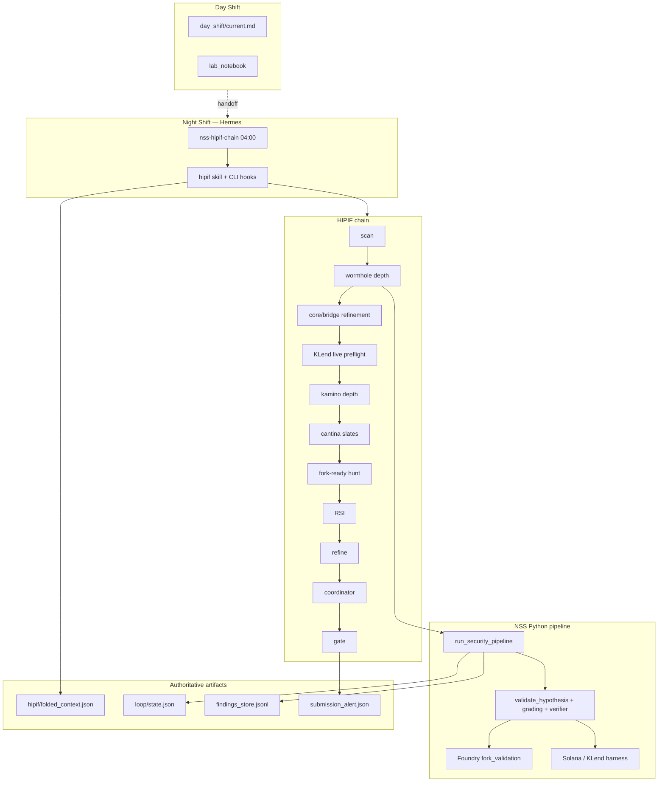

# Night Shift Security — System Audit

**Date:** 2026-06-14  
**SPEC:** v3.3.0  
**Tests:** 344 passed, 3 skipped  
**Auditor:** Grok (codebase + artifact review)

---

## Executive summary

Night Shift Security is a **mature, gate-heavy adversarial research engine** with a closed outer loop (HIPIF → bounty loop → RSI → human gate). Infrastructure for novel bounty work is largely shipped across Operator Layer v3.0 (A–D), live Wormhole forks, and KLend validator harness. The bottleneck is **evidence grade 3+ on non-catalogue novel surfaces**, not missing scaffolding.

| Metric | Value |
|--------|-------|
| `submit_ready` findings | **0** (gates correct) |
| Latest bounty-depth run | **93 min**; Wormhole 69+60 fork repros; Cantina reserve/coinbase harness (v3.3.0) |
| Platform coverage | 18 Immunefi + 12 Cantina curated vs **208 + 52** live |
| Primary cron | `nss-hipif-chain` 04:00 (agent, OAuth required) |
| Saturated slugs | aave, coinbase, euler, kamino, marinade, morpho, orca, raydium, wormhole |

---

## System map

### Core modules

| Area | Path | Role |
|------|------|------|
| Pipeline | `src/night_shift_security/core/pipeline.py` | Hypothesis → simulation → validation → export |
| Bounty loop | `orchestration/bounty_loop.py` | Scan, target pick, `--trials`, submit gate |
| HIPIF | `orchestration/hipif.py` | Folded context, subgoal chain, repetition guard |
| RSI | `orchestration/recursive_improvement.py` | Store signals → refinement queue |
| Coordinator | `orchestration/coordinator.py` | Mission lifecycle, debrief |
| Validation | `validation/{evidence_grading,task_verifier,solana_validation,fork_validation}.py` | Levels 0–4, balance delta, harness modes |
| Operator v3 | `operator/`, `triage/`, `mcp/` | Foundry/Slither MCP, Anvil, file triage |
| Platform intel | `platform/sync.py` | Immunefi + Cantina listing sync, `scope_registry.json` |
| Export v3.3 | `export/{gates,poc_bundler,immunefi_ivss}.py` | `research` vs `submittable` tracks |
| Hermes | `hermes/` | Skills, cron, deterministic chain runner |

---

## Strengths

1. **Explicit trust boundaries** — LLM output untrusted; gates in Python; Hermes never bypasses `validate_hypothesis()`.
2. **Layered validation** — Structural filters → MC → CPCV/PBO → fork/validator → grading → task verifier → credible harness gate.
3. **Operator layer shipped** — Task verifier, checkpoint, triage, MCP, Anvil, oracle/TVS, Wormhole program map.
4. **Autonomous outer loops** — Bounty loop, HIPIF folding, RSI, Coordinator with provenance (lab notebook, improvement ledger).
5. **Test coverage** — 344 tests (+16 v3.3.0); `test_platform_v330.py` for sync/export gates.
6. **Platform intel (v3.3.0)** — Live listing sync; curated gap report; deposit_usd from Cantina API.
7. **Honest export** — `bounty/submittable/` empty unless `qualifies_for_submission()`; triage surface → `research` only.
8. **Zero-budget path** — Shoestring scans, x402 RPC proxy, OAuth Grok, deterministic fallback chain.

---

## Gaps and bugs (prioritized)

### P0 — Bounty outcome

| ID | Issue | Evidence |
|----|-------|----------|
| P0-1 | No novel `submit_ready` after extensive runs | `submission_alert.json` absent |
| P0-2 | Agent cron requires xAI OAuth | `hermes --profile night-shift model`; fallback: `NSS_HIPIF_MODE=deterministic` |
| P0-3 | KLend lacks `live_executed` + measured delta | `MEASURED_DELTA_LAMPORTS:0`; fee-only CPI blocked at gate |

### P1 — Orchestration

| ID | Issue | Evidence |
|----|-------|----------|
| ~~P1-1~~ | ~~HIPIF fold `subgoal_id` drift~~ | **Fixed v3.2.0** |
| ~~P1-2~~ | ~~Hunt starves when fork-ready slugs saturated~~ | **Fixed v3.2.0** |
| ~~P1-3~~ | ~~Day Shift handoff stale~~ | **Fixed v3.3.0** — `day_shift/current.md` refreshed |
| P1-4 | Cron job skills omit `operator-submit` | Agent gate step; skill installed, cron array not updated |

### P2 — Research depth

| ID | Issue | Evidence |
|----|-------|----------|
| P2-1 | Wormhole triage grade 4 ≠ submittable | `triage_surface_verified` → `research_surface` only (v3.3.0 export gate) |
| ~~P2-2~~ | ~~Cantina coinbase/polymarket used wormhole_fork~~ | **Fixed v3.3.0** — dedicated configs; reserve-protocol harness |
| P2-3 | Morpho/pendle still Euler analogue forks | Native Morpho contracts TBD |
| P2-3 | Kamino 5 trials ~5 min — likely catalogue replay not 5× validator spins | Wall time vs `klend_require_live` expectation |

### P3 — Polish

| ID | Issue |
|----|-------|
| P3-1 | `pyproject.toml` version `0.1.0` vs SPEC v3.3.x |
| P3-2 | No E2E pytest for full `nss-hipif-chain-run.py` |
| P3-3 | Agent HIPIF path untested E2E with OAuth in CI |

---

## Validation gate chain (`submit_ready`)

All must pass (`validation/submission_gates.py` → `qualifies_for_submission()`):

1. `submit_now` recommendation from bounty scoring
2. Evidence grade ≥ 4
3. `deployed_viable` true
4. `catalog_analogue` false
5. `reproduction_tier` ∈ `{fork_reproduced, solana_validator}`
6. `finding_has_credible_reproduction()` — KLend requires `live_executed`, not fixture/fee-only
7. `finding_balance_verified()` — `DELTA_WEI` / measured lamport delta for novel

Catalogue fork replay (Euler, Nomad analogues) **does not qualify** — by design.

---

## Cron and scripts inventory

### Active cron (`hermes/cron/jobs.example.yaml`)

| Job | Schedule | Mode |
|-----|----------|------|
| `nss-health` | every 6h | no-agent |
| **`nss-hipif-chain`** | `0 4 * * *` | **agent** + `hipif` skill |
| `nss-immunefi-scan` | Wed/Sat 06:00 | agent |
| `nss-novel-digest` | every 3d | agent |
| `nss-campaign-review` | Sun 09:00 | agent |

**Deprecated:** `nss-bounty-loop`, `nss-investigate-queue`, `nss-coordinator-kamino`  
**Fallback:** `nss-bounty-loop-cron.sh.legacy`, `NSS_HIPIF_MODE=deterministic nss-hipif-chain.sh`

### Key scripts

| Script | Purpose |
|--------|---------|
| `nss-hipif-chain.sh` | Bootstrap; sets `NSS_HIPIF_BOUNTY_DEPTH=1` |
| `nss-hipif-chain-run.py` | Deterministic bounty-depth chain |
| `nss-bounty-loop.sh` | Single/multi bounty loop tick |
| `nss-write-wormhole-triage-proposals.py` | Wormhole triage → proposals |

---

## Data artifacts

| Artifact | Path | Trust |
|----------|------|-------|
| Findings store | `knowledge/findings_store.jsonl` | Engine append-only |
| Loop state | `loop/state.json` | Engine; saturated slugs, RSI |
| Folded context | `hipif/folded_context.json` | HIPIF chain memory |
| Hermes proposals | `hermes_proposals/latest.json` | **Untrusted** until validated |
| Lab notebook | `lab_notebook/*.md` | Mandatory provenance; not scored |
| Submission alert | `loop/submission_alert.json` | Human gate trigger (schema v2) |
| Platform sync | `platform/{immunefi_programs,cantina_programs,scope_registry}.json` | Weekly refresh |
| Export research | `bounty/research/manifest.json` | Internal grade ≥ 3 packs |
| Export submittable | `bounty/submittable/manifest.json` | External-ready only when gate passes |

---

## Recommended next actions

1. **KLend `live_executed`** — real instruction discriminators + protocol/vault delta (P0-3).
2. **Novel Wormhole exploit** — balance delta beyond triage surface (P0-1).
3. **Weekly platform sync** — `platform sync --all`; review `platform diff` before external submit.
4. **Cron skills** — add `operator-submit` to `nss-hipif-chain` job skills array.
5. **Agent cron E2E** — verify OAuth path writes lab notebook after one `nss-hipif-chain` run.

---

## Root documentation map

| File | Audience | Content |
|------|----------|---------|
| `README.md` | Visitors | Elevator pitch, quickstart, status |
| `SPEC.md` | Implementers | Version history, CLI, gates, shipped features |
| `AGENTS.md` | Coding agents | Onboarding, day/night shift, trust boundary |
| `AUDIT.md` | Operators | This document |
| `CHANGELOG.md` | Everyone | Release notes |
| `BOUNTY_RUN.md` | Operator | Command cookbook |
| `adversarial_research_architecture.md` | Architects | Layered design |
| `METHODOLOGY.md` | Researchers | Research loop, evidence standards |
| `SUSTAINABILITY.md` | Operator | Payout allocation |

---

*Audit based on code review, pytest (344 passed), and `folded_context.json` from 2026-06-14 v3.3.0 bounty-depth run (~93 min).*