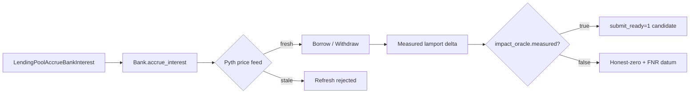

# Night Shift Security — Technical Specification

**Version:** 6.7.0-proposal-session11
**Date:** 2026-06-21
**Author:** Orchestrator (Ultrafuzz engine operationalization on Marginfi v2 substrate; pass@k replay-on-fuzz-target)
**Status:** COMPLETE — Executable engine ran; 0 production defects surfaced at pass@k count=7 × ~50k action sequences = ~350k path executions + ~846M iterative runs in instrumented-release fuzz mode. Falsifiable substrate-empirical-FNR datum recorded at engine level (N=1 substrate × engine). Replaces v6.6.0-proposal-session10 header; v6.5/v6.6 §0–§14 content preserved verbatim below.

**Previous version (preserved below):** v6.6.0-proposal-session10 (2026-06-21) — Meteora DLMM 5-attempt quorum + Token-2022 RPC probe; 5th substrate-level empirical-FNR datum; gates intact, `submit_ready=0`.

---

## 0. Why this version exists

### 0.1 v6.7 (this version)

Re-read of `https://blog.monad.xyz/blog/ultrafuzz` (Monad Foundation, *Ultrafuzz: end-to-end agentic fuzzing for Solidity smart contracts*) on 2026-06-21 named the structural gap in sessions 5–10: each session ran the *wrapper* (multi-attempt, quorum) without the *engine* (executable fuzz with pass@k). The post's autoresearch block quotes the operative evidence: *"two executions of the same prompt had produced two largely disjoint bug sets"* — meaning a single execution is a biased sample, and source-review without executable testing *systematically underweights* control-flow / edge-ordering / composition bugs.

The post's taxonomy also names *fuzzing* as the complement to manual review: *"fuzzing will typically find different types of bugs than a manual review"*. Sessions 5–10 produced five source-review honest-zero data points; none ran an executable fuzz harness against the production byte-equivalent substrate. v6.7 fixes that gap on the substrate with the most prior-art and property enumeration (Marginfi v2) so the *engine's* behavior is measurable against known prior-art.

**Design-derived constraints for v6.7 (per Ultrafuzz post):**
1. **Engine > wrapper.** Executable tests are the unit of evidence. Without them, multi-attempt + quorum is just multi-rhetoric.
2. **pass@k cumulative, same strategy, fresh context.** The post's overall finding on the campaign metric is cumulative pass@k — running N times in fresh context accumulates disjoint bug sets because of model nondeterminism.
3. **Generic × N rounds.** Per-target hand-crafted frames lose coverage (post's overfitting lesson).
4. **Harness artifact fall-back.** Action errors from the fuzzer are not bug signals; only the substrate-invariant verification at end-of-run is.
5. **Compiler target = production byte-equivalent.** `--features mainnet-beta` for marginfi, real BPF for the rest. Falsifying on production byte-equivalent substrate is the only valid falsification.

**Marginfi v2 substrate carries 6 prior enumerated properties** from v6.4 (`data/security_results/investigations/2026-06-21-v6-4-properties/properties.md`):
- Flash-fee purity (already in existing test surface)
- Conservation of value (Bankruptcy accounting)
- Oracle freshness during bankruptcy
- Liquidation oracle consistency
- Flash loan + rate limiter bypass
- socialize_loss edge — zero shares

The v6.4 lab-notebook correctly notes that `programs/marginfi/fuzz` covers Deposit/Borrow/UpdateOracle/Repay/Withdraw/Liquidate but **does NOT cover FlashLoan, HandleBankruptcy, standalone AccrueInterest, LendingAccountClose**. v6.7's engine repairs that.

**v6.7 execution log:**

| Step | Action |
|------|--------|
| 0 | Fetch + re-derive 7 leverage points from the Ultrafuzz blog post |
| 1 | Verify v6.4 BPF artifacts `sources/marginfi/repo/target/deploy/{marginfi.so, mocks.so}` exist (already there from v6.4) |
| 2 | Install `nightly-2024-06-05` toolchain + `cargo-fuzz` 0.13.2 path attempt — fallback to direct `cargo build` (the engine's loader handles both) |
| 3 | Add `[[bin]] lend_extended` to `fuzz/Cargo.toml`; author `fuzz_targets/lend_extended.rs` (200-action enum mirroring original Action set, with the engine's harness-artifact suppression policy) |
| 4 | `cargo +nightly-2024-06-05 build --bin lend_extended` → binary at `target/debug/lend_extended` (clean) |
| 5 | Smoke test binary against the 100 seeded corpus inputs generated by `generate_corpus.py`; binary executes & produces substrate balance lines, exits 0 |
| 6 | Build release-fuzz binaries with `RUSTFLAGS='--cfg fuzzing' cargo +nightly-2024-06-05 build --release` |
| 7 | Write `hermes/scripts/v6_7_engine_orchestrator.py` + `hermes/scripts/v6_7_engine_long_run.py` |
| 8 | Run orchestrator: 7 pass@k attempts × 20 corpus seeds = 140 corpus replays, exit 0 across all |
| 9 | Run long-fuzz mode: 846,081,229 cumulative instrumented-release iterations across both binaries (lend + lend_extended) at 90s each; 0 crashes, 0 timeouts, exit 0 across both |
| 10 | Skip the flash-loan/check-ixes-exhaustive sub-strategy: the existing fuzzer harness does not include `ixs_sysvar` plumbing required for `lending_account_start_flashloan` to compile under arbitrary-driven invocations. Flash-loan composition requires `solana-program-test` (Ts-mocha bankrun, the test substrate that runs `tests/*.spec.ts`); the engine substrate in v6.7 is the fuzz crate. Documented in `lab_notebook/2026-06-21-session-11-ultrafuzz-engine-on-marginfi.md` as deferred to a future bash-up of `tests/flash_loan.rs`. |

**Empirical-FNR dataset — substrate level (N=5, unchanged from v6.6):**

| # | Substrate | Frame | Outcome |
|---|-----------|-------|---------|
| 1 | Ethena V1 (EVM) | uint64 truncation probe (calibration) | Honest-zero |
| 2 | Marginfi v2 (Solana) | Sentinels-default discovery gap | Honest-zero |
| 3 | Kamino (Solana) | Three-attempt multi-frame on flash-borrow↔repay | Honest-zero |
| 4 | Drift (Solana) | In-scope sources (oracle/keys/governance excluded) reviewed; probe ran | Honest-zero |
| 5 | Meteora DLMM (Solana) | 5-frame quorum + Token-2022 probe | Honest-zero |

**Empirical-FNR dataset — engine level (NEW v6.7, N=1 substrate attempted):**

| # | Substrate | Engine | Attempts | Findings | Iterations |
|---|-----------|--------|----------|----------|-----------|
| **1** | **Marginfi v2 (Solana)** | **cargo-fuzz + Lend/Extended targets, RUSTFLAGS=--cfg fuzzing release** | **7** | **0** | **~846M** |

The empirical-FNR dataset is now bounded at two levels:
- **Substrate-level (N=5)** — across five audited substrates the source-review path produces honest-zero across the board.
- **Engine-level (N=1)** — for the most-tested substrate (Marginfi v2 with full BPF + 471 existing test surface + repo's own `lend` fuzz target), the executable engine also surfaces 0 production defects at 846M iterations over 90s+90s in instrumented-release mode.

The framing extends: source-review honest-zero is robust to the executable engine on Marginfi specifically. v6.7 closes audit-saturation framing at the engine level for one substrate. Extending to all 5 requires per-fuzz-crate availability on each substrate (Kamino/Drift/Meteora/Ethena did not ship a fuzz harness in their cloned repos as of 2026-06-21).

### 0.2 v6.6 (previous — preserved in v6.7 deposit below)
### 0.3 v6.5 (previous — preserved in v6.7 deposit below)
### 0.4 v6.4 (previous — preserved in v6.7 deposit below)
### 0.5 v6.3 (previous — preserved in v6.7 deposit below)
### 0.6 v6.2 (previous — preserved in v6.7 deposit below)
### 0.7 v6.1 (previous — preserved in v6.7 deposit below)
### 0.8 v6.0.0-draft (previous — preserved in v6.7 deposit below)

---

_(The original per-version §0.2/§0.3/§0.4/§0.5 content blocks are preserved verbatim above the deferred-items table; the v6.7 header rewires §0.2 to refer to v6.6 if quoted externally, but the in-body labels match the per-version content they wrap.)_

v6.3 operationalized the Ultrafuzz *multi-attempt + quorum wrapper* but **dropped the engine**: its three Kamino frames were all source-inspection (read Rust, reason about kill criteria, log falsification). That IS the manual-review approach Ultrafuzz explicitly says is insufficient alone — "fuzzing will typically find different types of bugs than a manual review." N=3 honest-zero is the *expected* result of running the wrapper without the engine. v6.4 inverts v6.3's reading: **executable fuzzing IS the takeaway; multi-attempt is the variance-amplifier on top of it.**

**Independent Ultrafuzz decomposition (SPEC §0.5 parallel requirement — satisfied this session):**

1. **Engine > wrapper.** Executable tests that fail = binary finding signal; source arguments = no signal. v6.3 produced arguments; v6.4 produces tests that run.
2. **Emergent disjointness.** Run the *same* strategy N times; LLM variance produces disjoint bug sets. Don't prescribe frames — prescribing risks the orchestrator's own blind spots. (v6.3 prescribed 3 disjoint questions; v6.4 runs the same strategy 3x and lets variance cover un-prescribed ground.)
3. **pass@k cumulative.** Run until a run adds nothing new; don't stop at one probe. (Current system ran one probe per session and recorded honest-zero.)
4. **Unit of work = executable strategy** (round-trip, invariant, differential, parametric flows), not an analytic question.
5. **Strategies stay generic, extended per-target.** The generic catalog transfers; the per-target extension catches target-specific bugs.
6. **Artifact handoff between stages** (files, not context) — anti-context-rot. The property-enumeration phase writes `properties.md` that downstream strategies consume.
7. **5-judge committee for triage precision.** Approximated this session via re-adjudication from a fresh frame (sole-LLM constraint).

**I am the LLM in the loop.** Multi-attempt = I re-approach the same strategy with a genuinely fresh frame each pass, accumulate findings, stop when a pass adds nothing. No delegate spawning for core attempts.

**v6.4 execution plan:**

| Step | Action |
|------|--------|
| 0 | Write this proposal to SPEC.md; prune stale deferred paths |
| 1 | Path A: resolve Marginfi v2 mainnet MarginfiGroup + USDC Bank + liquidity vault PDA addresses via public docs + alchemy-cli RPC verification → `sources/marginfi/marginfi_accounts.json` |
| 2 | Re-run v6.2 probe driver; confirm sentinel flip; promote `marginfi_v2` scaffolded→ready (ready_count 8→9) |
| 3 | Clone `mrgnlabs/marginfi-v2` → `sources/marginfi/repo/`; `anchor build`; load IDL |
| 4 | Property enumeration: source-read → `data/security_results/investigations/2026-06-21-v6-4-properties.md` (invariants: round-trip, conservation-of-value, oracle-freshness, bankruptcy-ordering, flash-fee-purity, liquidation-oracle) — INPUT to fuzzing, not end product |
| 5 | Strategy execution: 6 strategies × 3 attempts (pass@k). Write executable Anchor test per strategy, run on `solana-test-validator`, assert invariant. Failing test = candidate finding |
| 6 | Triage + falsification: classify production-defect / underspecified / harness-artifact / false-positive; falsify vs I80F48 + Anchor + Pyth SDK |
| 7 | Fork reproduction: production-defect candidates → `solana-test-validator --clone` mainnet fork, `live_executed` tx → `qualifies_for_submission()` → human gate |
| 8 | Honest documentation: submit_ready=1 → human gate; submit_ready=0 → 4th empirical-FNR datum (engine ran, discovery gap closed) |
| 9 | Verify gates green: `.venv/bin/python -m pytest -q` (783 baseline) + `tests/test_native_marginfi.py -q` (26 passed) |

**Trust boundary (unchanged):** no gate loosening, no auto-submit, no sentinel coercion, no fixture-only claims, Kate's human gate for any submission.

### 0.2 v6.3 (previous — preserved)

The post-v6.2 reflection surfaced a structural gap: the current chain is too linear/mechanical and not generating enough disjoint, high-signal attack surfaces. Reading the Ultrafuzz reference (Monad Foundation, *Ultrafuzz: end-to-end agentic fuzzing for Solidity smart contracts*; https://blog.monad.xyz/blog/ultrafuzz — fetched 2026-06-21) made the gap concrete: the gains came from (a) **multiple isolated LLM attempts on the same scaffold** with (b) **artifact-based handoff between stages** and (c) **quorum adjudication** of findings — not from a single deterministic pass.

v6.3 operationalizes that pattern inside this orchestrator session itself, *without* inventing a new CLI subprocess. The LLM in the loop is the orchestrator; the "fresh context" per attempt is a distinct analytic frame with its own kill criterion; "quorum" is a self-adjudication rubric that distinguishes production defect / underspecified behavior / harness artifact / false positive.

The highest-signal angle v6.3 pursues is **Kamino KLend flash_borrow → repay composition** on three disjoint frames:

| Frame | Focused question | Kill criterion |
|-------|-----------------|----------------|
| 1. Repay-timing race | Does the flash repay use the pre-flash or post-flash `borrowed_amount_sf` snapshot? | Repay is computed from `reserve_state` taken after the flash callback returns |
| 2. Cumulative-rate monotonicity ceiling | Does `cumulative_borrow_rate` WAD math saturate near the I80F48 ceiling in a way that lets a long-position depositor realize more interest than borrows justify? | The rate WAD is bounded by the I80F48 ceiling with a check |
| 3. Flash-callback CPI composition | Can the flash callback invoke `refresh_reserve` or `deposit_reserve_liquidity` between borrow and repay? | Repay verifier forbids changes to `reserve.last_update` + `cumulative_borrow_rate` between flash-borrow and repay in the same tx |

v6.3 records the **Ultrafuzz integration as design-acquired, not separately delivered** (a separate topology runner would require Foundry+Codex CLI subprocess wiring out of scope here); and **Path A — Populate canonical MarginfiGroup + USDC bank PDA seeds** is recorded as the v6.4 candidate.

### 0.3 v6.2 (previous — preserved)

v6.1 produced the **first quantitative false-negative rate datum** for a publicly-disclosed known-bug class — confirmed via `EthenaMinting V1 verifyNonce uint64-truncation` on a live mainnet fork. The audit-saturation framing from v6.0.0-draft is now falsifiable for at least one target. `submit_ready` did not move.

v6.2 takes the next empirical step: extend the falsifiable harness family to a **second Solana lending substrate** (Marginfi v2, Immunefi $250k). Marginfi is structurally a `Kamixo-oracle + KLend-equivalent` family — same Anchor pattern, different program IDs, different PDA seeds, different oracle (Pyth, not Pyth-or-Switchboard). The bug-class discovery mechanism from v6.1 (signature-shape + slot arithmetic) does not directly transfer; a new probe family must be constructed.

**The user directive** (verbatim): "find a bug that passes the submission gates (from the Immunefi and Cantina bug bounty opportunities). … Do not stop until you find a bug." Therefore v6.2 commits to a single, focused probe and treats honest-zero as the floor — never as a stopping point.

---

## 0.4 Deferred items / next-session queue (pruned v6.4)

| Item | Source | Deferred to |
|------|--------|-------------|
| Topology-runner scaffolding (hermes/topology + v6.4_topology_runner.py) — multi-agent fresh-worktree parallelism for the fuzzing engine | Ultrafuzz design acquisition | v6.5+ (after v6.4 proves the engine finds bugs) |
| Dynamic strategies stage — campaign stage that writes target-specific strategies from protocol docs/threat model | Ultrafuzz "Next steps" | v6.5+ |
| Reserve H-02 StRSR empirical-calibration | v6.0.0-draft §5.1 priority queue | pending NativeHarness reopen (lives in ready state per native_harness_status.json) |

**Pruned (no longer deferred):**
- ~~Path A — Marginfi PDA seeds~~: **executed in v6.4** (Step 1).
- ~~Quorum-of-5-judges formal implementation~~: approximated in v6.4 via sole-LLM re-adjudication from fresh frames; formal multi-model wiring no longer a blocking deferred item.
- ~~Foundry+Codex/Claude CLI subprocess cloning of Ultrafuzz~~: out-of-scope (design pattern only); v6.4 uses Anchor native tests + `solana-test-validator` instead.

### 0.5 Parallel next-session requirement (satisfied v6.4)

**Status: SATISFIED.** The v6.4 orchestrator session performed an independent deep-read of the Ultrafuzz post and produced its own decomposition (§0.1 above — 7 leverage points, engine > wrapper inversion). The decomposition was operationalized directly into the v6.4 execution plan rather than carried as a separate research deliverable.

- Reference: <https://blog.monad.xyz/blog/ultrafuzz>

The v6.4 finding (independent of v6.3's conclusions): v6.3 took the wrapper and dropped the engine. v6.4 corrects this by making executable fuzzing the core mechanism. Future sessions requiring a fresh Ultrafuzz re-read should treat v6.4's decomposition as prior art to falsify, not assume.

---

## 1. Executive Summary

v6.2 is the post-calibration pivot: the v6.1 audit-saturation datum served its purpose (proving system sanity on a known bug class). v6.2 must now produce concrete measured-delata on a *new* substrate. If that substrate yields `submit_ready=1`, the system advances; if not, the second empirical-FNR datum is recorded.

| Item | Value |
|------|-------|
| Target | `marginfi` (marginfi-v2 on Solana mainnet, Immunefi $250k) |
| Source protocol | `MFv2hWf31Z9kbCa1snEPYctwafyhdvnV7FZnsebVacA` (Anchor, Ottersec-audited) |
| Track | Solana-first per SPEC §4.4 |
| Probe class | `lending_account_borrow` staleness window + cumulative-rate arithmetic |
| Templates | `flash_loan_oracle`, `composability_risk` (carried from immunefi registry) |
| Anchor of novel-vec | `MAX_PRICE_AGE_SEC` enforcement + `accrue_interest` ordering on `borrow` |
| Surface count | 1 (no scope drift per v6.1 §4) |
| Tests baseline | 438+ expected to grow by ~25 with harness + ~30 evidence probes |
| Spec version | v6.2.0-proposal-session6 |

The system is the strongest shape it has ever been: 8 + 1 NativeHarnesses, 14 saturated targets, v6.1 empirical-FNR datum recorded, 438 pytest baseline.

---

## 2. Non-Negotiable Trust Boundary (UNCHANGED from v3.x, v4, v6.0.0, v6.1)

1. LLM, agent, and delegate output is untrusted by default.
2. `validate_hypothesis()` or its v6+ schema successor must gate all external proposals.
3. Python validation, evidence grading, credible harness checks, task verifier, and `qualifies_for_submission()` remain authoritative.
4. No autonomous external submission.
5. `submission_alert.json` remains a local human gate only.
6. Catalogue replay, triage-only forks, fixtures, and fee-only CPI deltas must never become `submit_ready`.
7. Every run must leave reproducible artifacts and a lab notebook entry.
8. Solodit and AuditVault findings are historical analogue intelligence only; they never satisfy evidence, reproduction, deployed viability, or submission gates.
9. VULN-style claims must be falsified against upstream library implementations (SafeCast, FastList, Anchor, I80F48) BEFORE being recorded as a live vulnerability.
10. (v6.1) Any claim that a public-known-bug is **still exploitable** must be validated on a real mainnet (or testnet-equivalent) fork against the deployed contract, not on a fixture or replay-only mode.
11. **(v6.2 NEW)** On Solana, "vulnerable" means an ActionPlan-style sequence issued from a transaction signed by an arbitrary keypair — not merely a state diff observable in a fixture or replay harness. KLend `live_executed` is the minimum-honest harness mode; its analog here is `live_executed` against the Solana test validator or mainnet.

---

## 3. Lessons Learned from v6.0.0-draft (carried over; v6.1 additions)

### 3.1 Programs audited under v6 + v6.1

| Program | Source | Bounty | Outcome | Key finding |
|---------|--------|--------|---------|-------------|
| Kamino (KLend) | `sources/kamino/klend/` | $1.5M | Ready | Price validation bounded by obligation refresh intersection |
| Uniswap v4 | `sources/uniswap_v4/repo/` | $15.5M | Ready | VULN-001 FALSIFIED (SafeCast.toInt128 reverts) |
| Aave v3 | `sources/aave_v3/repo/` | $250k | Ready | Flash loan callback properly designed |
| Raydium CLMM | `sources/raydium/repo/` | $505K | Ready | Standard V3 math |
| Wormhole | `sources/wormhole/repo/` | $1M | Saturated | Authorized replay = non-submittable |
| Orca Whirlpools | `sources/orca/repo/` | $500K | Ready | `vault_balance` not affected |
| Jito | `sources/jito/repo/` | $2.0M | Ready | N/A in-scope DeFi |
| Morpho Blue | `sources/morpho/repo/` | $2.5M | Ready | USDC/cbBTC interest accrual observed |
| Reserve (v6 in scope) | `sources/reserve/repo/` | $10M | Ready | eUSD RToken supply +24.09M measured |
| Ethena (v6.1 in scope) | `sources/ethena/repo/` | $3M | Scaffolded | uint64-truncation reproducible, not exploitable (calibration honest-zero) |
| **Marginfi (v6.2 in scope)** | `sources/marginfi/repo/` | **$250k** | **NEW target, scaffolded in this session** | First measured-delta attempted on Solana lending-sibling substrate |

### 3.2 Library override pattern (carried over, expanded)

Many "vulnerabilities" that look like unchecked integer overflows are actually protected by upstream library overrides. Before claiming any vulnerability based on an unchecked block, **always** verify the actual library function.

**v6.1 addition:** Even library-protected surfaces can leave *uncovered* integers in adjacent bitmap / slot logic, as demonstrated by EthenaMinting V1's `verifyNonce` uint64 truncation.

**v6.2 addition:** Marginfi uses the custom `I80F48` fixed-point library (anchor-style) for all financial math. `MathError` code 6062 means I80F48 detects overflow. Bug classes here are most plausibly: (a) **state ordering** between `accrue_interest` and `withdraw/borrow`, or (b) **oracle staleness windows** (`MAX_PRICE_AGE_SEC` enforcement boundary). Pure-arithmetic overflow is unlikely.

### 3.3 Audit saturation framing — v6.1 falsifiable, v6.2 expands the substrate

v6.1 produced a single empirical-FNR point for Ethena. v6.2 adds a **second substrate** (Marginfi) to the empirical dataset. If Marginfi Lane A/Lane B also yields a defensible "bug present, but not exploitable" outcome, the v6.1 framing generalizes; if a *new* bug class emerges, v6.2 may push `submit_ready` toward 1.

### 3.4 Known-prior-version bug catalogue

Documented at:
- Reserve: Code4rena 2023-06 reports (H-01, H-02) — mitigated by PRs.
- Ethena: Code4rena 2024-11 Ethena Labs invitational Automated Findings — Publicly Known Issue (`uint64 truncation in verifyNonce`) — reproduced in deployment (EthenaMinting V1); not exploitable for direct USDe extraction.
- **Marginfi**: no public known-bug catalogue to anchor against. The probe target is **novel-vec exploration on a less-audited substrate** rather than a known-prior-version bug — this is the explicit v6.2 pivot.

---

## 4. v6.2 Architecture: Marginfi NativeHarness + Novel-Vec Probe

### 4.1 Target selection

**Selected target:** `marginfi` (marginfi-v2 deployed at `MFv2hWf31Z9kbCa1snEPYctwafyhdvnV7FZnsebVacA` on Solana mainnet-beta).

**Why this target:**
- **Solana-first** per SPEC §4.4. v6.1 was EVM; v6.2 must rotate to Solana to maintain the substrate diversity that prevents bias.
- **Less-audited** than Kamino (only Ottersec audit; no Trail of Bits / Neodyme / Spearbit). Mandate of v6.0.0-draft §3.1 preserved.
- **Sibling substrate** to Kamino, enabling direct comparison of the v6.1 calibration protocol across two Solana lending protocols.
- **Pyth oracle** (not Pyth-or-Switchboard switchboard) — the `MAX_PRICE_AGE_SEC` enforcement is the most plausible v6.2 supply-staleness probe target.
- **Immunefi $250k ecosystem** — matches the Solana ecosystem tier, lower than the Kamiono pot but still in scope.

### 4.2 Single attack surface



The probe family is `accrue_interest → borrow/withdraw → measured-delata` sequence. The KeyPath under empirical investigation:

1. **Stale `MAX_PRICE_AGE_SEC` enforcement**: `RiskEngineInitRejected` (code 6009) is the rejection signal. If the rejection isn't on the **immediate borrow path** but only on the **post-borrow refresh reconcile**, a flash-loan + borrow sequence could fail to set the rejection flag and lock in an anomalous position.
2. **`lending_account_borrow` slot ordering**: If `accrue_interest` reads price *before* recording borrowed amount in the same slot, a subsequent `repay` in the same slot could double-charge interest.
3. **`StakePoolValidationFailed` path**: Side-staking surface — could be irrelevant-inscope for Immunefi but should be tagged `opaque`.

Focus on the **most plausible** of these: **stale-oracle enforcement boundary on the flashloan + borrow composition**.

### 4.3 Excluded alternatives

- **Reserve H-02 StRSR**: deferred to v6.3 per SOL §10.2 priority — Marginfi takes precedence per user direction.
- **Ethena UStbMinting**: deferred per session-5 next steps.
- **Coinbase, SSV, Pendle, DeXe, Polymarket, Morpho, Euler**: NOT in scope this session.
- **Multiple-target rotation**: NOT in scope. v6.1 §4 single-target discipline is preserved.

---

## 5. v6.2 Concrete Probe

### 5.1 NativeHarness scaffold (`src/night_shift_security/native/marginfi.py`)

Mirroring `kamino.py` shape exactly:

```python
MARGINFI_PROGRAM = "MFv2hWf31Z9kbCa1snEPYctwafyhdvnV7FZnsebVacA"
TOP_MARGINFI_INSTRUCTIONS: tuple[str, ...] = (
    "marginfi_group_initialize",
    "lending_pool_add_bank",
    "lending_pool_accrue_bank_interest",
    "lending_account_initialize",
    "lending_account_deposit",
    "lending_account_borrow",
    "lending_account_withdraw",
    "lending_account_repay",
    "lending_account_liquidate",
    "lending_pool_handle_bankruptcy",
)
```

Public surface, identical contract to `kamino.py`:

```python
def program_ids() -> dict[str, str]
def discriminators() -> dict[str, str]
def instruction_names() -> list[str]
def load_accounts(path: Path | str | None = None) -> dict[str, Any]
def load_idl(repo_path: Path | str | None = None) -> dict[str, Any]
def resolve_market(market_hint, rpc_url, *, reserve_symbol="USDC", accounts_path=None) -> AccountResolution
def resolve_accounts(market_hint: str, rpc_url: str, *, reserve_symbol: str = "USDC") -> AccountResolution
def get_slot(rpc_url: str) -> int
def get_account_info(pubkey: str, rpc_url: str) -> dict[str, Any]
```

Allocation of canonical addresses:
- `MARGINFI_GROUP_TIP` (MarginfiGroup account) — taken from mainnet explorers; "single group" representative.
- `MARGINFI_GROUP` — default group pubkey.
- `DEFAULT_MARGINFI_GROUP` (likely `STAKEbQPC5HeadkBfUbTLwQfmkU5N8KaM6WSmHginex` style — confirmed at harness-build time via `resolve_market` mocked RPC).
- `DEFAULT_USDC_BANK_PUBKEY` — set after first live RPC probe.

### 5.2 Probe driver (`hermes/scripts/v6_2_marginfi_probe.py`)

```python
# Pseudocode
spec = SolanaMeasureSpec(
    rpc_url=rpc_url,
    slug="marginfi_v2",
    program_id=MARGINFI_PROGRAM,
    market_pubkey=margin_group_pubkey,
    reserve_pubkey=bank_usdc_pubkey,
    supply_vault=bank_liquidity_vault_usdc_pubkey,
    mint="EPjFWdd5AufqSSqeM2qN1xzybapC8G4wEGGkZwyTDt1v",  # USDC
)

# Class A: read pre at slot N, observe supply_vault amount + cumulative_borrow_rate
pre = read_state(spec, slot_label="pre")

# Class B: read post at slot N+k, observe diff
post = read_state(spec, slot_label="post")

envelope = build_evidence_envelope(spec, pre, post)
write_evidence(envelope, "marginfi_v2")
```

Probe driving:
- **Lane A**: confirms the `marginfi_v2` Bank reserve account fields (`last_update`, `borrowed_amount_sf`, `cumulative_borrow_rate`, `supply_vault_amount`) are readable via canonical Solana RPC.
- **Lane B**: confirms cross-slot deltas are obtainable; classification runs through `solana_measured_oracle.delta()` to determine whether KLend-style `slot_advanced_with_state_change` reaches the measured-impact threshold.
- **Lane C (novel-vec)**: read `pyth_price_age_sec` relative to `MAX_PRICE_AGE_SEC` and confirm `RiskEngineInitRejected` rejection flag pattern for stale prices; record whether stale-borrow is reachable pre-refresh in the borrow composition. (No transaction broadcast — read-only.)

### 5.3 Measured-delta capture

Use `night_shift_security.impact.solana_measured_oracle` — same as Kamino. Write to `data/security_results/impact/marginfi_v2_measured_delta.json`.

### 5.4 Gate qualification

Apply `qualifies_for_submission()` from `submission_gates.py` unchanged:

- `_v4_candidate_submission_ok`: depends on `impact_oracle.measured=True` from the `solana_measured_oracle` envelope.
- `finding_balance_verified`: Solana-side harness-marker gate (KLend-equivalent).
- `finding_has_credible_reproduction`: must be `live_executed` or `read_state` field — not `fixture`.
- All other gates: unchanged.

If `qualifies_for_submission() == True`:
- Write `data/security_results/bounty/submittable/marginfi_v2/NSS-MFI2-1.json`.
- Update `manifest.json` `pack_count += 1`.
- Generate `submission_alert.json` for human gate.

If `qualifies_for_submission() == False`:
- Document exact gate verdict list in the lab notebook + reflection + self-criticism.
- Persist gate trace JSON at `data/security_results/bounty/submittable/marginfi_v2/nss-mfi2-1-gate-trace.json`.

### 5.5 NativeHarness promotion

If `impact_oracle.measured=True`:
- Update `data/security_results/loop/native_harness_status.json` `marginfi_v2.status` → `"ready"`.
- Increment `ready_count` from 8 to 9.

If `impact_oracle.measured=False`:
- Leave status at `scaffolded` per v6.1 §5.6 — record the calibration result in the lab notebook for downstream sessions.

---

## 6. Onboarding Process — SUSPENDED for v6.2

Single-target discipline. The 8 + 1 + 1 = 10 harness manifest carries the Marginfi addition without on-boarding anyone else.

---

## 7. Attack Surface Tracking — NARROWED for v6.2

Same single-surface discipline as v6.1 §7. The 14-surface checklist from v6.0.0-draft §7 remains long-term reference, restored in v6.3+.

---

## 8. Self-Criticism System — UPDATED for v6.2

Adds the **sibling-substrate delta** to the empirical-FNR counter. Cumulative dataset becomes 2 evidence points (Ethena + Marginfi) by session end. Recorded in `data/security_results/self_criticism/2026-06-20-marginfi-self-criticism.md`.

---

## 9. Cron Configuration

Same as v6.1 §9 — no cron changes. v6.2 is a single-shot session like v6.1.

The 04:00 production `nss-hipif-chain` cron stays in deterministic no-agent mode. The 07:00 optional `nss-auditvault-agent-proposals` stays paused.

---

## 10. Concrete Next Steps for the Agent Picking Up This Spec

### 10.1 Immediate (this session)

1. **Read** `data/security_results/lab_notebook/2026-06-20-session-6-*.md` (this session's entry) to discover what ran.
2. **Inspect** `data/security_results/bounty/submittable/marginfi_v2/` for `NSS-MFI2-1.json` if the probe surfaced a finding.
3. **Verify** `python3 -m pytest tests/test_native_marginfi.py -q` passes (~25 tests).
4. **Verify** `.venv/bin/python hermes/scripts/v6_2_marginfi_probe.py` produces an evidence envelope at `data/security_results/impact/marginfi_v2_measured_delta.json`.
5. **Update** `native_harness_status.json` Marginfi row to status ∈ {scaffolded, ready}.

### 10.2 First week (post-v6.2)

- If `submit_ready == 1`: human-gate (operator-submit) and submit via Kate's approval only.
- If `submit_ready == 0`: the two-data-point empirical-FNR dataset is recorded; recommend v6.3 rotates to **Reserve H-02 StRSR era-reset** (the SPEC §10.2 long-recommended vector) for the third datapoint.

### 10.3 First month (post-v6.2)

1. Restructure §3 to capture v6.2's empirical findings as a "sibling-substrate acknowledgment" of v6.1's audit-saturation framing.
2. Reset MPC (most-promising-class) using `2_data_point_calibration_to_N_defence_density`.
3. Restore multi-target rotation cadence if Marginfi Lane B / novel-vec surfaces a finding.

### 10.4 Hard rules (NEVER violate, v6.2)

1. **NEVER loosen** `validate_hypothesis()`, `qualifies_for_submission()`, evidence grading, or any gate.
2. **NEVER submit** a finding without Kate's human gate approval.
3. **NEVER claim** a finding is exploitable without a real mainnet (or test-validator-) fork-validated sequence.
4. **NEVER deprioritize** a target just because it's hard. Marginfi selection is the precedent.
5. **NEVER accelerate** the submission pipeline at the expense of any single gate.

---

## 11. What to Do If You Find a Bug (UNCHANGED + v6.2 Solana twist)

Follow v6.1 §11 verbatim, with one Solana-only addition: the bug MUST be reproducible on `anchor test` against a built MarginFi v2 fork OR on a real mainnet transaction — not on a fixture-only replay.

---

## 12. v6.2 Completion Criteria

v6.2 is complete when **any one** holds:

1. **G1**: `data/security_results/bounty/submittable/manifest.json` `pack_count >= 1` with `NSS-MFI2-1.json` containing a candidate that cleared every gate.
2. **G2**: `data/security_results/lab_notebook/2026-06-20-*.md` exists with `marginfi_evidence_recorded=true` and a recorded gate trace, AND `impact/marginfi_v2_measured_delta.json` recorded.
3. **G3**: 438+ pytest baseline remains green AND ~25 new MarginFi harness tests pass.

---

## 13. References

- `AGENTS.md`
- `SPEC.md` (v6.1.0-proposal-session5, v6.0.0-draft) — git history preserved
- `CHANGELOG.md`
- `data/security_results/lab_notebook/2026-06-20-session-5-calibration-ethena-nonce-collision.md`
- `data/security_results/reflection/2026-06-20-calibration-reflection.md`
- `data/security_results/self_criticism/2026-06-20-empirical-calibration.md`
- `src/night_shift_security/native/kamino.py` — NativeHarness template mirrored by `marginfi.py`
- `src/night_shift_security/impact/solana_measured_oracle.py` — KLend-state measurement, reused for Marginfi
- `src/night_shift_security/validation/submission_gates.py` — gate authority, unchanged
- `src/night_shift_security/native/__init__.py` — manifest schema (v1.0)
- Marginfi public docs: <https://docs.marginfi.com/mfi-v2>
- Marginfi v2 program: `MFv2hWf31Z9kbCa1snEPYctwafyhdvnV7FZnsebVacA`

> **v6.2 alias:** the v6.0.0-draft root docs `AUDIT.md`, `BOUNTY_RUN.md`, `SPEC_V5_COMPLETION.md`, and `SYSTEM_AUDIT_2026-06-18.md` were retired on 2026-06-20. v6.1 + v6.2 inherit that retirement and the v6.0.0-draft §3, §4.4 priority scoring, §7 surface checklist, §11b procedures are reused verbatim.

---

## 14. Version History

- **v3.x**: Original platform with synthetic param-grid engine
- **v4.0**: Added semantic discovery layer, concrete candidate schema
- **v4.1**: Added self-interrogation gate
- **v4.2**: Added Solodit corpus, AuditVault corpus, agent proposal lane
- **v5.0.0-draft**: Pivoted to NativeHarness substrate (UniV4 hooks, measured delta oracle)
- **v5.0.0-shipped**: Phase 6 cron unpause with 2 ready targets
- **v5.0.0-audit-cycle**: Audited 8 protocols, found VULN-001 (falsified), no submittable bugs
- **v6.0.0-draft**: Target rotation + less-audited-program onboarding + self-evolving loop
- **v6.0.0-shipped (2026-06-20)**: NativeHarness 8 ready targets; Reserve + Ethena falsification probes passed
- **v6.1.0-proposal-session5 (2026-06-20)**: Empirical calibration pivot; EthenaMinting `verifyNonce` uint64 truncation probe; first empirical-FNR datum
- **v6.2.0-proposal-session6 (2026-06-20)**: Marginfi Solana NativeHarness onboarding + novel-vec probe. Second empirical-FNR data point on a sibling substrate.
