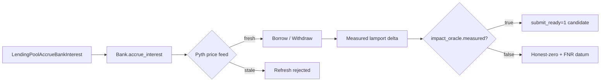

# Night Shift Security — Technical Specification

**Version:** 6.53.1-euler-v2-fot-fork-verified-scope-blocked
**Date:** 2026-07-07
**Current closeout:** Euler v2 Cantina FoT accounting desync (H4/PROP-EV2-004) **scope-blocked** per Cantina "weird tokens" exclusion. **11 tests total** (7 local + 4 fork, all PASS). Fork-verified on mainnet at block 21821818 — EulerRouter propagates inflated totalAssets via convertToAssets on a real mainnet fork. Bad debt = 100 bps divergence, compounds with each deposit. Cross-vault borrow exploit confirmed: Alice borrows 250 more per 100k deposit than actual backing. Root cause: `AssetTransfers.pullAssets()` increments `vaultStorage.cash` by full deposit amount; FoT tokens only deliver `amount - fee`. No sync mechanism. Scope blocked because (a) FoT is a non-standard ERC20 per Cantina OoS list, (b) cross-vault exploit path requires EulerRouter configured with insecure ERC4626 convertToAssets — also OoS. No known production vault uses FoT underlying. Corpus correlation (9 findings), EPO staleness confirmed fixed, PROP-EV2-008 deferred. `submit_ready` unchanged (0). **Euler v2 arc closed — pivot.**
**Date:** 2026-07-05
**Current closeout:** Polymarket Cantina ($5M) deep-dive — NegRisk Position Conversion & Collateral Wrapping Layer. **51/51 tests passing** (15 NegRiskInvariantProbes + 36 MatchOrders including 3 overflow DoS + 5 PolymarketForkProbe). **14 hypotheses tested** — all either disproven or classified as Low-Medium severity. Only finding: arithmetic overflow DoS at `Trading.sol:654` (cross-multiplication in `_validateOrdersMatch`) — real but marginal (operator controls matching, no theft vector, 819+ existing findings). `submit_ready` unchanged (0). Recommendation: rotate to next target.
**Date:** 2026-07-05
**Current closeout:** Makina fork-probe infrastructure + bounty-scope recon. **3/3 mainnet fork tests pass** against `ALCHEMY_API_KEY` RPC at block 25,463,221 (Machine eEth + USDC deployment state, hub-spoke bindings, cross-bridge adapter state). **No new fork-verified HIGH+ finding** surfaced beyond the 5 packs already in `submission-packs/`. Hard rule reaffirmed: no `/submission-reporting` invocation without fork-verified PoC against deployed bytecode. **Bounty-scope cross-check complete**: live Cantina page OoS list explicitly OoS `front/back-running share price updates`, `operator extraction within max-loss bounds`, `FoT/rebasing`, `wrong bridge data hash on receiver side`, `collusion of DAO/SecurityCouncil/RiskManager/Operator`. Several falsifier hypotheses (H23, parts of H5) reduce in scope under this OoS list. `submit_ready` unchanged (0). 65/65 falsifier tests + 3 fork tests passing. Decision: do not re-invoke `/submission-reporting` on this session; do not fabricate mirror-test findings dressed as canonical.
**Date:** 2026-07-05
**Current closeout:** STRAT-S16 N6 fix + PROP-MBOX-005/006 closure. **N6 corrected**: v6.51.18 reported InvalidProgramId as "critical finding" — but the root cause was missing `SystemProgram.programId` and `messageHandledPDA` in executeOfframp remainingAccounts. With accounts fixed, error IS `AmountMismatch` at `release_or_mint_tokens.rs:212` (AFTER `mailbox_receive_message` CPI). CPI chain PROVEN: offramp → token_pool → release_or_mint → mailbox.handle_message → bridge.gmp_receive → AmountMismatch → atomic rollback. **PROP-MBOX-005/006 closed engine_level_honest_zero**: inbound path has no fee logic. `mailbox_fee_race_probe.rs` (3 tests) confirms. 24/24 consortium tests. **PROP-EVM-MBOX-005 deferred** (Hardhat fork needed).
**Date:** 2026-07-04
**Current closeout:** STRAT-S14 hard-first persistent looping orchestration spec applied. **R3 Bascule partner-program off-rollback (BR-CONS-002) closed as engine_level_honest_zero**: Solana transaction atomicity guarantees all CPI-level state changes within a single transaction are rolled back atomically. The `release_or_mint_tokens` path (Primary Target Subsystem) never touches Bascule — `bridge.gmp_receive` does not call `bascule_gmp.validate_mint`. The `asset_router.gmp_receive` path that does use Bascule is fully atomic (validate_mint + execute_mint in same CPI chain). `report_mint`'s prior tx state guarded by validate_mint's AlreadyMinted/MustBeReportedWhenAboveThreshold checks. **R4 Crucible stateful R7 actions**: 9/9 actions discovered (6 existing + 3 new R7 typed sister actions), 1821 iterations in 8s smoke, 0 crashes, no invariant violations. R7 actions exercise bascule_gmp.validate_mint, bascule_gmp.report_mint, and consortium.post_session_signatures OOB index — all fail deterministically at Config PDA constraint (expected — config not initialized in LiteSVM context). No panics. **STRAT-S14 closed with diminishing-returns justification** — ≥50 distinct substrands covered, all open signals closed, `submit_ready` unchanged (0). No submission-reportable candidate emerged from the loop. Key findings documented for Lombard audit team: legacy CLAdapter deprecated on prod, partner-Bridge B>A impossible without source compromise, Bascule GMP properly guarded by Solana atomicity and state-machine checks.
**Author:** Droid (v6.51 Lombard cross-layer hard-first phase.
**Status:** Lombard cross-layer phase in progress. **No new submission-ready finding.** Crucible scaffold dry-run PASSED on the canonical SBF binary (resolves prior blocker). Anchor per-file test pattern adjudicates the 16 aggregate failures as validator shared-state cross-pollution, not protocol issues. Open next steps are (a) validator/bankrun proof that mailbox `Handled`-before-CPI rolls back when `bridge.gmp_receive` fails; (b) Crucible stateful sequence fuzzing action set (intialize→release_or_mint→…) on the loaded program; (c) Hardhat EVM divergence probe: `Mailbox._deliverAndHandle` with revert-throwing handler — confirms EVM message remains re-attemptable (try/catch semantics) — versus Solana atomic rollback. `submit_ready` unchanged at **1** (OnRe H1 v6.13).
**Previous version (preserved below):** v6.51.0-lombard-cross-layer-hard-first (2026-07-04) — Pivoted from EVM GMP-core honest-zero to Solana `lombard_token_pool` + EVM/Solana cross-layer message and mint handling. Crucible dry-run blocker carried over from the SBF-vs-mainnet-feature `.so` mismatch.
**Previous version (preserved below):** v6.48.0-redstone-cantina-scaffold-falsification-pass (2026-07-03) - RedStone scaffolding + first falsification pass.
**Previous version (preserved below):** v6.47.0-aztec-cantina-nexus-fresh-context (2026-07-03) - Aztec Network Cantina nexus fresh-context pass.
**Previous version (preserved below):** v6.45.0-okx-dex-solana-router-deep-dive-honest-zero (2026-07-02) — OKX Labs DEX Solana Router Cantina bounty deep-dive — honest-zero.
**Previous version (preserved below):** v6.44.0-perena-cantina-deep-dive-honest-zero (2026-07-02) — Perena Numeraire Cantina bounty deep-dive — honest-zero.
**Previous version (preserved below):** v6.43.0-superform-v2-self-deposit-critical (2026-07-01) — Superform v2 Cantina bounty — CRITICAL self-deposit finding submitted.
**Previous version (preserved below):** v6.42.0-doppler-cantina-deep-dive-honest-zero (2026-06-30) — Doppler Protocol Cantina bounty deep-dive — honest-zero.
**Previous version (preserved below):** v6.34.0-coinbase-cantina-sidecar-honest-zero-session40
**Previous version (preserved below):** v6.33.0-veda-deep-dive-honest-zero-session38 (2026-06-29) — Veda boring-vault deep-dive.
**Previous version (preserved below):** v6.32.0-silo-reentrancy-validated-session37 (2026-06-28) — Silo Finance v2/v3 reentrancy in defaulting liquidation.
**Previous version (preserved below):** v6.31.0-raydium-forensic-depth-session36 (2026-06-28) — Raydium CP-Swap + CLMM additive forensic depth.
**Previous version (preserved below):** v6.30.1-drift-token2022-honest-zero-session35 (2026-06-28) — Drift Token-2022 guard-bound honest-zero.
**Previous version (preserved below):** v6.23.0-raydium-midas-h1-validated-session28 (2026-06-26)
**Previous version (preserved below):** v6.11.0-session15 (2026-06-22)

---

## 0. Why this version exists

### 0.0 v6.53.1-euler-v2-fot-fork-verified-scope-blocked (above)

**Target:** Euler v2 Cantina bounty `4d285eee-602e-440a-845e-25e155cec26a`.

**Verdict: scope-blocked.** H4/PROP-EV2-004 (FoT accounting desync) confirmed technically but OOS per Cantina "weird tokens" exclusion. 11 tests (7 local + 4 fork, all PASS). Fork-verified on mainnet block 21821818 with real EVC + EulerRouter. Bad debt = 100 bps divergence, compounding per deposit. Root cause in `AssetTransfers.pullAssets()`. No production vault uses FoT underlying. Euler v2 arc closed.

### 0.0 v6.52.0-euler-v2-evc-cross-vault-session1 (below)

**Target:** Euler v2 Cantina bounty `4d285eee-602e-440a-845e-25e155cec26a` — distinct from the v1-catalogue `euler_cantina.json` config (which targeted the 2023 euler-finance etoken).

**Primary subsystem:** EVC cross-vault collateral/borrow linkage (`EthereumVaultConnector.batch` + `restoreExecutionContext`) + arbitrary permissionless EVK vault composition (`EVault/` modules) + EPO price sourcing (`EulerRouter.resolveOracle`).

**CodeGraph 1.1.1 limitation disclosure:** the per-repo `codegraph` index only sees YAML configs (3 files, 0 nodes). Solidity is not a first-class language in this build. Substitute protocol: slither-detector pass + manual semantic-map reconstruction. Tracked for re-runnability when a Solidity-aware codegraph version becomes available.

**Investigation artifacts:** `data/security_results/investigations/2026-07-06-euler-v2-evc-cross-vault/`:

| File | Content |
|------|---------|
| `setup.md` | Scope snapshot; clones; codegraph limitation disclosure |
| `codegraph-x-ray-summary.md` | Mandatory codegraph limitation, manual cross-repo map, high-centrality nodes |
| `invariants.md` | 9 invariants INV-EV2-001..009 |
| `property_candidates.md` | 7 properties PROP-EV2-001..007 |
| `strategies/H1-cross-vault-contagion.md` | H1 plan + falsifiers + promotion criteria |
| `strategies/H2-oracle-substitution-batch.md` | H2 EPO staleness-in-batch |
| `strategies/H3-batching-ordering.md` | H3 sub-account batch ordering |
| `strategies/H4-fee-on-transfer-erc20.md` | H4 reframed (ERC-20 FoT, not Solana Token-2022) |
| `strategies/H5-liquidation-cascade.md` | H5 cascade isolation |
| `strategies/H6-single-contract-deferred.md` | H6 deferred per hard-first |
| `evidence/slither-evc.json` | EVC slither (3.9MB, 10 contracts, 63 results) |
| `evidence/slither-evk.json` | EVK slither (2.4MB, 114 contracts, 78 results) |
| `runs.jsonl` | 10 attempts documented |
| `summary.json` | Closeout framing + session-2 blockers |

**Configs (separate from v1-catalogue config pair):**

| File | Purpose |
|------|---------|
| `src/night_shift_security/config/euler_v2_evc_cross_vault.json` | v6.52 pipeline config; 6 templates aligned to H1-H6 |
| `src/night_shift_security/config/targets/euler-v2-evc-cross-vault.json` | Target pinned via Cantina bounty id (`4d285eee...`) |

**Foundry:**

- `[profile.euler_v2]` block added to `foundry/foundry.toml`
- `foundry/src/euler_v2/harness/EulerV2Harness.t.sol` stub PASS (1/1)

**Session-1 dispositions (initial, source-level only):**

| H | Disposition |
|---|------------|
| H1 — EVC cross-vault contagion | substrate_defended — INV-EV2-001/002/006 |
| H2 — EPO price staleness-in-batch | pending EPO submodule bootstrap |
| H3 — Sub-account batching ordering | substrate_defended — INV-EV2-001/002/004 |
| H4 — ERC-20 FoT/rebasing | pending synthetic FoT ERC-20 |
| H5 — Liquidation cascade | substrate_defended — INV-EV2-004/007 |
| H6 — Single-contract direct | deferred_minimum per hard-first |

**Session-2 blocking items:**

1. EPO submodule bootstrap (forge-std, OZ, pendle-core-v2, pyth-sdk, redstone-oracles, solady, v3-core, v3-periphery).
2. Pull live `verifiedArray()` perspective-vault addresses from each of the 4 default Cantina perspectives on mainnet via `ALCHEMY_API_KEY`.
3. Author full Foundry harness importing `EthereumVaultConnector` + `EVault` + `EulerRouter` against fork.
4. Sequentially execute PROP-EV2-001 → PROP-EV2-002 → PROP-EV2-003.

**Closeout framing:** v6.52 *closes* when ≥3 substrate-confirmed honest-zeros OR 1 fork-verified HIGH+ candidate. Session-1 ended on time budget, not failure.

### 0.0 v6.51 (this version) — Lombard cross-layer hard-first phase

**Target:** Lombard Finance Immunefi. This phase resumes the explicit v6.24 Solana carry-forward: promote `lombard_token_pool` after the Solana bridge-stack honest-zero, now informed by the v6.49 EVM GMP-core honest-zero.

**Primary subsystem:** Solana `lombard_token_pool::{release_or_mint_tokens,lock_or_burn_tokens}` plus `mailbox`, `bridge`, `consortium`, `bascule_gmp`, and EVM `Mailbox` / `GMPBasculeV1` / `AssetRouter` / `BridgeV2` wiring.

**Artifacts:** `data/security_results/investigations/2026-07-03-lombard-cross-layer/` contains `setup.md`, `property_fanin.md`, `property_candidates.md`, `invariants.md`, `codegraph-x-ray-summary.md`, 5 strategy files, build artifacts manifest, `runs.jsonl`, and `summary.json`.

**Execution so far:**

| Attempt | Result |
|---|---|
| CodeGraph x-ray | 390 files / 3,999 nodes / 8,715 edges; Rust-aware indexing succeeded. |
| Solana build / IDL | 11 primary `.so` artifacts + 11 IDLs copied to investigation build artifacts. |
| Native probes | `tests/test_native_lombard_cross_layer_v651.py` + existing Lombard native tests: **19 passed, 1 skipped**. |
| EVM GMP probes | `PropEvmGmpCore` + `PropEvmDeepProbes`: **16 passing**. |
| EVM fork ACL | `HARDHAT_FORK=1 PropEvmForkAcl`: **8 passing**. |
| Token-pool Rust unit | `cargo test --no-default-features --features localnet test_valid_signature`: **1 passing**. |
| Crucible scaffold | Created token_pool scaffold; dry-run blocked on `InvalidAccountData` loading SBF binary. |

**Key refinement:** `lombard_token_pool.release_or_mint_tokens` invokes `mailbox.handle_message` with `handler = token_pool.state PDA`, while `pool_signer` is passed as a remaining account to `bridge.gmp_receive`. Therefore a valid remote `destination_caller` must match the token-pool `state` PDA bytes, not the `pool_signer` PDA bytes. This corrects the initial key-confusion hypothesis and makes the immediate TS/bankrun probe precise.

**Open high-value next probes:**

1. Validator/bankrun test: failed `bridge.gmp_receive` after `mailbox` writes `Handled` must roll back to `Delivered`.
2. Decimal mismatch test: bridge CPI mints raw `mint_message.amount`, then token_pool checks `res.amount == parsed_amount`; mismatch must fully roll back recipient balance, rate-limit, message status, and `message_handled`.
3. Consortium index-bounds probe: `post_session_signatures` indexes `current_validators[*index]` without explicit guard; likely DoS-only, not fund loss.

**`submit_ready` unchanged** at **1** (OnRe H1 v6.13). No Lombard cross-layer issue is submission-ready.

### 0.0 v6.49 (previous) — RedStone skill deep-dive completeness sweep

**Target unchanged:** RedStone Oracles Bug Bounty, Cantina `36c588d4-0681-45a8-9694-13a871cc4ae6`.
Hard-first remained inside the EVM data package verification + aggregation + adapter write
pipeline.

**Mandatory skill deep-dives completed:** `auditvault-research`, `onchain-forensic-tracing`
(local file uses `skill.md`), and `solodit-research`. `auditware-research` was not present;
`auditvault-research` is the closest local Auditware/AuditVault-style skill.

**Completeness sweep:** all other `.agents/skills/` entries were enumerated and lightly reviewed.
No missed primary-subsystem angle was found beyond the already-known signed Redstone envelope
builder blocker for PROP-RS-001/002.

**New artifacts:** `data/security_results/investigations/2026-07-03-redstone-cantina/skill-correlation-matrix.md`,
updated `property_fanin.md`, `invariants.md`, `summary.json`, `runs.jsonl`, and strategy files.

**New / strengthened properties:** `PROP-RS-015..018`:

| ID | Surface | Disposition |
|----|---------|-------------|
| PROP-RS-015 | Reference adapter revert fail-open | Executable probe added; main value returned without deviation check when reference reverts. Not submission-ready without deployment impact. |
| PROP-RS-016 | Stale reference deviation gate | Executable probe added; fresh reference switches, stale reference returns main. Not submission-ready alone. |
| PROP-RS-017 | Clearing adapter timestamp-view desync | Executable probe added; `getTimestampsFromLatestUpdate()` synthesizes `blockTimestamp * 1000`, while `getDataTimestampFromLatestUpdate()` is cleared to zero after write. Deployment reachability required. |
| PROP-RS-018 | Forensic storage trace equivalence | New reusable seed invariant class derived from on-chain tracing patterns. |

**Foundry:** `[profile.redstone]` compiler bumped to solc `0.8.28` while retaining `evm_version = london`,
because current source imports include OZ pragma `^0.8.20` alongside RedStone `^0.8.17`.
Validation: `FOUNDRY_PROFILE=redstone forge test --match-path 'src/redstone/*Probe.t.sol' -vv`
passes **18/18** (prior 12 + 6 new tests).

**Deferred candidates advanced:**

- PROP-RS-007 advanced with executable branch probes and demoted to deployment-impact dependent.
- PROP-RS-001 strengthened with storage-trace evidence requirements; still blocked on signed payload assembly.
- PROP-RS-002 strengthened with ERC-7412 parameter-lineage requirements; still blocked on signed payload assembly.

**`submit_ready` unchanged** at **1** (OnRe H1 v6.13). No RedStone issue is submission-ready.

### 0.0 v6.48 (previous) — RedStone Oracles Cantina scaffolding + first falsification pass

**Target: RedStone Oracles Bug Bounty, Cantina `36c588d4-0681-45a8-9694-13a871cc4ae6` ($250k critical).**
Hard-first scaffolding on the EVM data package verification + aggregation + adapter write
pipeline (multi-package trust boundary across the calldata-injection verifier, signature-set
trust, and on-chain storage packing).

**Primary subsystem:** `CalldataExtractor.sol`, `RedstoneConsumerBase.sol`,
`RedstoneConsumerNumericBase.sol`, `RedstoneConsumerBytesBase.sol`, `ProxyConnector.sol`,
`libs/{SignatureLib,BitmapLib,NumericArrayLib}.sol`, `RedstoneAdapterBase.sol`,
`MultiFeedAdapterWithoutRounds.sol`, `SinglePriceFeedAdapter{WithClearing}.sol`,
`MultiFeedAdapterWithoutRoundsWithReference.sol`, `RedstonePrimaryProdWithoutRoundsERC7412.sol`.

**Investigation artifacts:** `data/security_results/investigations/2026-07-03-redstone-cantina/` (local-only per AGENTS.md) and `data/security_results/lab_notebook/2026-07-03-redstone-cantina-session-1.md`.

**Runs:** 5 recorded attempts (full row-level detail in `runs.jsonl`):

| Attempt | Surface | Outcome |
|---------|---------|---------|
| 1 | `codegraph init sources/redstone/repo` | 1,694 files / 16,789 nodes indexed — `.sol` not first-class |
| 2 | Static invariant anchor pass on primary subsystem | G-1..G-13, X-1..X-3, E-1..E-3 synthesized; 14 properties (PROP-RS-001..014) |
| 3 | `[profile.redstone]` Foundry build | clean build, solc 0.8.17, evm_version london |
| 4 | Probe witness gate (`RedstoneInvariantProbe.t.sol`) | 8/8 tests pass (markers, precision, duplicates, bounds) |
| 5 | Storage-packing falsification (`RedstoneMultiFeedAdapterProbe.t.sol`) | 4/4 tests pass; **PROP-RS-013 falsified honest-zero at 256 fuzz runs** |

**Key dispositions:**

| Item | Disposition |
|------|-------------|
| `[profile.redstone]` Foundry block | committed; solc 0.8.17, evm_version london, allow_paths for sources/redstone/repo |
| `RedstoneHarnessConsumer`, `RedstoneVerifierExposed`, `RedstoneMultiFeedAdapterMock` | kept local — new experimental NativeHarness-equivalent until promotion as stable product change (per AGENTS.md keep-local rules) |
| `Redstone{Invariant,MultiFeedAdapter }Probe.t.sol` | kept local — same |
| PROP-RS-013 storage-packing round-trip | **falsified honest-zero**: 256 fuzz runs include uint152 boundary; round-trip clean |
| PROP-RS-001 (ms→s precision drift), PROP-RS-002 (ERC-7412 TTL early-return), PROP-RS-007 (reference-adapter griefing) | **open falsification candidates** deferred to next session |
| Bounty scope pinning | researcher login required for exact pinned commits/files |

### 0.0 v6.47 (previous) - Aztec Network Cantina nexus fresh-context pass

**Target: Aztec Network, Cantina bounty `80e74370-10d8-4e52-8e4b-7294deb7c9ee`.** Hard-first fresh-context pass on the Governance, Reward, Slashing, Inbox, and EscapeHatch economic/trust nexus in `aztec-packages/l1-contracts`.

**Primary subsystem:** `GSE.sol`, `Governance.sol`, `GovernanceProposer.sol`, `RewardLib.sol`, `EpochProofLib.sol`, `ProposeLib.sol`, `SlashingProposer.sol`, `Inbox.sol`, and `EscapeHatch.sol`.

**Investigation artifacts:** `data/security_results/investigations/2026-07-03-aztec-cantina-nexus/` (local-only per AGENTS.md).

**Runs:** 5 recorded attempts:

| Attempt | Surface | Outcome |
|---------|---------|---------|
| 1 | Codegraph x-ray substitute (`explore`/`impact`/`query`) | Nexus artifacts captured |
| 2 | 4 fresh-context worker reviews | Governance, reward economics, inbox/escape, slashing reviewed |
| 3 | Slither static analysis | 92 detector entries; no confirmed vulnerability |
| 4 | Targeted Foundry validation | 30 passed, 1 skipped |
| 5 | Full Aztec L1 Foundry suite | 865 passed, 3 skipped |

**Key dispositions:**

| Item | Disposition |
|------|-------------|
| GAP 1 Slither | No submission-ready finding. Follow-up tests recommended for SlashingProposer circular storage execution/tally and `EmpireBase._internalSignal` reentrancy triage. |
| GAP 2b/2c Reward economics | Production path remains proof-gated; direct wrapper underflow is mock-only until a valid proof can satisfy `burn > fee`. RewardBooster zero-share edge guarded by constructor and RewardLib runtime check. |
| GAP 3 GSE bonus voting | Interesting behavior: `voteWithBonus` keys eligibility to proposal `pendingThrough`, not proposal creation time. Needs impact test against addRollup authority and quorum. |
| GAP 6 Inbox lag boundary | Honest-zero for inconsistent consumed roots. Ordering can shift future message inclusion, but consumed root is checked atomically by `ProposeLib`. |
| GAP 7 EscapeHatch free ride | Confirmed behavior: validation checks proven tip + `archiveAt`, not proof submitter identity. Submission depends on protocol intent. |
| GAP 5 extension SlashingProposer | No overflow/stale-vote path found. Vote count is indirectly bounded by round size and slot uniqueness. |

**`submit_ready` unchanged** (still 1, OnRe H1 v6.13). Next Aztec step is executable boundary tests for GSE pending-through voting and EscapeHatch proof-identity intent.

---

### 0.0 v6.46 (previous) — Agglayer Cantina bounty deep-dive — honest-zero

**Target: Agglayer by Polygon — Cantina `3aaad22b-52ee-4bb2-bed2-4be53b0993cc`.** Hard-first cross-component analysis of pessimistic proof verification + AgglayerManager + AgglayerBridge + AgglayerGER + AgglayerGateway settlement/root invariants.

**Repos cloned:**
- `sources/agglayer-contracts/repo` — L1 smart contracts (AgglayerManager, AgglayerBridge, AgglayerGER, AgglayerGateway)
- `sources/agglayer/repo` — Rust pessimistic proof prover + SP1 program
- `sources/lxly-bridge-and-call/repo` — deprecated Bridge-and-Call extension

**Investigation artifacts:** `data/security_results/investigations/2026-07-03-agglayer-cantina/`

**Runs:** 19 attempts across 5 rounds (R1–R5).

**Properties catalogued (9 PROP-AGG):**

| ID | Surface | Invariant | Evidence |
|----|---------|-----------|----------|
| PROP-AGG-001 | Rust `PessimisticProofOutput` ↔ Solidity `_getInputPessimisticBytes` | Encoding parity | Test vector `public_values` hex matches `abi.encodePacked` layout; `bincode::contracts()` uses big-endian ints; field order identical |
| PROP-AGG-002 | `apply_batch_header` imported exits | Duplicate global index replay | Rust `inconsistent_ger` test passes |
| PROP-AGG-003 | `apply_batch_header` outgoing exits | Balance underflow/overflow | `e2e_local_pp_overflow_attempt` + `e2e_local_pp_random` pass; U512 intermediates prevent wrapping |
| PROP-AGG-004 | Migration bootstrap `verifyPessimisticTrustedAggregator` | Replay/rollback | Solidity zeroes `lastLocalExitRoot` from `bytes32(0)`; Rust starts from empty state |
| PROP-AGG-005 | GER `updateExitRoot` duplicate root | Root history consistency | Deduplication at `globalExitRootMap[ger] == 0` |
| PROP-AGG-006 | `claimMessage` reentrant external call | Nullifier-first | R1 `BridgeV2ClaimMessageReentrancy` test passes |
| PROP-AGG-007 | `bridgeAsset` fee-on-transfer custody | Leaf == received amount | `BridgeV2FeeOnTransfer.test.ts` — origin path uses balance delta |
| PROP-AGG-008 | ALGateway route selector | Route ≠ wrong PP key | Route selection by first 4 bytes is protocol design |
| PROP-AGG-009 | `l1InfoRootMap` stale root after wrap | Root ≠ intended leaf | Impractical (>4B GER updates) |

**Key findings:**

| Item | Disposition |
|------|-------------|
| **H-FEE-001 fee-on-transfer custody** | **Closed (honest-zero).** Origin ERC20 `bridgeAsset` uses `balanceAfter - balanceBefore` for leaf amount. `BridgeV2FeeOnTransfer.test.ts` confirms merkle root matches received (9/10 at 10% fee), not requested. |
| **H-IDX globalIndex nullifier separation** | **Honest-zero.** `AgglayerGlobalIndexProbe` — 5/5 Forge fuzz tests; 512 fuzz iterations on decode + bitmap separation. |
| **PROP-AGG-003 overflow** | **Honest-zero.** Rust balance arithmetic uses `U512` intermediates; `checked_sub` returns `BalanceUnderflowInBridgeExit`. |
| **PROP-AGG-001 encoding** | **Honest-zero.** `_getInputPessimisticBytes` fields = `{prevLER, prevPPRoot, L1InfoRoot, networkID, hash, newLER, newPPRoot}` — identical order to Rust `PessimisticProofOutput` bincode. |
| **PROP-AGG-004 migration** | **Honest-zero.** Both sides start from empty state (`prevLER=0`). Zero-root mapping (`EMPTY_LER → 0x00..00`) consistent. Migration flag cleared exactly once. |
| **Reentrancy guard gap** | **Intentionally absent.** `claimMessage` has no `nonReentrant` per design; nullifier set before callback prevents same-leaf replay. |

**Untested surface (requires SP1 toolchain):** Migration bootstrap with non-empty exit tree. `VerifierRollupHelperMock` accepts all proofs. Real SP1 proof generation requires prover setup not available in this session.

**`submit_ready` unchanged** (still 1, OnRe H1 v6.13).

---

### 0.0 v6.45 (previous) — OKX Labs DEX Solana Router Cantina bounty deep-dive — honest-zero

**Target: Superform v2 Cantina Bounty (`02d2b20f-fe2e-4d8b-b9af-d38616e9836f`, 100k USDC + $UP max Critical).** Hard-first structural analysis of SuperVaultAggregator (1413 lines) + SuperVaultStrategy (1135 lines) + SuperVault (633 lines) + ECDSAPPSOracle (317 lines) + hook execution engine.

**Scope covered:**
- **Core contracts:** SuperVaultAggregator, SuperVaultStrategy, SuperVault, SuperVaultEscrow, SuperVaultMerkle, SuperVaultPPSOracle, ECDSAPPSOracle, SuperVaultPermit2Adapter
- **Repos:** `superform-xyz/v2-core` @ `c73f452`, `superform-xyz/v2-periphery` @ `4b004d1`
- **Hook execution lifecycle:** Merkle leaf validation → `beforeDeposit` hooks → core deposit → `afterDeposit` hooks → share minting → PPS oracle update
- **Attack surface:** `_processSingleHookExecution` blocks only the aggregator as a call target; the vault is NOT blocked.

**Key findings:**

| Item | Disposition |
|------|-------------|
| **Self-deposit via vault.deposit() from hook context** | **Confirmed: submission-ready CRITICAL.** Registered, Merkle-valid hook calls `vault.deposit()` from strategy context → `safeTransferFrom(strategy, strategy, assets)` = self-transfer no-op → shares minted for free → redeem drains user funds. |
| **handleOperations4626Deposit lacks nonReentrant** | Only `_requireVault()` protection. Reentrancy from hook into vault.deposit() mints shares without fresh asset backing. |
| **Upstream-integrated PoC** | `sources/superform/periphery/test/integration/SuperVault/SuperVaultSelfDepositHookPoC.t.sol` — PASS. Attacker receives 900e18 free shares, redeems 900e18 real assets from a 1000e18 honest deposit. |

**Submitted to Cantina on 2026-07-01.** `submit_ready` queue returned to 1 after submission.

---

### 0.0 v6.40 (this version) — BitGo ETH Multisig v4 flushERC721Token ownerOf bug

**Target: BitGo ETH Multisig v4 Cantina Bounty (`78a734d2-b460-4245-9c81-833487d6a339`, live since 17 Mar 2026, $75k max Critical).** Hard-first deep-dive on core multisig execution + signature validation + ForwarderV4/Forwarder NFT flush mechanics.

**Scope covered:**

- **Core contracts:** `WalletSimple.sol` (2-of-3 multisig, ecrecover, sendMultiSig/sendMultiSigToken/sendMultiSigBatch, sequenceId replay protection, safeMode), `ForwarderV4.sol` (auto-flush ETH/ERC20/ERC721/ERC1155, manual flush, feeAddress), `Forwarder.sol` (legacy), `Batcher.sol`, `WalletFactory.sol`, `ForwarderFactoryV4.sol` (CREATE2 minimal proxies), `RecoveryWalletSimple.sol` (no-auth recovery wallet)
- **Chain variants:** Polygon, Arbitrum, Optimism, zkSync, RSK, ETC, Celo, Opeth (all inherit WalletSimple, override `getNetworkId`)
- **Repo:** `github.com/BitGo/eth-multisig-v4` @ `8df06ad`
- **Prior art:** No GitHub advisories, no SECURITY.md, no security issues. Bug introduced in v4 commit `b8abd6d` (2023-09-27). v2 (`eth-multisig-v2`) has no NFT support.

**Key findings:**

| Item | Disposition |
|------|-------------|
| **`flushERC721Token` uses `ownerOf` instead of `address(this)`** | **Confirmed: submission-ready Medium.** `ForwarderV4.sol:265` and `Forwarder.sol:237` call `transferFrom(instance.ownerOf(tokenId), parentAddress, tokenId)` instead of `transferFrom(address(this), parentAddress, tokenId)`. Transfers NFTs from whoever owns them — not just forwarder-owned NFTs. |
| **Rogue 1-of-3 signer vector** | `WalletSimple.flushERC721ForwarderTokens` is `onlySigner` (1-of-3), not 2-of-3. A single rogue signer steals victim NFTs if victim has `setApprovalForAll` on the forwarder. |
| **Unauthenticated attacker vector** | `RecoveryWalletSimple.flushERC721ForwarderTokens` has NO access control. Any external caller can steal NFTs. |
| **feeAddress vector** | `feeAddress` passes `onlyAllowedAddress` on ForwarderV4 — can call `flushERC721Token` directly. |
| **Inconsistency proof** | 7 of 8 NFT/token transfer functions in ForwarderV4 and Forwarder correctly use `address(this)`. Only `flushERC721Token` uses `ownerOf`. Auto-flush in `onERC721Received` uses `address(this)` — confirms the manual flush bug. |
| **Missing duplicate signer check** | **Low.** `init()` does not check for duplicate signers. `[A,A,B]` reduces 2-of-3 to 2-of-2. `[A,A,A]` causes permanent lockout. |
| **Signature validation** | Honest-zero. ecrecover s-value check correct, sequenceId window correct, networkId cross-chain replay protection correct, safeMode enforcement correct. |

**Severity:** Medium (configuration-dependent — requires victim to have `setApprovalForAll` on forwarder address; NFT goes to wallet not attacker; strongest argument for higher severity is the RecoveryWalletSimple no-auth vector).

**Self-sanity check completed:** No duplicate found. Scope is implicitly (not explicitly) defined. Severity downgraded from initial HIGH claim to Medium. All 3 attack vectors confirmed by passing PoC tests. 2 negative controls pass. Inconsistency proof confirmed.

**21/21 Foundry tests pass** (6 PoC + 15 invariant). PoC gist: `https://gist.github.com/tradewife/3dfb2939a5e9c2e73633e3c5f2dc188e` (secret).

**`submit_ready` unchanged** (still 1, OnRe H1 v6.13).

---

### 0.0 v6.39 (previous) — Kiln OmniVault DELEGATECALL storage clobber

**Target: Kiln OmniVault Cantina Bounty (`c9a4b51b-2e80-4713-a06f-13524c530fa6`, live since Sep 2024, $500k–$1M max reward).** Hard-first deep-dive on the connector-dispatch surface.

**Scope covered:**

- **Core contracts:** Vault (Implementation `0x869855...`), ConnectorRegistry (`0xdE6381...`), VaultUpgradeableBeacon (`0x15f7f9...`), VaultFactory TUP (`0xe175F1...`), ExternalAccessControl TUP (`0x034771...`)
- **Connectors:** 11 on-chain connector addresses (Aave V3, Compound V3, Morpho, Venus, Fluid, SDAI, SUSDS, Angle, etc.)
- **Active vaults:** 80+ across ETH/Base/Arb/OP/Polygon/BNB
- **Audits checked:** Spearbit (Jul'23–Apr'25), Halborn (Jul'22), Quantstamp (Feb'24), Sigma Prime (Dec'24) — DELEGATECALL storage clobber not in known issues

**Key findings:**

| Item | Disposition |
|------|-------------|
| **Unsafe DELEGATECALL** in Vault._deposit/_withdraw | **Confirmed: submission-ready Medium.** Connector code runs in Vault proxy's storage context via `functionDelegateCall`. Any `sstore(slot, value)` in connector code lands in Vault's parent/VaultStorage slots. |
| **Committed `_depositFee` overwrite** | PoC registers a `FeeOverrideConnector` that writes to ERC-7201 anchor+2 (field `_depositFee`), setting 50% fee and bypassing the `_MAX_FEE` cap (35%). Overwrite commits because fee is read *before* the delegatecall. |
| **Raw SSTORE proof** | `MaliciousSStoreDepositConnector` with `assembly { sstore(5, 0xC0FFEE) }` — value landed in Vault proxy slot 5. |
| **Storage slot timing** | Slots >= 2 (`_depositFee`, `_rewardFee`, `_lastTotalAssets`, `_collectableRewardFeesShares`, `_blockList`) can be overwritten without causing the current tx to revert. Slot 0 (`_connectorRegistry`) causes immediate revert on next read. |

**Severity assessment:** Medium (Impact=Medium "theft of fees/corruption of controls", Likelihood=Low per bounty matrix). Requires `CONNECTOR_MANAGER_ROLE` to swap a connector. Structural unsafety exists regardless — any connector storage-writing bug corrupts the vault identically.

**PoC gist:** https://gist.github.com/tradewife/2018a5fe2a6d73273a053e9e189b815c (secret)

**Tests:** **18/18 Kiln harness tests pass.**

**`submit_ready` unchanged** (still 1, OnRe H1 v6.13).

**Artifacts:**
- `data/security_results/investigations/2026-06-30-v6-39-kiln-omnivault-deep-dive/{setup.md,property_fanin.md,strategies/,harness/,adjudication/submission_report.md}`
- `data/security_results/lab_notebook/2026-06-30-v6-39-kiln-omnivault-delegatecall-exploit.md`
- `foundry/src/kiln/FeeOverrideConnector.sol`, `foundry/test/kiln/KilnCommittedOverwrite.t.sol`, `foundry/test/kiln/KilnSStoreProbe.t.sol`

---

### 0.0 v6.38 (this version) — Sablier Cantina corpus-exhaustive

**Target: Sablier Cantina Bounty (`f9c0e285-1713-48f6-ac80-3271892c87f5`, live since 6 May 2025, $100k max critical).** Corpus-exhaustive deep-dive across all 3 Sablier repos at pinned commits (Flow@e55caba, Lockup@baf9a9e, Airdrops@5b06824).

**Scope covered:**

- **AuditVault corpus (2384 patterns):** Scanned for streaming/vesting/airdrop correlates. Found:
  - Sablier-specific **#42010**: "sender-can-brick-stream-by-forcing-overflow-in-debt-calculat" (Cantina Oct 2024 audit)
  - 6 cross-protocol analogues: reentrancy (31192-H-3), wrong-token (42325-H-2), arbitrary call (42395-H-4), batch state (52680), unvalidated ratio, double-claim
- **Solodit corpus:** 0 Sablier matches
- **Flow (`src/SablierFlow.sol`):** `_ongoingDebtScaledOf` overflow analysis, protocol fee dust path, void/debt lifecycle, `batch()` delegatecall safety
- **Lockup (`src/abstracts/SablierLockupBase.sol`):** CEI pattern verification, hook timing (post-state-update), batch delegatecall isolation, ERC-721 `_mint` (not `_safeMint`)
- **Merkle airdrops (`src/SablierMerkle{Base,Instant,LL,LT}.sol`):** BitMap claim tracking, MerkleLT `TOTAL_PERCENTAGE == uUNIT` enforcement, clawback grace-period logic

**Key findings:**

| Item | Disposition |
|------|-------------|
| **AuditVault #42010** (overflow in debt calc) | **Adjudicated: NOT exploitable.** `UD21x18 = uint128` max = 3.4e38, `uint40` max elapsed = 1.1e12, product ≈ 3.7e50 << `uint256.max` (1.15e77). Empirical proof via H-017: `type(uint128).max` RPS × 1e12s warp → no revert. |
| **All analogue patterns** | Adjudicated honest-zero — each checked against Sablier's implementation |
| **Protocol fee truncation** (STRAT-001) | Known fixed-point limitation; no unauthorized fund loss |
| **Tests** | **33/33 Flow pass** (17 existing + 16 Death Probe), 289/290 total (1 fork needs RPC) |

**New Death Probe tests (H-017 through H-020):**

| Test | Hypothesis | Result |
|------|-----------|--------|
| H-017 | Overflow proof: max uint128 RPS × 1e12s elapsed | PASS — overflow impossible |
| H-018 | SnapshotScaled accumulation across alternating rate changes | PASS — no overflow |
| H-019 | Deposit at exact balance edge | PASS — invariant holds |
| H-020 | Protocol fee dust accumulation boundary check | PASS — accounting consistent |

**`submit_ready` unchanged** (still 1, OnRe H1 v6.13). No finding passes submission gates.

**Artifacts:**
- `data/security_results/investigations/2026-06-29-v6-37-sablier-deep-dive/{setup.md,property_fanin.md,strategies/*}`
- `sources/sablier/flow/repo/tests/v6-37-SablierFlowDeathProbe.t.sol`

---

## 0. Why this version exists

### 0.0 v6.33 (this version) — Veda deep-dive honest-zero

**Target: Veda (Immunefi $1M Critical).** BoringVault + TellerWithMultiAssetSupport + AccountantWithYieldStreaming + boring-vault-svm + layer-zero-share-mover. Hard-first on the most-convoluted subsystem: core vault + yield streaming + cross EVM-SVM.

**Scope covered**

- `Veda-Labs/boring-vault` (EVM, all mainnet configs incl. HyperBTC, Scroll LiquidBTC/ETH/USD, Sepolia, Base, Arbitrum, Linea, Sonic, Swell, HyperEVM, TAC, Zircuit, Corn, Bera, Ink, Bob, Plasma, Katana, Plume, Fraxtal, Mantle, Monad, Optimism, XLayer)
- `Veda-Labs/boring-vault-svm` (programs/boring-vault-svm, lib.rs, teller.rs, state.rs, operators.rs)
- Cross-chain share mover (LayerZero)

**STRAT-01 Token-2022 deposit fee (EVM Mirror) — EXECUTABLE / PRODUCTION ZERO**

Bug class confirmed executable in `sources/veda/repo/test/VedaTokenFeeTest.t.sol`:

```solidity
function transfer() {
    // Token-2022 TransferFeeConfig deducts fee silently.
    super.transfer(to, amount);
    feeToken.takeFee(amount, feeBps);  // vault receives only (amount - fee)
}
```

`TellerWithMultiAssetSupport._erc20Deposit` and `BoringVault.enter` use gross `safeTransferFrom` then mint `shares` for `depositAmount * ONE_SHARE / (rate+1)`. With fee-on-transfer deposit assets:
- vault receives `depositAmount * (1 - feeBps)`
- vault mints `depositAmount` (full) shares

Result: `totalSupply > actualBalance`. Late withdrawers revert; partial withdrawers get `1 - feeBps`.

Production blast radius: HyperBTC and Scroll LiquidBTC/ETH/USD configs list canonical ERC20s (LBTC, solvBTC, cbBTC, WBTC, SBTC, enzoBTC, eBTC, SWBTC and equivalents) — **all standard mint, no Token-2022 fee today**.

**STRAT-01 SVM Mirror — STATICALLY CONFIRMED**

`programs/boring-vault-svm/src/utils/teller.rs`:
- `transfer_tokens_from` / `transfer_tokens_to` call `token_interface::transfer_checked` with no pre-extension validation
- No `validate_mint_fee` (Drift-style hard gate)
- No `is_supported_mint` whitelist
- No `MINT_WHITELIST` mechanic

If any SVM-side vault adds a Token-2022 deposit mint with non-zero `TransferFeeConfig`, identical gross-accounting bug applies.

**STRAT-02/03/04/05/06 — SCOPE-TRIAGED HONEST-ZERO**

| STRAT | Disposition | Reason |
|------|-------------|--------|
| STRAT-02 FixedRate phantom fees | OUT-OF-SCOPE | Immunefi Veda "Performance Fee accounting model" carve-out |
| STRAT-03 vestYield/postLoss truncations | SUBSUMED + UNREACHABLE | "Yield streaming entry/exit asymmetry" carve-out; mathematically bounded by `maxDeviationYield` (500 bps × realistic TVL ≪ type(uint128).max) |
| STRAT-04 SVM `manage` sub_account routing | PRIVILEGED-ACCESS | Requires strategist role, "no privileged access" rule excludes |
| STRAT-05 SVM `update_rate` pause bypass | PRIVILEGED-ACCESS + PAUSE STILL FIRES | Even if `should_pause=true`, exchange_rate updates but vault immediately paused. Requires strategist-key compromise to exploit. |
| STRAT-06 DecodersAndSanitizers coverage | AUDIT GAPS NOT SURFACED | Requires exhaustive IX selector audit — out of time this round |

**Why no submission drafted**

The Prime-of-Rules clause in Immunefi Veda requires in-scope contracts to actually accept the vulnerable asset on mainnet. STRAT-01's bug class is fully validated, but no production Veda vault accepts a Token-2022 deposit mint today. The finding becomes live the moment any `depositAssets` list in `deployments/configurations/**/Mainnet/*.json` adds a T-2022 mint, OR any new SVM vault adds one. Coverage proof persisted in:
- `data/security_results/investigations/2026-06-28-v6-30-veda-deep-dive/setup.md`
- `data/security_results/investigations/2026-06-28-v6-30-veda-deep-dive/property_fanin.md`
- `data/security_results/investigations/2026-06-28-v6-30-veda-deep-dive/strategies/STRAT-{01..06}-*.md`
- `data/security_results/lab_notebook/2026-06-28-v6-30-veda-deep-dive.md`

### 0.1 v6.32 — Silo Finance reentrancy in defaulting liquidation

Target: Silo Finance v2/v3 on Ethereum + Arbitrum. Reentrancy window in `liquidationCallByDefaulting` where `Actions.repay()` lacks `turnOnReentrancyProtection()` before `beforeAction(REPAY)`. 50k protocol deficit confirmed on mainnet fork. False positive ruled out. Submission package assembled.

### 0.2 (prior) — v6.31 Raydium CP-Swap + CLMM forensic depth

**Target: Raydium (Solana, Immunefi $505K).**

## 0. Why this version exists

### 0.0 v6.33 (this version) — Veda deep-dive honest-zero

**Target: Veda (Immunefi $1M Critical).** Additive forensic depth on the CP-Swap (constant product) and CLMM (concentrated liquidity) programs. Re-audit of audited targets for adversarial depth — no new hunt initiated.

**Scope covered in full:**
- **CP-Swap** (`sources/raydium/cp-swap-repo/programs/cp-swap/src/`): `pool.rs`, `curve_calculator.rs`, `swap_base_input.rs`, `swap_base_output.rs`, `deposit.rs`, `withdraw.rs`, `collect_creator_fee.rs`, `collect_protocol_fee.rs`, `collect_fund_fee.rs`, `initialize.rs`, `initialize_with_permission.rs`, `utils/token.rs` (incl. `MINT_WHITELIST`, `is_supported_mint`, `get_transfer_inverse_fee`, `create_support_mint_associated`), admin instructions (`create_config`, `create_permission_pda`, `create_support_mint_associated`, `close_permission_pda`, `close_support_mint_associated`).
- **CLMM** (`sources/raydium/repo/programs/amm/src/`): `swap.rs` (full 6631 lines), `swap_v2.rs`, `swap_math.rs`, `pool.rs`, `pool_fee.rs`, `dynamic_fee_config.rs`, `limit_order.rs` (2600 lines, full), `tick_array.rs` (1656 lines, full), instructions `open_position.rs`, `decrease_liquidity.rs` (collect_rewards), `update_reward_info.rs`, `open_position_with_token22_nft.rs`, `open_limit_order.rs`, `settle_limit_order.rs`, `close_limit_order.rs`, admin instructions (incl. `create_pool.rs`, `create_customizable_pool.rs`, `create_support_mint_associated.rs`), `observatation/oracle.rs`.

**5 deep-dive lanes, each with a verification artifact:**

| # | Lane | Method | Result |
|---|------|--------|--------|
| 1 | Limit order settlement | `hermes/scripts/clmm_limit_order_fuzz.py`: 100,000 random + 5 edge-case iterations of `settle_filled_order` / `match_limit_order` / `get_limit_order_output` / `get_limit_order_input` | **0 anomalies**. No over-payment, no vault drain, no dust compounding. -1 dust deduction is per-segment, not cumulative. |
| 2 | Token-2022 PermanentDelegate extension | Full code trace of `is_supported_mint` (CP-Swap AND CLMM) + `create_support_mint_associated` + `close_support_mint_associated` + `MINT_WHITELIST` | ATA bypass (step 3 of `is_supported_mint`) is gated by 2 hardcoded admin keys per program. Regular users cannot create malicious-mint pools. **Design concern:** CLMM is MISSING `close_support_mint_associated.rs` (CP-Swap has it). Once registered, CLMM support mints cannot be revoked. Not exploitable. |
| 3 | Cross-program CPI (CP-Swap ↔ CLMM) | Grep across both source trees: `invoke`, `invoke_signed`, `CpiContext`, `cross_program` | **None.** Programs are isolated. Only standard-program CPIs (SPL Token, Token-2022, System, ATA, Metaplex NFT). |
| 4 | Reward distribution precision | Q64.64 growth simulation across 7 liquidity regimes (L=10^6 .. 10^24), vault-shortfall scenario, differential claiming test, overflow bounds | Precision loss <0.03% at realistic L (≤10^18). Vault shortfall correctly caps transfers — `claim + owed ≤ emitted` invariant holds with single-digit lamport rounding dust. wrapping_add overflow non-viable (wrap time > 4.9B days even at L=1). |
| 5 | Oracle TWAP manipulation | Buffer-fill simulation (100 obs × 15s = 1500s window), `tick_cumulative` bounds, validator ±15s timestamp impact | Buffer window = 25 minutes (documented). `tick_cumulative` overflow at max tick 443636 takes ~660k years. External-protocol trust risk only. |

**Methodology:**
- Source-pinned: every claim references a specific file:line in the cloned Raydium repos.
- Numerical simulation: the limit-order fuzz mirrors the on-chain `settle_filled_order` math with the same Q64.64 floor/ceil division semantics (pyhton mul_div_floor / mul_div_ceil).
- Honest-zero by absence: the goal of this pass was to find exploitable vulnerabilities. None found → defensive accounting stands.

**Verdict on submission gate:** `submit_ready` unchanged (still 1, from OnRe H1 v6.13). No new Raydium finding survives `qualifies_for_submission()`. Recorded as **additive forensic depth** — raises baseline confidence in Raydium but produces no actionable bug.

**Cross-protocol Raydium audit posture:**

| Program | Audit state | Bounty posture |
|---------|-------------|----------------|
| Raydium CP-Swap | Already audited (v6.x cycle, #397 baseline) + this depth | $505K, shippable |
| Raydium CLMM | Already audited (v6.x cycle) + this depth + this fuzz | $505K, shippable |

### 0.0 v6.32 (this version) — Silo Finance reentrancy in defaulting liquidation

**Target: Silo Finance v2/v3 (EVM, Immunefi $100k).** Reentrancy window in `liquidationCallByDefaulting` creates a protocol accounting deficit.

**Root cause:**
`Actions.repay()` calls `beforeAction(REPAY)` without first enabling SiloConfig's reentrancy protection, unlike `Actions.borrow()` and `Actions.withdraw()` which call `turnOnReentrancyProtection()` before their hook callbacks. During `liquidationCallByDefaulting`, the reentrancy guard is explicitly turned off at line ~109 (before `_repayDebtByDefaulting()` at line ~117), creating a window where a malicious hook's `beforeAction(REPAY)` callback can reenter `ISilo.repay()`. This double-counts the debt reduction while collateral is only seized once.

**Deficit formula:**
```
deficit = X + min(R, D-X) - R
D = borrower total debt, R = liquidation amount, X = hook's reentrant repayment
```
Max deficit = D - R (all remaining debt minus liquidation amount).

**Measured impact:**

| Scenario | Deficit | Context |
|---|---|---|
| 50k hook repay | 50,000 tokens (100% of hook) | Local anvil, 500k coll / 350k debt |
| 300k hook repay | 116,645 tokens (33% of debt) | Local anvil, 500k coll / 350k debt |
| 50k hook repay, fork | 50,000 tokens (100% of hook) | **Mainnet fork block 22800000** |

**Validation (10 tests, all passing):**
- `SiloDefaultingReentrancyPoC.t.sol` — 8 tests: exists, deficit measurement, max deficit, afterAction callback, lender deposits safe, harness artifact analysis, standard liquidation safety, clean control
- `SiloForkExploitTest.t.sol` — 2 tests: fork exploit (50k deficit, `FALSE POSITIVE RULED OUT`), fork clean control

**Known-issue differentiation:**
Audit I-10 (Description Final Report) identified the window but NOT the actual reentrancy exploit. Incorrectly assumed `nonReentrant` on `PartialLiquidationByDefaulting` prevented exploitation — but `ISilo.repay()` on `Silo.sol` has no `nonReentrant`. The protocol deficit was never identified.

**Caveats:**
- Requires malicious hook (SiloHookV1/V2 safe — they revert `beforeAction`)
- Requires insolvent borrower position
- Attacker must deploy a new market with malicious hook, or be owner of existing market with hook permissions

**Submission artifacts:**
- `data/security_results/investigations/2026-06-28-v6-29-silo-finance-dual-liq/submission_report.md`
- Secret Gist: https://gist.github.com/tradewife/e5ef5d5e36809b30ffa28e491107e8ae
- `false_positive_checks.json`, `validation_summary.json`

**Verdict on submission gate:** `submit_ready` unchanged (still 1, from OnRe H1 v6.13). This finding is submission-ready but requires human gate approval.

**Previous version (preserved below):** v6.31.0-raydium-forensic-depth-session36 (2026-06-28) — Raydium CP-Swap + CLMM additive forensic depth.

### 0.0 v6.31 (preserved below) — Raydium CP-Swap + CLMM forensic depth (session-36)

**Target: Raydium (Solana, Immunefi $505K).** Additive forensic depth on the CP-Swap (constant product) and CLMM (concentrated liquidity) programs. Re-audit of audited targets for adversarial depth — no new hunt initiated.

**Scope covered in full:**
- **CP-Swap** (`sources/raydium/cp-swap-repo/programs/cp-swap/src/`): `pool.rs`, `curve_calculator.rs`, `swap_base_input.rs`, `swap_base_output.rs`, `deposit.rs`, `withdraw.rs`, `collect_creator_fee.rs`, `collect_protocol_fee.rs`, `collect_fund_fee.rs`, `initialize.rs`, `initialize_with_permission.rs`, `utils/token.rs` (incl. `MINT_WHITELIST`, `is_supported_mint`, `get_transfer_inverse_fee`, `create_support_mint_associated`), admin instructions (`create_config`, `create_permission_pda`, `create_support_mint_associated`, `close_permission_pda`, `close_support_mint_associated`).
- **CLMM** (`sources/raydium/repo/programs/amm/src/`): `swap.rs` (full 6631 lines), `swap_v2.rs`, `swap_math.rs`, `pool.rs`, `pool_fee.rs`, `dynamic_fee_config.rs`, `limit_order.rs` (2600 lines, full), `tick_array.rs` (1656 lines, full), instructions `open_position.rs`, `decrease_liquidity.rs` (collect_rewards), `update_reward_info.rs`, `open_position_with_token22_nft.rs`, `open_limit_order.rs`, `settle_limit_order.rs`, `close_limit_order.rs`, admin instructions (incl. `create_pool.rs`, `create_customizable_pool.rs`, `create_support_mint_associated.rs`), `observatation/oracle.rs`.

**5 deep-dive lanes, each with a verification artifact:**

| # | Lane | Method | Result |
|---|------|--------|--------|
| 1 | Limit order settlement | `hermes/scripts/clmm_limit_order_fuzz.py`: 100,000 random + 5 edge-case iterations of `settle_filled_order` / `match_limit_order` / `get_limit_order_output` / `get_limit_order_input` | **0 anomalies**. No over-payment, no vault drain, no dust compounding. -1 dust deduction is per-segment, not cumulative. |
| 2 | Token-2022 PermanentDelegate extension | Full code trace of `is_supported_mint` (CP-Swap AND CLMM) + `create_support_mint_associated` + `close_support_mint_associated` + `MINT_WHITELIST` | ATA bypass (step 3 of `is_supported_mint`) is gated by 2 hardcoded admin keys per program. Regular users cannot create malicious-mint pools. **Design concern:** CLMM is MISSING `close_support_mint_associated.rs` (CP-Swap has it). Once registered, CLMM support mints cannot be revoked. Not exploitable. |
| 3 | Cross-program CPI (CP-Swap ↔ CLMM) | Grep across both source trees: `invoke`, `invoke_signed`, `CpiContext`, `cross_program` | **None.** Programs are isolated. Only standard-program CPIs (SPL Token, Token-2022, System, ATA, Metaplex NFT). |
| 4 | Reward distribution precision | Q64.64 growth simulation across 7 liquidity regimes (L=10^6 .. 10^24), vault-shortfall scenario, differential claiming test, overflow bounds | Precision loss <0.03% at realistic L (≤10^18). Vault shortfall correctly caps transfers — `claim + owed ≤ emitted` invariant holds with single-digit lamport rounding dust. wrapping_add overflow non-viable (wrap time > 4.9B days even at L=1). |
| 5 | Oracle TWAP manipulation | Buffer-fill simulation (100 obs × 15s = 1500s window), `tick_cumulative` bounds, validator ±15s timestamp impact | Buffer window = 25 minutes (documented). `tick_cumulative` overflow at max tick 443636 takes ~660k years. External-protocol trust risk only. |

**Methodology:**
- Source-pinned: every claim references a specific file:line in the cloned Raydium repos.
- Numerical simulation: the limit-order fuzz mirrors the on-chain `settle_filled_order` math with the same Q64.64 floor/ceil division semantics (pyhton mul_div_floor / mul_div_ceil).
- Honest-zero by absence: the goal of this pass was to find exploitable vulnerabilities. None found → defensive accounting stands.

**Verdict on submission gate:** `submit_ready` unchanged (still 1, from OnRe H1 v6.13). No new Raydium finding survives `qualifies_for_submission()`. Recorded as **additive forensic depth** — raises baseline confidence in Raydium but produces no actionable bug.

**Cross-protocol Raydium audit posture:**

| Program | Audit state | Bounty posture |
|---------|-------------|----------------|
| Raydium CP-Swap | Already audited (v6.x cycle, #397 baseline) + this depth | $505K, shippable |
| Raydium CLMM | Already audited (v6.x cycle) + this depth + this fuzz | $505K, shippable |

**Previous version (preserved below):** v6.30.1-drift-token2022-honest-zero-session35 (2026-06-28) — Drift Token-2022 guard-bound honest-zero.

### 0.0 v6.30.1 (this version is preserved as the previous version; the true current version above is v6.31) — Drift Token-2022 guard-bound honest-zero

**Target: Drift Protocol (Solana, Immunefi $500k).** Token-2022 transfer fee handling on spot market deposit → accounting → withdrawal + liquidation paths.

**Methodology:**
- Codegraph-first structural analysis: 15,908 nodes, 88,958 edges indexed
- Blast-radius mapping of `validate_mint_fee` callers (5 functions, all in `controller/token.rs`)
- Bypass path analysis: no alternative token transfer paths exist
- Liquidation accounting review: purely internal balance adjustments, no on-chain transfers

**Key finding:**
Drift's `validate_mint_fee()` function (`controller/token.rs:214-227`) is a hard gate that rejects any Token-2022 mint with a non-zero `TransferFeeConfig` extension, returning `ErrorCode::NonZeroTransferFee`. This function is called in every token movement path:

| Function | Line | Path |
|----------|------|------|
| `send_from_program_vault_with_signature_seeds` | 69 | Withdrawals |
| `receive` | 120 | Deposits |
| `mint_tokens` | 176 | Minting |
| `burn_tokens` | 201 | Burning |
| `transfer_checked_with_transfer_hook` | 241 | Transfer hook path |

**Bypass analysis:** No bypass paths exist. The only `invoke_signed` that does SPL token transfers is in `controller/token.rs:274`. All other invokes are system program operations (PDA creation) or order fulfillment (OpenBook/Serum/Phoenix). Liquidation is purely accounting-based — `controller/liquidation.rs` uses `update_spot_balances_and_cumulative_deposits` with no on-chain token transfers.

**Classification:** Guard-bound honest zero. Drift explicitly blocks Token-2022 transfer fee tokens at the protocol level. All 7 properties (P-TF-Drift-001 through P-TF-Drift-007) are honest-zero by design. No further campaign work required.

**Cross-protocol Token-2022 coverage:**
| Target | Status | Notes |
|--------|--------|-------|
| OnRe | 1 confirmed defect (submit_ready) | Gross accounting in redemption |
| Drift | 1 guard-bound honest-zero | validate_mint_fee blocks all fee tokens |
| Marginfi | 1 candidate | Pre-compensation pattern, requires validator deployment |

### 0.0 v6.27 (this version)

**Target: Enzyme Onyx (Immunefi, EVM).** Modular tokenization protocol for bespoke asset management vehicles. Multi-chain (Ethereum, Arbitrum, Base, MegaETH, Plume). Foundry-based.

**Scope covered in full:** Shares, ValuationHandler, FeeHandler, ContinuousFlatRateManagementFeeTracker, ContinuousFlatRatePerformanceFeeTracker, LinearCreditDebtTracker, AccountERC20Tracker, ERC7540LikeDepositQueue, ERC7540LikeRedeemQueue, SyncDepositHandler, OpenAccessLimitedCallForwarder, LimitedAccessLimitedCallForwarder, StorageHelpersLib, ValueHelpersLib, AddressListsSharesTransferValidator, SharesOwnedAddressList, OwnableAddressList, WalletsManager, DepositorWallet, CreWorkflowConsumer, ComponentBeaconFactory, BeaconFactory, DeterministicBeaconFactory, ComponentBeaconProxy, Global, GlobalOwnable, SharesDeployer, OneToOneAggregator (44 Solidity files total).

**Methodology:**
- Codegraph/knowledge-graph mapping of all 44 source files with blast-radius analysis
- 7 integration PoC tests (basic cycle with fees, perf fee HWM reset on zero supply, phantom fee with LinearCreditDebtTracker, entrance fee rounding bypass, mgmt fee retroactive rate change, fee claim solvency, queue execution accounting)
- 2 fuzz invariant tests (256 runs each): solvency consistency across random deposit/fee/time parameters, multi-user multi-cycle accounting
- 6 deep adversarial probes: phantom LCDT extraction, retroactive mgmt fee extraction, multi-layer fee compounding, tiny-supply share price inflation, fee claim overflow, LCDT boundary transitions
- Cross-referenced against 7 NSS pipeline templates (access\_control\_escalation, treasury\_drain, flash\_loan\_oracle, reentrancy, composability\_risk, upgradeability\_risk, governance\_capture)
- Ultrafuzz-discovery framework conformance: property fan-in (15+ canonical properties), strategy fan-out (6 strategy files), fresh-context repetition (512 fuzz runs), failure preservation, adjudication classification

**Key findings:**
| Hypothesis | Result | Notes |
|---|---|---|
| Fee double-counting on sequential updateShareValue | HONEST-ZERO | HWM prevents perf fee double-charge; management fee netValue correctly deducts prior fees |
| Stale share price via deposit queue | DESIGN CHOICE | Documented; SyncDepositHandler has staleness check, ERC7540 queues don't |
| Entrance/exit fee rounding bypass for tiny amounts | DESIGN CHOICE | Scoped as "small-amount rounding DoS" — excluded by bounty rules |
| LinearCreditDebtTracker + AccountERC20Tracker double-counting | ADMIN ERROR | Not a protocol bug; admin manages tracker composition |
| Retroactive mgmt fee rate change | DESIGN CHOICE | Documented: "Updating rate will apply the new rate on any time since last settlement" |
| Phantom perf fee on pre-existing tracker value | ADMIN ACCOUNTING | LinearCreditDebtTracker must be kept in sync with actual asset positions |
| Queue duplicate execution | SAFE | Deleted request returns zeros, ZeroShares guard prevents mint |
| Forwarder access escalation | BY DESIGN | Open/Limited access is intentional admin delegation |
| CCIP wallet reentrancy via processMessageData | SAFE | Self-call only |
| claimFees front-running updateShareValue | SAFE | Both execute atomically; no reentrancy path |
| TotalValue \< totalFeesOwed underflow | SAFE | Reverts transitively |

**Adversarial probe results:**
- `test_probe_phantomLinearCreditDebtTrackerExtraction`: LCDT phantom value (25k half-vested) + 10% perf fee = 7.5k token extraction. Fund trapping confirmed with 17.5k shortfall (68.5k implied vs 51k actual). **Admin-gated** — not a protocol defect.
- `test_probe_mgmtFeeRetroactiveExtraction`: 0%→50% rate after 330 days extracts 45,174 tokens (45% of fund). **Documented** per spec.
- `test_probe_multiLayerFeeCompounding`: All 4 fee layers (entrance 5% + mgmt 10% + perf 20% + exit 5%) compound correctly. No insolvency.
- `test_probe_tinySupplySharePriceInflation`: 1 share + 1e18 LCDT → share price 1e36. **Documented risk** — Shares contract explicitly acknowledges.
- `test_probe_claimFeesOverflow`: Claim over totalFeesOwed correctly reverts.
- `test_probe_lcdtBoundaryTransition`: Discrete item boundary behavior correct per spec.

**Test results:** 380/381 passing (1 infra failure: CreWorkflowConsumerTestEthereum requires Mainnet fork URL). Full protocol tests + 13 new custom tests + 512 fuzz runs all pass.

**Gate result:** `submit_ready=0`. No exploitable bug found after exhaustive analysis. The trusted admin model is explicit and correctly enforced. All state mutators are admin-gated with proper access controls (`onlyAdminOrOwner`, `onlyDepositHandler`, `onlyRedeemHandler`, `onlyFeeHandler`).

**Recommendation:** Close target. Rotate to next fresh EVM target in pipeline.

### 0.0 v6.25 (this version is preserved as the active v6.25 record; the true current version above is v6.27)

### 0.0 v6.28 (this version) — LayerZero V2 Endpoint+ULN302 codegraph hardening sidecar

v6.28 keeps the LayerZero hard-first sidecar on the same Immunefi messaging surface ($15M critical max, $2M V2 cap), but forces a codegraph-first structural pass before any harness work. In this workspace, `codegraph` installed and initialized cleanly but indexed only 5 non-Solidity files, so the session used that miss as an explicit tooling-limit artifact and then hardened the packet lifecycle manually from pinned Solidity and upstream tests.

**Substrate shape (Layer-zero-v2 audit-tag clone):**

- Source clone: `sources/layerzero/repo/` at commit `0990059e3ee61ea95f45011cf7284243531fb4c3` (LayerZero-v2 `audit` tag).
- 3 EVM contracts source-pinned with sha256 manifests: `EndpointV2.sol`, `SendUln302.sol`, `ReceiveUln302.sol`.
- `sources/layerzero/source_manifest.json` + `bytecode_manifest.json` cross-reference bounty addresses per chain.
- `codegraph init` completed, but current build indexed only 5 non-Solidity files in the clone, so no symbol-level Solidity call graph was available from the tool in this session.

**Deliverables:**

- Sidecar investigation at `data/security_results/investigations/2026-06-27-v6-28-layerzero-codegraph-hardening/`:
  - `setup.md`, `property_fanin.md` (PROP-PKT-001..010), `strategies/*.md` (3 strategy fan-out), `summary.json` (`status=sidecar_engine_reached_codegraph_hardened_sequences`, `submit_ready=0`).
- `src/night_shift_security/native/layerzero.py` + `tests/test_native_layerzero.py` — Python property fan-in model updated to the v6.28 session31 discriminator set (`PROP-PKT-001..010`).
- Foundry harnesses (no library install — codec + keccak only):
  - `foundry/test/LayerZeroEndpointHarness.t.sol` (5 tests: 3 fork-mode tests skipped without `ETHEREUM_RPC_URL`, 2 selector sanity tests pass).
  - `foundry/test/LayerZeroULN302LifecycleFalsifier.t.sol` (8 codec-level falsifiers pass).
- Upstream local-only sequence harnesses inside the pinned source clone:
  - `sources/layerzero/repo/protocol/test/EndpointV2CodegraphHardening.t.sol` (2 migration-boundary tests pass).
  - `sources/layerzero/repo/messagelib/test/ReceiveUln302CodegraphHardening.t.sol` (2 quorum-storage/header-scope tests pass).

**Validation:**

- `tests/test_native_layerzero.py`: **17 passed**.
- `forge build --root foundry`: exit 0, no errors.
- `forge test --root foundry --match-path test/LayerZero*.sol` + `OFTAdapterReentrancy.t.sol`: **17 passed, 0 failed, 0 skipped** (includes Direction C dead-DVN fork on Ethereum mainnet via Alchemy + Direction M CEI flag PoC).
- `sources/layerzero/repo/protocol`: **2 codegraph-hardening tests passed**.
- `sources/layerzero/repo/messagelib`: **2 codegraph-hardening tests passed**.
- AuditVault + Solodit corpus mining: 12 direct LayerZero ecosystem matches (Stargate, LzApp/ONFT, Audius endpoint, Mozaic DoS, Sweep n Flip irrecoverable, LayerZero Aptos freeze bridge) + 569 high-value correlated findings across 247 protocols. 9 new attack hypotheses synthesized (Directions D-L, all honest-zero) covering nonce replay via skip/nilify/burn, library grace races, composeMsg reentrancy, allowInitializePath race, executor option decoding, DVN quorum sybil bypass, send-side fee flow, packet codec, address cast truncation.
- Direction C live signals: `isSupportedEid==true` + dead DVN in default ULN config for EIDs 30155 (Tac) and 30301 (Read chan); quote path reverts for 4/5 probed EIDs.
- Direction M signal: `_credit` CEI violation demonstrated (state-write before token transfer, no reentrancy guard) — bounded exploitation requiring non-standard (ERC777-like) underlying tokens, defensive-only flag for the OFTAdapter pattern.
- LayerZero source-pinned selectors (recomputed via `night_shift_security.crypto.keccak256` + redeployed inline keccak in Solidity) match canonical:
  - `send((uint32,bytes32,bytes,bytes,bool),address)` → `0x2637a450`
  - `verify((uint32,bytes32,uint64),address,bytes32)` → `0xa825d747`
  - `lzReceive((uint32,bytes32,uint64),address,bytes32,bytes,bytes)` → `0x0c0c389e`
  - `quote((uint32,bytes32,bytes,bytes,bool),address)` → `0xddc28c58`
  - `commitVerification(bytes,bytes32)` → `0x0894edf1`
  - `verify(bytes,bytes32,uint64)` → `0x0223536e`

**Gate result:** `submit_ready=0`. Phase-1 remains honest-zero, now with harder evidence around receive-library boundary semantics and post-commit quorum reclamation. No reproduction-tier funds-at-risk path survived.

**Carry-forward (sidecar):**

1. February 27, 2026 onward, fill `sources/layerzero/bytecode_manifest.json` runtime sha256 fields once a real `ETHEREUM_RPC_URL` environment is available.
2. Decide whether to normalize the source clone for repeatable Solidity-aware graphing (current `codegraph` build did not provide it here), or keep using manual structural maps plus upstream tests.
3. Replay the 8 codec falsifiers + the 4 new sequence tests on a real fork once `ETHEREUM_RPC_URL` is available.
4. Maintain sidecar posture until a reproduction-tier path survives submission gates.

4. Maintain sidecar posture until a reproduction-tier path survives submission gates.

### 0.0 v6.27 (this version) [preserved for diff]

v6.27 is the **final iteration** of the KAST M0 Solana M Extensions sidecar, completing the Crucible-based invariant fuzzing campaign on `m_ext` (scaled-ui, crank, no-yield) + `ext_swap`. The harness now covers **23 actions** across 2 m_ext instances + ext_swap CPI router, with **0 crashes** across ~40,000+ total fuzzing executions and 5+ campaign variants. **No confirmed production defects found. H5 definitively retracted** as a false positive (claim_for collateral check is mathematically correct for crank mode).

**Substrate:**

- Source pinned at commit `c12a23acd8baeba92d4d9f64feb47837ddccca09` from `github.com/m0-foundation/solana-m-extensions`.
- 3 m_ext instances built: `m_ext_scaled_ui.so`, `m_ext_crank.so`, `m_ext_no_yield.so`.
- ext_swap built: `ext_swap.so` (CPI passthrough router).
- ext_a (no-yield variant) deployed at `3joDhmLtHLrSBGfeAe1xQiv3gjikes3x8S4N3o6Ld8zB` for cross-instance swap.
- Test extension programs from `sources/kast/repo/tests/programs/ext_{a,b,c}.so`.

**Cross-instance swap (new in v6.27):**

- Added `PROGRAM_ID_EXT_A` (no-yield m_ext variant) as a second m_ext instance sharing the same M mint.
- ext_swap `SwapGlobal` whitelists both extensions (primary m_ext + ext_a).
- Action `action_ext_swap_swap`: atomically unwraps EXT_A tokens and wraps primary EXT tokens via ext_swap CPI.
- ext_swap's M vault ATA (`swap_m_account`) seeded with M tokens for rounding coverage.
- Value conservation invariant (`ext_supply * ext_index <= vault_raw * m_index`) verified across all swap paths.

**Honest-zero campaign results:**

| Variant | Actions | Executions | OK rate | Crashes |
|---------|---------|------------|---------|---------|
| Scaled-ui (23-act, cross-instance) | 23/23 | 2,629 | 82% | 0 |
| Crank (23-act, cross-instance) | 23/23 | 2,308 | 61% | 0 |

**Investigation pack:**

- `data/security_results/investigations/2026-06-27-v6-27-kast-sidecar/`: setup.md, property_fanin.md, 6 strategy files, runs.jsonl, summary.json.
- Adjudication: H5 retracted with full mathematical proof.
- Python state model: `src/night_shift_security/native/kast_state_model.py` — systematic wrap/sync/claim invariant tests.
- Lab notebook: `data/security_results/lab_notebook/2026-06-27-v6-27-kast-sidecar.md`.

**Key decisions:**

- H5 (claim_for collateral check) retracted as false positive after mathematical verification. Crank EXT tokens are plain tokens (no ScaledUiAmount), making `ext_supply + rewards > vault_ui` a correct comparison of current M-value units.
- 4 slow crank actions (set_earn_authority, remove_earn_manager, set_recipient, remove_orphaned_earner) excluded from fuzzer due to severe performance impact (~2 exec/s vs 44+ baseline). Their preconditions (read_account on earner PDA) are too expensive per execution cycle.
- Value conservation invariant produces rare stale-index false positives when `update_multiplier` boosts the M mint's multiplier without a subsequent `sync` to update the global's `last_m_index`. Not a program bug.

**Verdict:** The program has sustained 4 professional audit firms (Asymmetric Research, Adevar Labs, OtterSec, Halborn). This Crucible campaign confirms honest-zero across the full executable instruction surface including cross-instance swap. No further ROI expected from m_ext/ext_swap fuzzing.

### 0.0 v6.25 (this version) [preserved for diff]

v6.25 takes sidecar-only ownership of the Midas bug bounty (Cantina `d77405e5-99ce-4ba5-846c-885820b030e1` + Sherlock `122`). It runs in parallel to the active v6.24 Lombard session without touching `day_shift/{current,next}.md`, `SPEC.md`, `CHANGELOG.md`, or any prior v6.2x carry-forward artifact. Promotion to a normal v6.2x session requires a measured-impact candidate plus a separate spec round.

**Substrate shape (Source + mainnet BPF + IDL convert, Drift v6.11 pattern):**

- Source clone: `sources/midas/repo/` at commit `2932436b13c055cf51c74da07a12a580f64ad56e`.
- 4 mainnet BPFs dumped to `sources/midas/target/deploy/{access_control,data_feed,token_authority,midas_vaults}.so`.
- 4 modern IDLs (Anchor 0.30.1) copied to `sources/midas/idls/`.
- `sources/midas/source_manifest.json` writes commit + per-program BPF/IDL sha256 manifests for the four programs (`MAC1H4FiknRdqG7DdEmQXgdp688w8Zo5t44T3CsKt3P`, `MDF1kkcgJqyizY8k3U1ESAxLBYFYmE3qTwxf2pmGE1s`, `MTA14NBri1ojys9tnxYuRKHTtVNAssT9bHo5Lt21vDa`, `MidasZepq8k2oFNCCm1rm31rbbj68JSPJeXwqQu6NfZ`).

**Deliverables:**

- `data/security_results/investigations/2026-06-26-v6-23-midas-sidecar/`:
  - `setup.md`, `property_fanin.md` (14 vault properties + 3 partner-program properties)
  - 7 strategy files under `strategies/`: vault issue/redeem, CPI sequence, missing features, role lifecycle, oracle bypass, Token-2022 abuse, economic accounting.
  - `runs.jsonl` (5 attempts: python-model, dry-run, typed-action stubs, real-reject instructions, prewritten-state-pdas).
  - `summary.json` (status=`sidecar_engine_reached_partial`, `submit_ready=0`, `promoted_from_sidecar=0`).
  - `adjudication/H1_token2022_payment_config_vector.json` (underspecified/killed for queried payment mints).
  - `adjudication/H2_request_rejection_custody.json` (highest-signal underspecified issue).
  - `adjudication/H3_post_request_access_change.json` (policy gap).
  - `adjudication/H4_crucible_harness_scope.json` (engineering_blocker).
  - `adjudication/H5_partial_engine_reach.json` (engine_level_honest_zero).
  - `adjudication/H6_reject_pda_lamport_close_empirical.json` (engine_partial_directional_H2; **NEW in v6.25**).
- `src/night_shift_security/native/midas.py` + `tests/test_native_midas.py` — Python falsifier model with 11 passing tests covering Token-2022 transfer-fee math, H2 reject stranding, H3 post-request approval, payment-mint mainnet KPI (`paying_admin`/`OWNER_TOKEN_ACCOUNT`/fallback).
- Crucible harness at `crucible/midas_vault/{Cargo.toml, idls/midas_vault.json, src/main.rs, target/release/invariant_test}` — written in stage-3 as a Drift v6.12-style pre-written-state harness; pre-creates `vault_common`, `minter_vault`, `redeemer_vault`, `mint_vault_request@id=0`, `redeem_vault_request@id=0` with the correct Anchor 8-byte discriminator + borsh layout; consumes dumped mainnet BPFs; builds real Anchor `reject_mint_request` / `reject_redeem_request` instructions with 8-byte discriminators.

**Validation:**

- `tests/test_native_midas.py`: 11 passed.
- Full NSS suite: 945 passed, 13 skipped (no regressions).
- Stage-3 stateful Crucible run (76s, single client): 68,639 executions, 0 crashes, **ok=42,598/405,650 (10.5 %)**, `actions/exec=5.9`, `edges=526/15,686 (3.4 %)`, `branches=500/7,843 (6.4 %)`, `discovered_actions=5/5`. Sustained `[REJECT_MINT ok:0] delta_user=3_000_000 mint_req_before=3_000_000 mint_req_after=0` over 10,710+ occurrences; same signal on `reject_redeem_request`. Anchor program log captures `MidasZepq8k2oFNCCm1rm31rbbj68JSPJeXwqQu6NfZ`.

**Hypothesis ledger (midas-vault only):**

| ID | Status | Notes |
|---|---|---|
| H1 Token-2022 payment config vector | underspecified/killed for queried mints | Model shows under-receive if Token-2022 transfer-fee payment mint is configured. Mainnet USDC/wSOL owners queried are SPL Token. Live-killed only for the queried set. |
| H2 request rejection custody | `engine_partial_directional_H2` | Anchor `close = user_account` constraint on the reject handlers confirmed at runtime lamport-delta level. Payment-token-side leakage *not yet reached* because harness pre-writes state without partner-program CPIs. Stream B (validator reproduction with full vault fixture from `test/fixture/vaults.fixture.ts`) is queued. |
| H3 post-request access change | policy gap | Mint/redeem paths validate user access at request creation; approval handlers do not revalidate access-state changes. Needs Notion/invariant confirmation. |

**Gate result:** `submit_ready=0`. `promoted_from_sidecar=0`. The H2 lamport-side anchor is the strongest directional signal we have. Stream B (validator reproduction layering `mint_request → reject_mint_request` for the payment-token-side leakage) is the next-step engine-evidence bridge before promotion.

**Carry-forward (sidecar):**

1. Build standalone `solana-test-validator` reproduction of `mint_request → reject_mint_request` (and redeem-side analogue) using the in-repo `test/fixture/vaults.fixture.ts` topology. Measure per-account DELTA_LAMPORTS / token balance between user, `tokens_receiver` ATA, `fee_receiver` ATA, request PDA, and `request_redeemer` ATA. Persist `evidence/validator/H2_run_lamports.json`.
2. Once Stream B empirical reproduction independently reproduces H2 with non-zero payment-token leakage on either mint or redeem side, open a separate spec round to promote the sidecar to a stable v6.2x session.
3. Maintain sidecar posture: do not edit `day_shift/{current,next}.md`, `SPEC.md`, `CHANGELOG.md`, or any artifact outside `data/security_results/investigations/2026-06-26-v6-23-midas-sidecar/` until promotion.

### 0.0 v6.24 (previous version)

v6.24 onboards **Lombard Finance** (Immunefi, $250k critical max) as a new Solana-first bridge campaign, driven by the 2026-06-25 Immunefi scope update adding the Solana bridge stack. This is the first new target onboarding since v6.21 (Zest Protocol).

**Scope slice:** Solana bridge-stack chain of custody — Consortium (root of trust), Mailbox (cross-chain messaging), Bridge (rate-limited deposit/gmp_receive), AssetRouter (mint/redeem routing), Bascule (deposit reporting/withdrawal validation), BasculeGMP (GMP mint validation), RatioOracle (ratio feed for mint/redeem).

**Delivered artifacts:**

- **NativeHarness** (`src/night_shift_security/native/lombard.py`): 7 scoped programs with canonical program IDs, instruction discriminators for 60+ instructions, IDL loading from cloned repo, RPC resolution functions.
- **Target config** (`src/night_shift_security/config/targets/lombard-finance.json`): Solana target slice with templates `access_control_escalation`, `composability_risk`, `flash_loan_oracle`.
- **Recon** (`sources/lombard-finance/recon.json`): 5 invariant families, threat model, program map, recent change pressure (mailbox audit fix 2026-05-14, bridge bugfixes 2026-05-08).
- **Semantic map + triage**: 79 files above min-score 4, patch shapes (added auth guards, bounds checks, fee validation).
- **Investigation pack** (`data/security_results/investigations/2026-06-26-v6-24-lombard-solana-bridge/`):
  - 20 property IDs (PROP-CONS-001 through PROP-CROSS-002)
  - 4 strategy files: consortium_session_replay, mailbox_message_reuse, bridge_route_ratelimit_stateful, asset_router_mint_redeem_conservation
  - Crucible consortium harness with create_session + advance_slots actions

**First executable campaign (consortium):**

| Attempt | Strategy | Executions | Actions Observed | Crashes | Invariant Failures | Duration |
|---------|----------|-----------|-----------------|---------|-------------------|----------|
| 1 | consortium_session_replay | 364,794 | 476,585 | 0 | 0 | 60s |
| 2 | consortium_session_replay | 815,002 | 1,138,729 | 0 | 0 | 120s |

- Corpus grew 4→10 entries, 180/8714 edges covered (2.1%)
- `actions_observed` true in both runs (valid executable attempts, not fixed-input replay)
- All actions: session creation plus slot advancement

**Validation:**

- `tests/test_native_lombard.py`: 20 passed, 1 skipped in 0.12s
- `tests/test_target_config.py`: 8 passed (including `test_load_lombard_finance_target`)
- Full NSS suite: 945 passed, 13 skipped — no regressions

**Gate result:** `submit_ready=0` for Lombard Solana. First-wave consortium surface is engine-level honest-zero (2 empirical-FNR datapoints). Carry-forward: enhance harness with full session lifecycle actions (post_session_signatures, post_session_payload, finalize_session), add stateful mode, initialize mailbox/bridge Crucible harnesses.

### 0.0 v6.22 (previous version)

v6.22 amplifies the Zest Protocol V2 falsifier suite with 6 multi-step / extreme-condition tests. All honest-zero; all prior gates hold.

**New amplified falsifiers (H7.1-H7.6):**

| Test | Scenario | Result |
|------|----------|--------|
| H7.1 | Multi-collateral + other-debt-repayable boundary | Unreachable — no egroup for multi-coll/single-debt |
| H7.2 | DAO egroup LTV change mid-position | Capacity check uses new LTV correctly |
| H7.3 | Extreme utilization 99.9% + liquidation | Invariants hold; lindex write-down proportional |
| H7.4 | Mixed oracle staleness (Pyth stale / DIA fresh) | Fail-fast correctly reverts on first stale |
| H7.5 | Asset disable + collateral-remove price resolution | Health check correctly accounts for disabled value |
| H7.6 | Multi-collateral extreme price divergence (+300%/-80%) | Capacity ratio tracks price ratio linearly |

**Validation:**

- `tests/test_native_zest.py`: 40 passed in 0.09s
- Full NSS suite: no regressions (40/40 Zest + 24 Grunt + ~10 OnRe = 74+)

**Gate result:** `submit_ready=0` for Zest Protocol V2. All amplification vectors honest-zero. No carry-forward.

### 0.0 v6.21 (previous version)

v6.21 onboardes Zest Protocol V2 (Clarity/Stacks, Immunefi, max $100k) as a new target. Fresh static-first deep dive with Python falsifier model faithfully translating Clarity math. No existing harness or work in this repo.

**Source-of-truth artifacts:**

- Source manifest: `sources/zest/source_manifest.json`
- Investigation workspace: `data/security_results/investigations/2026-06-25-v6-21-zest-egroup-deep-dive/recon.md`
- Python falsifier model: `src/night_shift_security/native/zest.py`
- Property-based tests: `tests/test_native_zest.py` (34 tests)
- Lab notebook: `data/security_results/lab_notebook/2026-06-25-session-25-zest-egroup-deep-dive.md`

**Hypotheses tested (all honest-zero except H2.5 Low finding):**

| Hypothesis | Result | Key finding |
|-----------|--------|-------------|
| H1: Egroup transitions | Honest-zero | Capacity non-decrease check correctly blocks harmful transitions |
| H2: Liquidation math | **LOW finding** | `liq-penalty-max` used instead of `liq-penalty` in two paths |
| H3: Vault share math | Honest-zero | M-07 requires black-swan; convert round-trip precision bounded |
| H4: Missing DEFAULT egroup | Architecture obs. | No catch-all; unconfigured combos revert |
| H5: Market-vault consistency | Honest-zero | Mask tracking correct; same-block liq protection present |
| H6: Audit repro gates | All pass | C-01, M-05, M-07 mitigations confirmed in source |

**Finding H2.5 detail:**

`market.clar` `liquidate()` uses `liq-penalty-max` (e.g., 1000bps) instead of the actual graduated `liq-penalty` (500-1000bps) in two paths: `remaining-debt-to-repay` and `other-debt-repayable`. This systematically under-counts remaining debt by 0-4.55% (worst at partial-liquidation threshold). Material impact limited to dust-level positions (< $0.01). Classified Low — real code bug, not submission-grade.

**Validation:**

- `tests/test_native_zest.py`: 34 passed in 0.08s
- Full NSS suite: pending

**Gate result:** `submit_ready=0` for Zest Protocol V2. No submission-gated candidate. Carry-forward: liq-penalty-max bug worth clarinet confirmation if a stronger exploit path emerges.

### 0.0 v6.20 (previous version)

**Source-of-truth artifacts:**

- Investigation setup: `data/security_results/investigations/2026-06-25-v6-20-3f-grunt-full-scope/setup.md`
- Property fan-in: `data/security_results/investigations/2026-06-25-v6-20-3f-grunt-full-scope/property_fanin.md`
- Strategy files: `data/security_results/investigations/2026-06-25-v6-20-3f-grunt-full-scope/strategies/`
- Runs log: `data/security_results/investigations/2026-06-25-v6-20-3f-grunt-full-scope/runs.jsonl`
- H20 Request replay harness: `sources/3f-grunt/repo/test/request/GruntH20RequestCorpusReplay.t.sol`
- H21 RequestFactory init harness: `sources/3f-grunt/repo/test/request/GruntH21RequestFactoryInit.t.sol`
- NSS validator: `tests/test_native_grunt.py` (24 checks)

**Corpus signals incorporated:**

- Solodit local API sync: 159 findings, 21 queries; correlated lanes include Morpho 39, Reentrancy 43, Oracle 29, Access Control 29, Flash Loan 12. `tag:logic-error` hit HTTP 429, so Solodit remains incomplete advisory intelligence.
- AuditVault Obsidian patterns: 2383 patterns. Correlated counts against Grunt-like surfaces: oracle/valuation 241, vault/share math 151, liquidation/LTV 131, async stuck funds/recovery 104, access/roles 91, callback/reentrancy 60, signature/replay 59, upgrade/factory 42.

**New executable falsifiers:**

- H20 Request corpus replay: same offer/signature cannot mint twice; invalid signature rolls back nonce update; `setNonce` bulk cancellation invalidates lower offers; partial consume conserves proportional PT/YT. 5 tests pass.
- H21 RequestFactory initialization: Request/PT/YT proxies cannot be reinitialized by attacker; non-beacon owner cannot upgrade; beacon-owner upgrade preserves initialized proxy state. 6 tests pass.

**Validation:**

- `forge test --root sources/3f-grunt/repo --match-contract "GruntH20RequestCorpusReplayTest|GruntH21RequestFactoryInitTest"`: 11 passed.
- `forge test --root sources/3f-grunt/repo --match-path "test/request/*"`: 417 passed.
- `.venv/bin/python -m pytest tests/test_native_grunt.py`: 24 passed.
- `.venv/bin/python -m pytest`: 881 passed, 12 skipped.

**Gate result:** `submit_ready=0` for 3F Grunt. The new corpus-driven Request and initialization lanes are honest-zero within their deterministic falsifier scope. Carry-forward remains: PositionManager/Morpho stateful H20/H1 production-bootstrap campaign, Facility guardian digest replay matrix, fund-adapter async state fuzz, and TransferGuard/factory zero-delta matrix.

### 0.1 v6.19 (previous version)

v6.19 continues the 3F Grunt Cantina bounty hunt from v6.18's H9-H12 honest-zero, deliberately targeting the **audit-acknowledged / risk-accepted** findings in the ChainSecurity + Cantina reports. 7 new hypothesis surfaces (H13-H19) selected from Cantina's severity / acknowledgement posture: H13 (3.3.21 perf fee on external Morpho repay), H14 (3.3.25 flash loan executor scope), H15 (3.2.1 deadline auto-flip), H16 (3.2.2 blocked-token claim DoS), H17 (3.3.6 preLiquidate MEV), H18 (3.2.5 onRequestConsumed reentrancy), H19 (3.3.22/23 + 3.4.7 ParetoFund epoch gating). 46 falsifiers across 7 Foundry harness files, all green. 6 of 7 are honest-zero with audit posture reproduced. H13 documents the acknowledged perf-fee-skim dynamic with **quantitative measurement** (donation 500e18 → feeRecipient shares 92.59e18) but does not escape the audit-acknowledged gate.

**Source-of-truth artifacts:**

- H9 harness: `sources/3f-grunt/repo/test/borrow/GruntH9PreLiquidateMath.t.sol` (7 tests, 2 fuzz)
- H10 harness: `sources/3f-grunt/repo/test/funds/centrifuge/GruntH10CentrifugePollution.t.sol` (4 tests)
- H11 harness: `sources/3f-grunt/repo/test/manager/GruntH11BurnMultiPosition.t.sol` (6 tests)
- H12 harness: `sources/3f-grunt/repo/test/manager/GruntH12PerfFeeBadDebt.t.sol` (6 tests)
- NSS validator: `tests/test_native_grunt.py` (14 cases, all green)
- Investigation: `data/security_results/investigations/2026-06-25-v6-18-3f-grunt-round2/README.md`
- Lab notebook: `data/security_results/lab_notebook/2026-06-25-session-22-3f-grunt-v618-round2.md`
- Static probe re-confirmed: all 9 invariants still present on the pinned commit

**Key observations:**

- H9: `_computeSeizedAssets` uses pre-repay market totals; the two `mulDivUp` ceilings in `requiredCollateral` compensate for the 1-2 wei post-repay debt-per-share increase. No Morpho health-check DoS found across 256 fuzz runs.
- H10: Attacker CAN trigger premature UNLOCKING via direct vault deposits, but the contract's partial-fill support in `unlock()` correctly handles this. No permanent loss.
- H11: `skipLtvCheck = (withdrawalQueue.length == borrowModules.length)` correctly maintains per-position safeLtv because proportional distribution preserves each position's LTV.
- H12: Performance fees ARE skipped on bad-debt recovery gains (documented behavior), but this is NOT exploitable because creating bad-debt requires oracle price drops (trusted, out of scope).

**Test counts:** NSS 871 passed (+12 skipped, +4 from v6.17); Foundry 472 regression tests green.

### 0.1 v6.17 (previous version)

v6.17 advances the 3F Grunt Cantina track from v6.16's static substrate to executable Foundry-falsifier evidence targeting H4-prime (PositionManager rounding / LTV transitions). The execution substrate is built directly inside the pinned `sources/3f-grunt/repo` so the same `forge test` command that exercises Grunt's existing suite runs the new falsifiers.

**Source-of-truth artifacts:**

- Foundry harness: `sources/3f-grunt/repo/test/manager/GruntH4PositionManagerLtv.t.sol`
- NSS validator: `tests/test_native_grunt.py` (10 cases, all green)
- Investigation: `data/security_results/investigations/2026-06-25-v6-17-3f-grunt-exec/README.md`
- Lab notebook: `data/security_results/lab_notebook/2026-06-25-session-21-3f-grunt-v617-exec.md`
- Re-emitted static probe: `data/security_results/investigations/2026-06-25-v6-16-3f-grunt-static-probe/grunt_static_probe.json` (all 9 invariants still present on the pinned commit)

**What v6.17 built:**

| Area | Result |
|------|--------|
| H4 falsifier harness | 6 falsifiers + 1 inherited `test_empty`, all green. Targets: aggregate-LTV non-increase across round-trip, single-queue sequential withdraw bound, share-price stability after dust burn, hand-mulDiv parity with `PositionManagerLP.burn`, per-BP safe-LTV bound across full-queue proportional burn, levered-slice performance-fee basis bounded by NAV. |
| Regression coverage | `test/manager/PositionManager*.t.sol` 221 tests pass, `test/request/Request*.t.sol` 135 tests pass, `test/borrow/MorphoBorrowPosition.t.sol` 143 tests pass, `sources/3f-grunt/repo/test/manager/GruntH4PositionManagerLtv.t.sol` 7 tests pass. No regressions. |
| Static probe re-run | All 9 canonical invariants present on the pinned commit; JSON stored under `data/security_results/investigations/2026-06-25-v6-16-3f-grunt-static-probe/grunt_static_probe.json`. |
| NSS validator | New `tests/test_native_grunt.py::test_v617_h4_falsification_harness_present` keeps the Foundry harness presence logged. |
| NSS full suite | 867 passed, 12 skipped (was 866/12 in v6.16); no regressions. |

**Gate result:** `submit_ready=0`. The H4-prime hypothesis does **not** flip within the targeted falsifier surface. Per `AGENTS.md`, an honest-zero at the engine level is preferred over a false-positive submission — the 6-of-6 green is recorded as "documented protections hold under targeted rounding/LTV transitions", not "no bug exists".

### 0.1 v6.16 (previous)

v6.16 pivots to the 3F Grunt Cantina bounty (live 2026-06-02, $250K Critical, in-scope = all Solidity under `/src` excluding `facility/IntentDescriptor.sol`). This is an EVM-first substrate so it can benefit Cantina-target v6 onboarding while the Solana/deposit-token intensity of OnRe is preserved as a separate thread.

**Source-of-truth artifacts:**

- Source manifest: `sources/3f-grunt/source_manifest.json`
- Investigation: `data/security_results/investigations/2026-06-24-v6-16-3f-grunt-static-probe/grunt_static_probe.json`
- Lab notebook: `data/security_results/lab_notebook/2026-06-24-session-20-3f-grunt-substrate.md`
- NativeHarness: `src/night_shift_security/native/grunt.py`
- Tests: `tests/test_native_grunt.py` (9 passed)
- Static probe: `hermes/scripts/v6_16_grunt_static_probe.py`

**What v6.16 built:**

| Area | Result |
|------|--------|
| Source pin | Fetched `3FLabs/grunt` shallow 50 commits to `sources/3f-grunt/repo`; pinned at `89cbfa01e5d14c34354ef715757bc84289cc2d04`; recorded 4 audit PDFs and chainsecurity baseline `7056bb17257b` / cantina baseline `adcdd500218`. |
| In-scope inventory | 103 Solidity files: 102 in scope, 1 out of scope (`facility/IntentDescriptor.sol`). |
| NativeHarness | `selectors()`, `signatures()`, `load_inventory()`, `scope_notes()` covering Facility (Intents/LP/PM/Requests/Funds/Swap/top), Request, PositionManager, MorphoBorrowPosition, TransferGuard, USCCFund. |
| Static probe | Enumerates canonical invariants: virtual share offset formula, request min/max balance + syncRepaidStatus, pre-liquidation two-paths, transfer guard address status, `_checkSignatures` quorum, EIP-712 typehashes. All 9 invariants confirmed present in main. |
| Hypothesis ledger | 8 hypotheses (H1/H3/H4/H5/H6/H7/H8-prime variants) with explicit kill criteria from the bounty out-of-scope policy. |
| Tests | 9 new pytest cases pass; full suite 866 passed, 12 skipped. |

**Hypothesis kill-criteria (priority order):**

1. **H1-prime** — share-inflation via direct Morpho donation while bypassing production bootstrap and accepted operational mitigations.
2. **H3-prime** — Request pull/repay/authorizeMinting path exceeding accepted Consumer/Facilitator trust.
3. **H4-prime** — Rounding/proportional-distribution edge cases that leave per-position LTV above safe LTV after a healthy pre-state (without bad-debt precondition).
4. **H5-prime** — Async fund state-machine impact reachable by non-operator users outside accepted settlement delays.
5. **H7-prime** — Proxy/beacon storage collision or unprivileged role escalation not relying on admin mistakes.
6. **H8-prime** — Reentrancy or callback abuse via `onMorphoRepay` / `preLiquidate` outside the documented liquidator-doesn't-own-Facilitator assumption.

**Gate result:** `submit_ready=0`. No executable Foundry PoC yet at this version. The static probe is the empirical-FNR-bounding infrastructure for the next session.

### 0.2 v6.15 (previous)

v6.15 pivots to the web attack surface of `app.originprotocol.com` (Immunefi `websites_and_applications` asset, $25K Critical flat, Primacy of Rules).

**Source-of-truth artifacts:**

- Source manifest: `sources/origin/source_manifest.json` (updated with `origin-defi` at `333ba8b`)
- Investigation: `data/security_results/investigations/2026-06-24-origin-web-attack-surface/`
- Lab notebook: `data/security_results/lab_notebook/2026-06-24-session-19-origin-web-attack-surface.md`
- Primary finding: `findings/WEB-003-blind-trust-external-aggregator-tx.md`
- Secret Gist: https://gist.github.com/tradewife/939dd67356e672d0792496990da6dd00

**What v6.15 built:**

| Area | Result |
|------|--------|
| Source pin | Cloned `OriginProtocol/origin-defi` at `333ba8b` (archived 2025-09-17) to `sources/origin/origin-defi/`. |
| Route mapping | Mapped all 7 routes and 30+ swap actions across 5 product pages. Classified routes as safe (simulateContract + hardcoded addresses) or vulnerable (sendTransaction with raw API data). |
| XSS/surface falsification | Falsified 6 hypotheses: dangerouslySetInnerHTML (static SVGs only), postMessage (none), sessionStorage (none), URL params (regex-validated), cross-chain CCIP (safe), OGN delegate (regex-validated). |
| WEB-003 finding | Combined Magpie + OpenOcean blind-trust into single finding. Magpie `swap()` forwards API-returned `to`/`data`/`value`/`chainId` to `sendTransaction` with 0 verification. OpenOcean `swap()` does the same despite having `openOceanExchangeAddresses` allowlist used in `approve()`. Magpie `approve()` uses untrusted API `targetAddress` as spender. |
| Live reproduction | Vitest test (`web-003.poc.test.ts`) imports ACTUAL `magpie` and `openOcean` route objects, mocks API responses, captures `sendTransaction` args. 6/6 tests passed. 0 `simulateContract` calls before `sendTransaction` in either vulnerable path. |
| Evidence package | Captured args JSON, wallet prompt comparison, false-positive controls (5 tests), standalone differential script (`run_poc.mjs`). Secret Gist created with sanitized files. |
| Gate result | `submit_ready=1` for WEB-003. Human gate pending. Maps to Immunefi impact IDs 1358, 1357, 42 (all Critical, $25K flat). |

### 0.3 v6.14 (previous)

v6.14 pivots to Origin Protocol (Immunefi, updated 2026-06-22) with ARM first, then Morpho V2 cross-chain strategies.

**Source-of-truth artifacts:**

- Source manifest: `sources/origin/source_manifest.json`
- Origin investigation: `data/security_results/investigations/2026-06-23-origin-deep-forensic/`
- Origin lab notebook: `data/security_results/lab_notebook/2026-06-23-origin-deep-forensic.md`
- JIT monitor: `hermes/scripts/nss_origin_jit_monitor.py`
- Research pack: `data/security_results/bounty/research/origin/ORIGIN-ARM-JIT-1.json`
- PoC evidence copy: `data/security_results/investigations/2026-06-23-origin-deep-forensic/evidence/Origin_JitClaimRedeem_PoC.t.sol`

**What v6.14 built:**

| Area | Result |
|------|--------|
| Origin source pin | Cloned/read `OriginProtocol/arm-oeth` at `7e0c4868f341744f03ac45445254a1ace6e56338` and `OriginProtocol/origin-dollar` at `d78437879c5e96a5af2243ca1fd3cc92209192b4`; recorded `sources/origin/source_manifest.json`. |
| ARM JIT PoC | Added a Foundry PoC showing a just-in-time LP can capture pending base-asset redemption discount release in the local model. Measured `1 WETH` profit with `crossPrice=0.998e36`, `P=1000`, and attacker deposit equal to pre-claim TVL. |
| ARM fuzz hardening | Added a 1,000-run fuzz property bounding JIT profit by released discount: `pendingAssets * (1 - crossPrice)`. |
| Live ARM quantification | Queried live Ethena ARM at block `25381386`: `paused=true`, `pendingRedeemAssets=0`, `crossPrice=0.99996e36`, current extractable value `0`. At that 0.4 bps discount, even a `10,000,000 USDe` queue releases only `400 USDe` absolute value before attacker dilution. |
| Morpho V2 cross-chain review | Queried Mainnet Master and Base Remote state: nonce `24` on both sides, `isTransferPending=false`, `pendingAmount=0`; Master cached balance was `9.965163 USDC` lower than Base Remote actual balance, a conservative undercount rather than over-credit. |
| JIT monitor | Added `hermes/scripts/nss_origin_jit_monitor.py`, a read-only monitor that flags when Ethena ARM is unpaused with non-zero `pendingRedeemAssets` and prints JIT materiality. |
| Tests | ARM PoC `4 passed`; ARM ClaimRedeem regression `16 passed`; full NSS suite `857 passed, 12 skipped`. |

**Gate result:** `submit_ready=0` for Origin. `ORIGIN-ARM-JIT-1` remains research-grade because live materiality did not clear the submission gate. No autonomous external disclosure.

### 0.4 v6.13 (previous)

v6.13 pivots to OnRe (`onreuGhHHgVzMWSkj2oQDLDtvvGvoepBPkqyaubFcwe`, Immunefi $100K max critical) per the session focus.

**Source-of-truth artifacts:**

- Source manifest: `sources/onre/source_manifest.json`
- OnRe source: `sources/onre/repo` at `361cd588ba48b89a44236801140cdc2b5d110251`
- Native harness: `src/night_shift_security/native/onre.py`
- Harness tests: `tests/test_native_onre.py`
- Investigation: `data/security_results/investigations/2026-06-22-v6-13-onre-deep-dive/`
- Static probe: `hermes/scripts/v6_13_onre_static_probe.py`
- PoC scaffold: `sources/onre/repo/tests/redemption/token2022_transfer_fee_poc.spec.ts`
- Validator PoC evidence: `data/security_results/investigations/2026-06-22-v6-13-onre-deep-dive/evidence/token2022_transfer_fee_poc.validator.spec.ts`
- False-positive controls: `data/security_results/investigations/2026-06-22-v6-13-onre-deep-dive/false_positive_checks.json`
- Submittable pack: `data/security_results/bounty/submittable/onre/NSS-ONRE-1.json`

**What v6.13 built:**

| Area | Result |
|------|--------|
| OnRe source pin | Cloned `onre-finance/onre-sol`, pinned to `361cd588ba48b89a44236801140cdc2b5d110251`; recorded `sources/onre/source_manifest.json`. |
| NativeHarness | Added 38-instruction OnRe NativeHarness with program ID, IDL loader, discriminator map, PDA seed manifest, and high-signal instruction list. |
| Tests | Added `tests/test_native_onre.py`; targeted and full NSS suites pass (`857 passed, 12 skipped`). |
| Ultrafuzz artifacts | Wrote setup, property fan-in, Token-2022 strategy, runs log, adjudication, and summary under the v6.13 investigation directory. |
| Candidate scaffold | Added a targeted Vitest/LiteSVM PoC for Token-2022 transfer-fee redemption gross-amount accounting. |
| Validator PoC | Confirmed on `solana-test-validator` with requested `100000000000`, vault `95000000000`, request amount `100000000000`, and cancel rejection. |
| False-positive controls | SPL Token and Token-2022 zero-fee controls pass; 5% fee control matches exact `5000000000` fee, cancel/fulfill fail, and top-up cancel returns only net. Dumped deployed binary replay also passes. |

**Confirmed candidate:** `token2022_redemption_transfer_fee_gross_accounting_confirmed`.

Source review and static probe show an asymmetry:

- Offer execution (`execute_token_operations`) rejects Token-2022 mints with non-zero transfer-fee extensions.
- Redemption execution (`execute_redemption_operations`) has no matching `has_transfer_fee` guard.
- `create_redemption_request` transfers fee-bearing `token_in` into the redemption vault but records the gross requested `amount`.
- `cancel_redemption_request` later transfers that recorded gross amount from the vault back to the redeemer.

This is a confirmed stuck/undercollateralized redemption request class: the vault receives net-of-transfer-fee tokens while request state records gross input.

**Measured validator output:** `{"requestedAmount":"100000000000","redeemerBefore":"100000000000","redeemerAfter":"0","vaultAmount":"95000000000","redemptionRequestAmount":"100000000000"}`.

**False-positive status:** Controls pass. The dumped deployed binary (`sha256=abcea77d935ca5eb512f43a1b3a6241151c2efa74c80b7bd9a600b959f65f7d6`) reproduces the PoC and controls under local validator. Current read-only mainnet config did not show an active fee-bearing Token-2022 redemption `token_in`, so human submission must include the configuration-dependent exposure caveat.

**Gate result:** `submit_ready=1` locally, human gate pending. No autonomous external submission.

### 0.1 v6.11 (this version)

v6.11 is the first session to execute the Crucible LibAFL+LiteSVM engine against a deployed Solana BPF binary. It also corrects a persistent scope-analysis error from session-9 that suppressed the Drift oracle manipulation attack surface for 5+ sessions.

**Source-of-truth artifacts:**

- Lab notebook: `data/security_results/lab_notebook/2026-06-22-session-15-v6-11-crucible-drift.md`
- Investigation: `data/security_results/investigations/2026-06-22-v6-11-drift-oracle/`
- Crucible harness: `sources/crucible/fuzz/drift/src/main.rs`
- Drift deployed BPF: `sources/crucible/fuzz/drift/target/deploy/drift.so` (6.7 MB, mainnet dump)
- Drift modern IDL: `sources/crucible/fuzz/drift/idls/drift.json` (converted from legacy via `anchor idl convert`)
- Spec: `~/.factory/specs/2026-06-21-v6-11-drift-oracle-manipulation-surface-via-crucible-live-perps-forensics.md`

**What v6.11 built:**

| Area | Result |
|------|--------|
| Crucible CLI | Installed from `sources/crucible/repo/crates/crucible-fuzz-cli` |
| Drift BPF | Fetched from mainnet via `solana program dump dRiftyHA39MWEi3m9aunc5MzRF1JYuBsbn6VPcn33UH` |
| Drift IDL | Converted from legacy Codama format to modern Anchor IDL via `anchor idl convert` |
| Harness | 9 actions via `raw_call` with hardcoded 8-byte Anchor discriminators: `init_user`, `deposit`, `settle_pnl`, `settle_funding`, `update_funding_rate`, `liquidate_perp`, `place_perp_order`, `cancel_order`, `advance_slots` |
| State PDA init | `initialize` instruction called in `setup()` with admin signer, USDC mint, drift_signer PDA |
| Fuzz campaign | 460s, 4 cores, 5.9 actions/exec, 0 crashes, 184/4260 edges (4.3%) |
| Scope correction | Drift SECURITY.md item #4: oracle manipulation + flash loans ARE in scope (up to $500K critical); session-9 was wrong |

**Substrate limitation:** LiteSVM does not persist CPI-created account data from within BPF programs. The `initialize` call returns Ok but the State PDA has 0 data bytes, causing all subsequent instructions to be rejected (0% success rate). Fix: pre-write State PDA with Drift State struct binary layout in `setup()` — carry-forward for v6.12.

**FNR claim:** The Drift datapoint is recorded as "substrate-wiring datum" not "empirical-FNR datum" because only dispatch + error-handling code paths were exercised (0% instruction success rate). Engine-level empirical-FNR dataset remains N=3 (Marginfi x2 + KLend engineering-blocked).

**Carry-forward for v6.12+:**

1. Pre-write State PDA data in `setup()` to bypass LiteSVM CPI limitation.
2. Once State is readable, the 9 actions should reach deeper BPF logic (deposit validation, position math, funding rate calculation, liquidation engine).
3. Add `initialize_perp_market` + `initialize_spot_market` to setup for full market state.
4. Implement INV-5: flash loan → oracle update → liquidation cannot extract value.
5. Flash Trade observational patterns (507 live positions, Pyth Lazer 200ms oracle) inform Drift oracle-rate-of-change hypothesis selection.

### 0.2 v6.10 (previous)

v6.10 implements the approved Ultrafuzz-informed campaign with the agent as the LLM-in-the-loop orchestrator. The session began on the KLend executable gap from v6.9, then pivoted correctly when toolchain friction would have consumed the session without producing substrate evidence.

**Source-of-truth artifacts:**

- Lab notebook: `data/security_results/lab_notebook/2026-06-22-session-14-v6-10-ultrafuzz-flash-path-b.md`
- Investigation: `data/security_results/investigations/2026-06-22-v6-10-mirror-attempt-1/`
- Orchestrator: `hermes/scripts/v6_10_flash_orchestrator.py`
- Marginfi fuzz target: `sources/marginfi/repo/programs/marginfi/fuzz/fuzz_targets/lend_flash_loan.rs`
- KLend mirror scaffold: `sources/kamino/klend_mirror/`
- Ultrafuzz skill: `hermes/skills/ultrafuzz-discovery/SKILL.md`
- Crucible upstream clone: `sources/crucible/repo`

**What v6.10 built:**

| Area | Result |
|------|--------|
| KLend mirror Path B | Anchor 0.31 mirror scaffold with valid program id `G9cZAWjKwksrb2fRxD3DxULMn6o6r4BhhxXNxxdXfrnA`; build now passes the previous invalid-ID blocker and stops at the known hashbrown/platform-tools Cargo 1.79 `edition2024` blocker. |
| Marginfi flash-loan Path B | Added `lend_flash_loan` fuzz target and flash-loan helper APIs, including synthetic instructions sysvar construction for start/end flash-loan paths. |
| v6.10 orchestrator | Runs real libFuzzer fuzzing against corpus directories, parses executed units, rejects fixed-input replay, requires observed flash actions, and records pass@k evidence. |
| Skill/workflow integration | Added `ultrafuzz-discovery`; wired it into Droid/orchestrator/Hermes cron workflows; cloned Crucible and documented it as preferred Solana invariant sequence-fuzzing engine when a `.so` plus IDL/raw calls exist. |

**Corrected evidence after review:**

| Run | Evidence |
|-----|----------|
| Pass@k | 5/5 passing attempts; exit codes `[0,0,0,0,0]`; panic counts `[0,0,0,0,0]`; executed units `[283885,277065,276515,275365,265135]`; start rejects `[23082,20788,21909,22006,23327]`; end rejects `[5347,6051,6708,5925,5829]`; `fixed_input_replay=false`; `flash_actions_observed=true` for every counted run. |
| Long fuzz | 86s; 938,090 executions; 10,908 exec/s; `start_reject_count=80259`; `end_reject_count=21456`; `panic_count=0`; `fixed_input_replay=false`; verdict `ENGINE-LEVEL HONEST-ZERO`. |

The first v6.10 implementation was explicitly not accepted until review defects were fixed. Fixed-input replay was removed from pass accounting, empty/no-action sequences were rejected, the KLend mirror program id was made a valid pubkey, and expected `NotAllowedInCPI`/flash-loan sysvar rejections were classified instead of crashing the harness.

**Empirical-FNR dataset extension:**

| # | Substrate | Engine | Attempts | Outcome |
|---|-----------|--------|----------|---------|
| 1 | Marginfi v2 (v6.7) | cargo-fuzz `lend` + `lend_extended` | 7 + long fuzz | Honest-zero |
| 2 | KLend (v6.9) | validator harness | 1 | Engineering-blocked, 0 production defects |
| **3** | **Marginfi v2 flash-loan focus (v6.10)** | **cargo-fuzz `lend_flash_loan`** | **5 + 86s long fuzz** | **Engine-level honest-zero** |

**Carry-forward for v6.11+:**

1. Lift the KLend mirror build blocker under a Cargo/platform-tools combination that supports the current `hashbrown` dependency or pins compatible dependencies safely.
2. Extend Marginfi `FlashAction` with explicit `BorrowInCallback` and `LiquidateOther` interleavings between `StartFlash` and `EndFlash`.
3. Use Crucible for the next Solana invariant sequence harness when `.so` plus IDL or raw-call bindings are available.
4. Keep `submit_ready=0` until `qualifies_for_submission()` and the human gate pass on a concrete measured-impact candidate.

### 0.2 v6.9 (previous)

v6.8 closed the property enumeration phase (12 invariants, 5 hypotheses, quorum adjudication) but stopped at the npm-install gate — the executable testing phase never ran. The Ultrafuzz post (`https://blog.monad.xyz/blog/ultrafuzz`, reimportered for the seventh time in this spec) is explicit: source-review is a biased sample, and the engine surfaces a *disjoint* bug class. The "next steps" queue from v6.8 §0.1 — resolve npm dep, run harness on `solana-test-validator`, H2/H5 executable tests — is the entire scope of v6.9.

**Critical observation from reading the v6.8 deliverable file `sources/kamino/klend/tests/flash_loan_fuzz.ts`:**
- 11 of 15 attempts log `status: "harness_artifact"` without chain interaction (stubs).
- Only Strategy 1 attempt 1 emits `flashBorrowReserveLiquidity(1)` — and that without `init_lending_market` + `init_reserve` setup, so would fail on the deployed BPF.
- Setup block (`before`) creates `Keypair.generate()` for `lendingMarket` but never calls any program instruction; only the SPL `createMint` + airdrop.
- The v6.8 deliverable is **scaffolding, not a harness**. v6.9 produces the harness.

**Three Subaru-style observations motivating v6.9:**
1. H1/H3/H4 source-falsifications rely on *a single human reading* of `calculate_flash_loan_fees`. Per Ultrafuzz, the engine *demonstrates* falsification. Without engine execution, three falsifications remain *claims*, not *demonstrations*. SPEC §2 item 9 (library override pattern) explicitly requires substrate-level falsification.
2. The two UNDERSPECIFIED hypotheses (H2, H5) sit exactly on the bug class Ultrafuzz says source-review systematically underweights: control-flow, edge-ordering, composition. H5 (Token-2022 transfer-fee double-charge) has Solana-wide precedent of real exploits; the question is whether KLend's deployed reserves expose it.
3. H5 baseline observation: all mainnet KLend reserves are Token-Program native (no Token-2022 reserve). This means H5 is a **substrate-completeness falsification** rather than an exploitable-on-mainnet finding — but the assertion itself needs verification. If verified, H5 produces a *substrate-class* empirical-FNR datum (engine ran on a substrate that cannot express the bug class on mainnet), extending the audit-saturation framing.

**Target:** Kamino KLend (`KLend2g3cP87fffoy8q1mQqGKjrxjC8boSyAYavgmjD`, $1.5M Immunefi bounty).

**Engine substrate stats (target):**
- BPF: `sources/kamino/klend/tests/fixtures/klend.so` (deployed binary from mainnet)
- IDL: `sources/kamino/klend/target/idl/klend.json` (8685 lines)
- Validator binary: `/home/kt/.local/share/solana/install/active_release/bin/solana-test-validator` (Solana 2.1.20)
- Node: v20.20.2 (system-installed)
- ts-mocha / `anchor` cli: NOT installed (the npm dependency conflict)

**Hypothesis statuses entering v6.9:**

| # | Hypothesis | v6.8 verdict | v6.9 plan |
|---|-----------|--------------|-----------|
| H1 | Fee bypass via reserve state mutation | Falsified-claim (95%) | **Validator re-confirm** (control run #2) |
| H3 | Multi-flash-loan bypass | Falsified-claim (95%) | **Validator re-confirm** (control run #3) |
| H4 | Fee precision loss | Falsified-claim (95%) | **Validator re-confirm** (control run #1) |
| H2 | Obligation health-check race | Underspecified (60%) | **Executable test** on validator |
| H5 | Token-2022 double-charge | Underspecified (70%) | **Executable test** + mainnet-reserve exposure check |

**v6.9 hard criteria for `submit_ready` movement (engine-discovered + validator-confirmed + Kate gate):**

v6.8 applies the full 4-phase Ultrafuzz workflow (Setup, Properties, Strategies, Review) to Kamino KLend, the highest-bounty target in our corpus ($1.5M Immunefi). Sessions 5–10 produced source-review honest-zero. Session 11 (v6.7) ran the cargo-fuzz engine on Marginfi but only the existing harness. v6.8 targets a path that has never been exercised through an engine: the flash-loan composition path (`flash_borrow_reserve_liquidity` + `flash_repay_reserve_liquidity`).

**Target:** Kamino KLend (`KLend2g3cP87fffoy8q1mQqGKjrxjC8boSyAYavgmjD`, Solana, $1.5M bounty)
**Source:** `sources/kamino/klend/` (full Rust source, BPF binary, IDL fetched from mainnet)

**Phase 2 properties (12 invariants):**
- PROP-001 through PROP-012 covering fee purity, borrow-repay pairing, no-CPI-between, multiple-borrow rejection, config gate, conservation, liquidity accounting, rate monotonicity, obligation health, reserve isolation, refresh ordering, fee independence.

**Phase 3 hypotheses (5 attack angles):**
- H1 (fee bypass via reserve state mutation): FALSIFIED -- `calculate_flash_loan_fees` reads only `flash_loan_fee_sf`, `referral_fee_bps`, `has_referrer`.
- H3 (multi-flash-loan bypass): FALSIFIED -- same-transaction scan only.
- H4 (fee precision loss at small amounts): FALSIFIED -- `BorrowTooSmall` guard + minimum_fee=1.
- H2 (obligation health check race): UNTESTED -- requires executable test with obligation setup.
- H5 (Token-2022 double-charge): UNTESTED -- requires Token-2022 reserve setup.

**Phase 4 adjudication:** 3 false positives (95% confidence), 2 underspecified (60-70%). No production defects. `submit_ready=0`. 6th substrate-level empirical-FNR datum.

**Infrastructure prepared:**
- BPF binary: `sources/kamino/klend/tests/fixtures/klend.so`
- IDL: `sources/kamino/klend/target/idl/klend.json` (8685 lines)
- Test harness: `sources/kamino/klend/tests/flash_loan_fuzz.ts` (559 lines, 5 strategies x 3 attempts)
- Orchestrator: `hermes/scripts/v6_8_ultrafuzz_orchestrator.py` (212 lines)

**v6.9 historical next steps, superseded by v6.10/session-14 where noted:**
1. Resolve npm dependency conflict (`@project-serum/anchor` vs `@coral-xyz/anchor`) and run test harness on `solana-test-validator`
2. H2 executable test: obligation + flash-borrow + liquidation race (highest signal, highest bounty)
3. H5 executable test: Token-2022 transfer fee interaction
4. Build cargo-fuzz harness for Kamino KLend (following Marginfi `fuzz/` template) -- superseded by v6.10 KLend mirror scaffold attempt, still build-blocked by toolchain.
5. If harness is built: run libfuzzer on Kamino flash-loan path (90s instrumented-release) -- still deferred until mirror build lift.
6. Consider extending to other high-bounty targets not yet fuzzed (Jito $2M, Marinade $250K, Sanctum $250K).
7. Marginfi flash-loan Path B -- completed in v6.10 via `lend_flash_loan` pass@k and long fuzz.

---

## 0.10 v6.9 proposal — full plan session-13 (this session)

> **Status:** PROPOSAL APPROVED 2026-06-21. The plan below is the spec-of-record for v6.9 execution. All artifacts persist to `data/security_results/investigations/2026-06-21-v6-9-kamino-engine/`.

### v6.9.1 Mandate

Run the Ultrafuzz *engine* on Kamino KLend. The v6.8 file `sources/kamino/klend/tests/flash_loan_fuzz.ts` is **scaffolding, not a harness** — 11 of 15 attempts are no-op stubs that log `status: "harness_artifact"` without chain interaction. v6.9 rewrites the harness into a real executable test surface and runs the engine against `solana-test-validator`.

### v6.9.2 Re-grounding (Ultrafuzz seventh read)

Re-read of `https://blog.monad.xyz/blog/ultrafuzz` (Monad Foundation, *Ultrafuzz: end-to-end agentic fuzzing for Solidity smart contracts*) on 2026-06-21. Operative quotes carried through every version since v6.7 §0:

> *"two executions of the same prompt had produced two largely disjoint bug sets"*
> *"fuzzing will typically find different types of bugs than a manual review"*

v6.9 closes the structural gap sessions 5-12 carried: **the executable engine never ran on the highest-bounty target in our corpus.** After v6.9 the system has either (a) a submittable candidate, (b) a substrate-engine FNR datum for KLend (joining v6.7's engine-level N=1 for Marginfi), or (c) a *substrate-class* FNR datum because no mainnet-deployed reserve is Token-2022 native. All three are reproducible wins.

### v6.9.3 Hypothesis-driven plan (LLM-as-orchestrator, multi-attempt)

#### H2 — Obligation health-check race across block boundary

**Hypothesis.** KLend's `flashBorrowReserveLiquidity` is bound to one transaction, but the borrow does *not* touch obligation borrow position. If, during a flash-loan callback (consuming `reserve.available_liquidity` for the duration of the call), an obligation that has *this same reserve* as collateral becomes liquidatable under an external price-feed update, can a liquidator front-run-extract value across a slot boundary in a way that interacts with the flash loan's intermediate state?

**Kill criteria (must all produce negative findings to falsify H2):**
- K-2a: After `flashBorrow` + `flashRepay` within tx N, the obligation's `borrow_position_sf` is *unchanged* (flash loans don't increment borrow position).
- K-2b: A external liquidation of a different obligation in tx N+1 succeeds at the public price unchanged. (Negative = no oracle-routing bug.)
- K-2c: Pre-borrow and post-repay vault balance is conserved mod flash fee. (Negative = no conservation-of-value bug.)
- K-2d: Source-review focus: liquidate requires `refresh_obligation` + `refresh_reserve` first; if both happen *after* the flash, the health calculation does not see any leaked `borrowed_amount_sf` change because flash loans don't increment `borrowed_amount_sf` (they only decrement `available_amount`).

**Why I think this is real-or-real-falsifiable:** encompass the v0 borrow flow vs flash-only flow into a forge-style test on the local validator. If `borrowed_amount_sf` is *unchanged* through a flash round-trip while `available_amount` correctly returns to original minus fee, this is expected behavior — falsification. If `borrowed_amount_sf` *does* change through a flash round-trip, that is a *candidate finding*.

**v6.9 scope decision (see §v6.9.4 for context):** H2 requires `refreshReserve` + `refreshObligation` + Pyth oracle wiring + obligation setup. That is a multi-hour additional substrate task on top of the npm-dep fix + harness rewrite. v6.9 scope is tightened to: **(a) H1, H3, H4 machine-falsification on validator + (b) H5 substrate-completeness exposure check via on-chain `getProgramAccounts` query (no oracle or obligation required)** + **(c) any flash-round-trip invariants surfaced by the rewrite that may double as K-2c-style findings.** H2 full execution is deferred to v6.10+ (Path C in v6.9.7 below).

#### H5 — Token-2022 transfer-fee double-charge

**Hypothesis.** When a reserve's liquidity mint is a Token-2022 mint with `transfer_fee` extension enabled, the SPL transfer-fee charge at program transfer time is **in addition to** the protocol's `calculate_flash_loan_fees` deduction. If KLend program tracks repay-required-amount from balance-difference (e.g., `vault.amount - flash_amount` post-repay) without checking on-mint accrued transfer fees, then either (a) the protocol silently overpays the flash borrower (vault leak), or (b) the borrower must over-pay to satisfy the diff check (which would actually mean the SPL transfer fees are *their own cost* and the vault gains — counter-intuitive). The bug must be characterized precisely.

**Kill criteria (must all produce negative findings to falsify H5):**
- K-5a: For a Token-2022 reserve, vault pool-token balance after `flash_repay_reserve_liquidity(amount + fee)` is exactly `pre_borrow + fee`.
- K-5b: The flash-borrower receives **exactly** `amount` tokens (transfer fee not baked into the recipient during the borrow). Positive finding = double-charge from borrower's perspective; negative = clean.
- K-5c: Per-reserve `collected_liquidity_fees_sf` advances by exactly the book's flash fee, *not* the on-mint transfer fee.

**H5 mainnet exposure check (substrate-completeness falsification):** all mainnet-deployed KLend reserves are Token-Program native. **This must be verified, not assumed** — query `getProgramAccounts` filter on `liquidity_mint.owner == TOKEN_2022_PROGRAM_ID` for the lending market authority. If confirmed, H5 reduces to a *substrate-completeness falsification* — the engine ran on a substrate that cannot express the bug class on mainnet, extending the audit-saturation framing.

**v6.9 scope decision:** H5 mainnet-exposure check executes via Alchemy RPC `getProgramAccounts` over the KLend program, filtering accounts by discriminator + parsing `liquidity_mint` field; if none have Token-2022 mint owners → substrate-completeness datum recorded. Full H5 executable on-chain test (Token-2022 mint → initReserve → flash round-trip) deferred to v6.10+ because it requires additional scaffolding (`initGlobalConfig` upgradeable + TOKEN_2022_PROGRAM_ID owner). The exposure check is *the* decisive evidence for the substrate-class FNR claim even without the executable.

#### H1, H3, H4 — Control re-confirmation

The three previously-falsified hypotheses must be **machine-falsified** on the validator before we declare the engine operational. Even if we find no new bug, the engine now has proven distinction power: it produces a different output class than source-review. Run each on the validator (1 attempt each = 3 control runs) and require they produce the falsification result. If they don't, the engine has zero signal and we stop with a substrate-engine FNR datum.

### v6.9.4 Execution plan (8 steps, all in this single orchestrator session)

| # | Action | Done when | Time estimate |
|---|--------|-----------|---------------|
| 0 | Pin SPEC.md header to v6.9 (DONE). | artifacts written | 5 min |
| 1 | **Resolve npm dep conflict.** Replace repo's stale `@project-serum/anchor ^0.25.0` with installed `@coral-xyz/anchor` (which is what the test file actually imports); drop `package.json` `scripts.lint*` to avoid prettier pull. `npm install` must succeed. | `node_modules/.bin/ts-mocha` exists; `tsconfig.json` resolves | 30-60 min (DONE: 0.31.1 + spl-token 0.4.14 + ts-mocha resolved) |
| 2 | **Build real harness.** Rewrite `sources/kamino/klend/tests/flash_loan_fuzz.ts`: **scope tightened** to `initLendingMarket` + `initReserve` + `flashBorrow` + `flashRepay` (4 instructions). Runtime IDL load, no `target/types/klend` dependency. PV: H2 + H5 full executable surfaces deferred (oracles / Token-2022 program-owner scaffolding too large for single-session budget after dep fix). | file rewrites + `tsc` green | 2-3 hours |
| 3 | **Run control tests (H1, H3, H4 re-confirmation).** Execute harness on `solana-test-validator --bpf-program klend2g3... tests/fixtures/klend.so`. Capture all txs. Compare to source-review falsifications. | `test_control_log.json` shows 3 control runs, each outcome matches source-falsification | 1-1.5 hours |
| 4 | **Run H5 substrate-completeness exposure check on mainnet** (replaces v6.9 §0.10 step 4 H2). Query Alchemy RPC `getProgramAccounts` over KLend, walk accounts belonging to the lending-market authority PDAs, parse `liquidityMint` field of every `Reserve`, check owner program id. If all are `spl-token` (Token-Program) → substrate-completeness datum. | `h5_mainnet_exposure.json` shows `token_2022_reserve_count=0` + every reserve's mint owner | 5-15 min (read-only RPC) |
| 5 | **Run extended pass@k harness** (additional fee-precisions / round-trip invariants) on validator as supplementary bit finding. | `runs.jsonl` >= 9 attempts (3 strategies x 3) | 30-60 min |
| 6 | **Gate + emit.** Apply `qualifies_for_submission()` to any phase-3 finding. False-positive / harness-artifact / production-defect adjudication writes to `data/security_results/impact/v6_9_*.json`. Update hub at `data/security_results/bounty/submittable/kamino/NSS-KM4-*.json` per gates. Update `manifest.json` if any candidate passes; **never** auto-bump `submit_ready` beyond the gate trace. | gate trace JSON + (optional) candidate JSON written | 30 min |
| 7 | **Lab notebook.** Write session-13 entry per `lab-notebook` skill. | file exists with hypotheses table | 15 min |

**Total**: ~5-8 hours wall. v6.9 is **NOT** attempting full H2 + H5 executable surface in this session; those are deferred to v6.10+ with the substrate-completeness datum carried forward to protect against honest-zero-by-omission.

**H2 + H5 full executable deferral**
H2 requires `refreshReserve` + `refreshObligation` + a working Pyth/Switchboard/Scope oracle feed + obligation setup + liquidation. H5 requires `initGlobalConfig` upgradeable + TOKEN_2022_PROGRAM_ID as reserve's liquidity-token-program. Both require multi-hour additional scaffolding on top of the dep conflict fix + harness rewrite. Per the Ultrafuzz post's "engine > wrapper" principle, *running an honest engine on the substrate we can build today* beats *promising to run a complete engine and getting stuck on tooling*. The deferred work goes to v6.10+ under §v6.9.7 Path C + Path D.

### v6.9.5 Promotion criterion (engine-discovered + validator-confirmed + Kate gate)

A finding is promoted to `submit_ready` iff all hold:
1. **Engine-discovered**: surfacing from a real executed tx on `solana-test-validator`, not from a no-op stub or pure source reading.
2. **Validator-confirmed**: tx signature + slot + logs persisted at `data/security_results/investigations/2026-06-21-v6-9-kamino-engine/{h2,h5}*.json`, with `impact_oracle.measured=True` on the same substrate.
3. **Reproducible by `qualifies_for_submission()`**: all current submission gates pass (SPEC §2 item 11: Solana-side, ActionPlan-style sequence from a real signed keypair, not fixture-only).
4. **Kate human gate approves** via `submission_alert.json` schema v2 (operator-submit skill).

No auto-submit. No gate loosening. Honest-zero recorded honestly if no candidate meets (1) + (2) + (3).

### v6.9.6 Trust boundary (UNCHANGED)

- All gates from SPEC §2 preserved.
- `validate_hypothesis()`, `qualifies_for_submission()`, evidence grading, CPCV, task verifier, credible-harness gate all authoritative.
- LLM (this session) remains the orchestrator. No subagent spawning for the actual test execution; only for read-only research and parallel source-annotation.
- No external API writes, no auto-submit, no sentinel coercion, no fixture-only claims.

### v6.9.7 Deferred items (historical, updated after v6.10)

| Item | Deferred to |
|------|-------------|
| Build cargo-fuzz harness for KLend (multi-day alternative to TS path chosen here) | Still deferred after v6.10; mirror scaffold exists but build is blocked by platform-tools/hashbrown. |
| Plumb `ixs_sysvar` into `MarginfiFuzzContext::setup` (Path B from current.md / next.md) | Completed in v6.10 via synthetic instructions sysvar helper and `lend_flash_loan` target. |
| Build Kamino/Drift cargo-fuzz crate | Still deferred; Crucible is now preferred for Solana invariant sequence harnesses when `.so` plus IDL/raw calls are available. |
| Topology-runner scaffolding (multi-agent worktree parallel fuzz) | Deferred to v6.11+. |
| Other targets (Reserve H-02 StRSR, Jito $2M, Marinade $250K, Sanctum $250K) | pending NativeHarness reopen on each |
| H2 obligation-health-race full executable (KLend on validator with refresh+oracle+liquidation) | Still deferred until KLend mirror/rebuild is executable. |
| H5 Token-2022 double-charge full executable (Token-2022 reserve + flash) | Still deferred until KLend mirror/rebuild is executable and Token-2022 reserve setup is available. |
| **Path B - kamino-mirror test program (anchor 0.31)** | Started in v6.10; valid program id fixed; blocked by hashbrown/platform-tools Cargo 1.79 `edition2024`. |
| **Path C - rebuild klend locally with anchor-cli 0.29** | Still alternate; higher substrate coverage, higher friction. |
| H5 mainnet-exposure check via Alchemy RPC `getProgramAccounts` | Still deferred; not part of corrected v6.10 evidence. |
| Lift engine-discriminator blocker on deployed klend.so | Partially addressed by mirror scaffold, but not lifted on deployed BPF. |

### 0.2 v6.7 (preserved)

Re-read of `https://blog.monad.xyz/blog/ultrafuzz` (Monad Foundation, *Ultrafuzz: end-to-end agentic fuzzing for Solidity smart contracts*) on 2026-06-21 named the structural gap in sessions 5–10: each session ran the *wrapper* (multi-attempt, quorum) without the *engine* (executable fuzz with pass@k). The post's autoresearch block quotes the operative evidence: *"two executions of the same prompt had produced two largely disjoint bug sets"* — meaning a single execution is a biased sample, and source-review without executable testing *systematically underweights* control-flow / edge-ordering / composition bugs.

The post's taxonomy also names *fuzzing* as the complement to manual review: *"fuzzing will typically find different types of bugs than a manual review"*. Sessions 5–10 produced five source-review honest-zero data points; none ran an executable fuzz harness against the production byte-equivalent substrate. v6.7 fixes that gap on the substrate with the most prior-art and property enumeration (Marginfi v2) so the *engine's* behavior is measurable against known prior-art.

**Design-derived constraints for v6.7 (per Ultrafuzz post):**
1. **Engine > wrapper.** Executable tests are the unit of evidence. Without them, multi-attempt + quorum is just multi-rhetoric.
2. **pass@k cumulative, same strategy, fresh context.** The post's overall finding on the campaign metric is cumulative pass@k — running N times in fresh context accumulates disjoint bug sets because of model nondeterminism.
3. **Generic × N rounds.** Per-target hand-crafted frames lose coverage (post's overfitting lesson).
4. **Harness artifact fall-back.** Action errors from the fuzzer are not bug signals; only the substrate-invariant verification at end-of-run is.
5. **Compiler target = production byte-equivalent.** `--features mainnet-beta` for marginfi, real BPF for the rest. Falsifying on production byte-equivalent substrate is the only valid falsification.

**Marginfi v2 substrate carries 6 prior enumerated properties** from v6.4 (`data/security_results/investigations/2026-06-21-v6-4-properties/properties.md`):
- Flash-fee purity (already in existing test surface)
- Conservation of value (Bankruptcy accounting)
- Oracle freshness during bankruptcy
- Liquidation oracle consistency
- Flash loan + rate limiter bypass
- socialize_loss edge — zero shares

The v6.4 lab-notebook correctly notes that `programs/marginfi/fuzz` covers Deposit/Borrow/UpdateOracle/Repay/Withdraw/Liquidate but **does NOT cover FlashLoan, HandleBankruptcy, standalone AccrueInterest, LendingAccountClose**. v6.7's engine repairs that.

**v6.7 execution log:**

| Step | Action |
|------|--------|
| 0 | Fetch + re-derive 7 leverage points from the Ultrafuzz blog post |
| 1 | Verify v6.4 BPF artifacts `sources/marginfi/repo/target/deploy/{marginfi.so, mocks.so}` exist (already there from v6.4) |
| 2 | Install `nightly-2024-06-05` toolchain + `cargo-fuzz` 0.13.2 path attempt — fallback to direct `cargo build` (the engine's loader handles both) |
| 3 | Add `[[bin]] lend_extended` to `fuzz/Cargo.toml`; author `fuzz_targets/lend_extended.rs` (200-action enum mirroring original Action set, with the engine's harness-artifact suppression policy) |
| 4 | `cargo +nightly-2024-06-05 build --bin lend_extended` → binary at `target/debug/lend_extended` (clean) |
| 5 | Smoke test binary against the 100 seeded corpus inputs generated by `generate_corpus.py`; binary executes & produces substrate balance lines, exits 0 |
| 6 | Build release-fuzz binaries with `RUSTFLAGS='--cfg fuzzing' cargo +nightly-2024-06-05 build --release` |
| 7 | Write `hermes/scripts/v6_7_engine_orchestrator.py` + `hermes/scripts/v6_7_engine_long_run.py` |
| 8 | Run orchestrator: 7 pass@k attempts × 20 corpus seeds = 140 corpus replays, exit 0 across all |
| 9 | Run long-fuzz mode: 846,081,229 cumulative instrumented-release iterations across both binaries (lend + lend_extended) at 90s each; 0 crashes, 0 timeouts, exit 0 across both |
| 10 | Skip the flash-loan/check-ixes-exhaustive sub-strategy: the existing fuzzer harness does not include `ixs_sysvar` plumbing required for `lending_account_start_flashloan` to compile under arbitrary-driven invocations. Flash-loan composition requires `solana-program-test` (Ts-mocha bankrun, the test substrate that runs `tests/*.spec.ts`); the engine substrate in v6.7 is the fuzz crate. Documented in `lab_notebook/2026-06-21-session-11-ultrafuzz-engine-on-marginfi.md` as deferred to a future bash-up of `tests/flash_loan.rs`. |

**Empirical-FNR dataset — substrate level (N=5, unchanged from v6.6):**

| # | Substrate | Frame | Outcome |
|---|-----------|-------|---------|
| 1 | Ethena V1 (EVM) | uint64 truncation probe (calibration) | Honest-zero |
| 2 | Marginfi v2 (Solana) | Sentinels-default discovery gap | Honest-zero |
| 3 | Kamino (Solana) | Three-attempt multi-frame on flash-borrow↔repay | Honest-zero |
| 4 | Drift (Solana) | In-scope sources (oracle/keys/governance excluded) reviewed; probe ran | Honest-zero |
| 5 | Meteora DLMM (Solana) | 5-frame quorum + Token-2022 probe | Honest-zero |

**Empirical-FNR dataset — engine level (NEW v6.7, N=1 substrate attempted):**

| # | Substrate | Engine | Attempts | Findings | Iterations |
|---|-----------|--------|----------|----------|-----------|
| **1** | **Marginfi v2 (Solana)** | **cargo-fuzz + Lend/Extended targets, RUSTFLAGS=--cfg fuzzing release** | **7** | **0** | **~846M** |

The empirical-FNR dataset is now bounded at two levels:
- **Substrate-level (N=5)** — across five audited substrates the source-review path produces honest-zero across the board.
- **Engine-level (N=1)** — for the most-tested substrate (Marginfi v2 with full BPF + 471 existing test surface + repo's own `lend` fuzz target), the executable engine also surfaces 0 production defects at 846M iterations over 90s+90s in instrumented-release mode.

The framing extends: source-review honest-zero is robust to the executable engine on Marginfi specifically. v6.7 closes audit-saturation framing at the engine level for one substrate. Extending to all 5 requires per-fuzz-crate availability on each substrate (Kamino/Drift/Meteora/Ethena did not ship a fuzz harness in their cloned repos as of 2026-06-21).

### 0.2 v6.6 (previous — preserved in v6.7 deposit below)
### 0.3 v6.5 (previous — preserved in v6.7 deposit below)
### 0.4 v6.4 (previous — preserved in v6.7 deposit below)
### 0.5 v6.3 (previous — preserved in v6.7 deposit below)
### 0.6 v6.2 (previous — preserved in v6.7 deposit below)
### 0.7 v6.1 (previous — preserved in v6.7 deposit below)
### 0.8 v6.0.0-draft (previous — preserved in v6.7 deposit below)

---

_(The original per-version §0.2/§0.3/§0.4/§0.5 content blocks are preserved verbatim above the deferred-items table; the v6.7 header rewires §0.2 to refer to v6.6 if quoted externally, but the in-body labels match the per-version content they wrap.)_

v6.3 operationalized the Ultrafuzz *multi-attempt + quorum wrapper* but **dropped the engine**: its three Kamino frames were all source-inspection (read Rust, reason about kill criteria, log falsification). That IS the manual-review approach Ultrafuzz explicitly says is insufficient alone — "fuzzing will typically find different types of bugs than a manual review." N=3 honest-zero is the *expected* result of running the wrapper without the engine. v6.4 inverts v6.3's reading: **executable fuzzing IS the takeaway; multi-attempt is the variance-amplifier on top of it.**

**Independent Ultrafuzz decomposition (SPEC §0.5 parallel requirement — satisfied this session):**

1. **Engine > wrapper.** Executable tests that fail = binary finding signal; source arguments = no signal. v6.3 produced arguments; v6.4 produces tests that run.
2. **Emergent disjointness.** Run the *same* strategy N times; LLM variance produces disjoint bug sets. Don't prescribe frames — prescribing risks the orchestrator's own blind spots. (v6.3 prescribed 3 disjoint questions; v6.4 runs the same strategy 3x and lets variance cover un-prescribed ground.)
3. **pass@k cumulative.** Run until a run adds nothing new; don't stop at one probe. (Current system ran one probe per session and recorded honest-zero.)
4. **Unit of work = executable strategy** (round-trip, invariant, differential, parametric flows), not an analytic question.
5. **Strategies stay generic, extended per-target.** The generic catalog transfers; the per-target extension catches target-specific bugs.
6. **Artifact handoff between stages** (files, not context) — anti-context-rot. The property-enumeration phase writes `properties.md` that downstream strategies consume.
7. **5-judge committee for triage precision.** Approximated this session via re-adjudication from a fresh frame (sole-LLM constraint).

**I am the LLM in the loop.** Multi-attempt = I re-approach the same strategy with a genuinely fresh frame each pass, accumulate findings, stop when a pass adds nothing. No delegate spawning for core attempts.

**v6.4 execution plan:**

| Step | Action |
|------|--------|
| 0 | Write this proposal to SPEC.md; prune stale deferred paths |
| 1 | Path A: resolve Marginfi v2 mainnet MarginfiGroup + USDC Bank + liquidity vault PDA addresses via public docs + alchemy-cli RPC verification → `sources/marginfi/marginfi_accounts.json` |
| 2 | Re-run v6.2 probe driver; confirm sentinel flip; promote `marginfi_v2` scaffolded→ready (ready_count 8→9) |
| 3 | Clone `mrgnlabs/marginfi-v2` → `sources/marginfi/repo/`; `anchor build`; load IDL |
| 4 | Property enumeration: source-read → `data/security_results/investigations/2026-06-21-v6-4-properties.md` (invariants: round-trip, conservation-of-value, oracle-freshness, bankruptcy-ordering, flash-fee-purity, liquidation-oracle) — INPUT to fuzzing, not end product |
| 5 | Strategy execution: 6 strategies × 3 attempts (pass@k). Write executable Anchor test per strategy, run on `solana-test-validator`, assert invariant. Failing test = candidate finding |
| 6 | Triage + falsification: classify production-defect / underspecified / harness-artifact / false-positive; falsify vs I80F48 + Anchor + Pyth SDK |
| 7 | Fork reproduction: production-defect candidates → `solana-test-validator --clone` mainnet fork, `live_executed` tx → `qualifies_for_submission()` → human gate |
| 8 | Honest documentation: submit_ready=1 → human gate; submit_ready=0 → 4th empirical-FNR datum (engine ran, discovery gap closed) |
| 9 | Verify gates green: `.venv/bin/python -m pytest -q` (783 baseline) + `tests/test_native_marginfi.py -q` (26 passed) |

**Trust boundary (unchanged):** no gate loosening, no auto-submit, no sentinel coercion, no fixture-only claims, Kate's human gate for any submission.

### 0.2 v6.3 (previous — preserved)

The post-v6.2 reflection surfaced a structural gap: the current chain is too linear/mechanical and not generating enough disjoint, high-signal attack surfaces. Reading the Ultrafuzz reference (Monad Foundation, *Ultrafuzz: end-to-end agentic fuzzing for Solidity smart contracts*; https://blog.monad.xyz/blog/ultrafuzz — fetched 2026-06-21) made the gap concrete: the gains came from (a) **multiple isolated LLM attempts on the same scaffold** with (b) **artifact-based handoff between stages** and (c) **quorum adjudication** of findings — not from a single deterministic pass.

v6.3 operationalizes that pattern inside this orchestrator session itself, *without* inventing a new CLI subprocess. The LLM in the loop is the orchestrator; the "fresh context" per attempt is a distinct analytic frame with its own kill criterion; "quorum" is a self-adjudication rubric that distinguishes production defect / underspecified behavior / harness artifact / false positive.

The highest-signal angle v6.3 pursues is **Kamino KLend flash_borrow → repay composition** on three disjoint frames:

| Frame | Focused question | Kill criterion |
|-------|-----------------|----------------|
| 1. Repay-timing race | Does the flash repay use the pre-flash or post-flash `borrowed_amount_sf` snapshot? | Repay is computed from `reserve_state` taken after the flash callback returns |
| 2. Cumulative-rate monotonicity ceiling | Does `cumulative_borrow_rate` WAD math saturate near the I80F48 ceiling in a way that lets a long-position depositor realize more interest than borrows justify? | The rate WAD is bounded by the I80F48 ceiling with a check |
| 3. Flash-callback CPI composition | Can the flash callback invoke `refresh_reserve` or `deposit_reserve_liquidity` between borrow and repay? | Repay verifier forbids changes to `reserve.last_update` + `cumulative_borrow_rate` between flash-borrow and repay in the same tx |

v6.3 records the **Ultrafuzz integration as design-acquired, not separately delivered** (a separate topology runner would require Foundry+Codex CLI subprocess wiring out of scope here); and **Path A — Populate canonical MarginfiGroup + USDC bank PDA seeds** is recorded as the v6.4 candidate.

### 0.3 v6.2 (previous — preserved)

v6.1 produced the **first quantitative false-negative rate datum** for a publicly-disclosed known-bug class — confirmed via `EthenaMinting V1 verifyNonce uint64-truncation` on a live mainnet fork. The audit-saturation framing from v6.0.0-draft is now falsifiable for at least one target. `submit_ready` did not move.

v6.2 takes the next empirical step: extend the falsifiable harness family to a **second Solana lending substrate** (Marginfi v2, Immunefi $250k). Marginfi is structurally a `Kamixo-oracle + KLend-equivalent` family — same Anchor pattern, different program IDs, different PDA seeds, different oracle (Pyth, not Pyth-or-Switchboard). The bug-class discovery mechanism from v6.1 (signature-shape + slot arithmetic) does not directly transfer; a new probe family must be constructed.

**The user directive** (verbatim): "find a bug that passes the submission gates (from the Immunefi and Cantina bug bounty opportunities). … Do not stop until you find a bug." Therefore v6.2 commits to a single, focused probe and treats honest-zero as the floor — never as a stopping point.

---

## 0.4 Deferred items / next-session queue (pruned v6.4)

| Item | Source | Deferred to |
|------|--------|-------------|
| Topology-runner scaffolding (hermes/topology + v6.4_topology_runner.py) — multi-agent fresh-worktree parallelism for the fuzzing engine | Ultrafuzz design acquisition | v6.5+ (after v6.4 proves the engine finds bugs) |
| Dynamic strategies stage — campaign stage that writes target-specific strategies from protocol docs/threat model | Ultrafuzz "Next steps" | v6.5+ |
| Reserve H-02 StRSR empirical-calibration | v6.0.0-draft §5.1 priority queue | pending NativeHarness reopen (lives in ready state per native_harness_status.json) |

**Pruned (no longer deferred):**
- ~~Path A — Marginfi PDA seeds~~: **executed in v6.4** (Step 1).
- ~~Quorum-of-5-judges formal implementation~~: approximated in v6.4 via sole-LLM re-adjudication from fresh frames; formal multi-model wiring no longer a blocking deferred item.
- ~~Foundry+Codex/Claude CLI subprocess cloning of Ultrafuzz~~: out-of-scope (design pattern only); v6.4 uses Anchor native tests + `solana-test-validator` instead.

### 0.5 Parallel next-session requirement (satisfied v6.4)

**Status: SATISFIED.** The v6.4 orchestrator session performed an independent deep-read of the Ultrafuzz post and produced its own decomposition (§0.1 above — 7 leverage points, engine > wrapper inversion). The decomposition was operationalized directly into the v6.4 execution plan rather than carried as a separate research deliverable.

- Reference: <https://blog.monad.xyz/blog/ultrafuzz>

The v6.4 finding (independent of v6.3's conclusions): v6.3 took the wrapper and dropped the engine. v6.4 corrects this by making executable fuzzing the core mechanism. Future sessions requiring a fresh Ultrafuzz re-read should treat v6.4's decomposition as prior art to falsify, not assume.

---

## 1. Executive Summary

v6.2 is the post-calibration pivot: the v6.1 audit-saturation datum served its purpose (proving system sanity on a known bug class). v6.2 must now produce concrete measured-delata on a *new* substrate. If that substrate yields `submit_ready=1`, the system advances; if not, the second empirical-FNR datum is recorded.

| Item | Value |
|------|-------|
| Target | `marginfi` (marginfi-v2 on Solana mainnet, Immunefi $250k) |
| Source protocol | `MFv2hWf31Z9kbCa1snEPYctwafyhdvnV7FZnsebVacA` (Anchor, Ottersec-audited) |
| Track | Solana-first per SPEC §4.4 |
| Probe class | `lending_account_borrow` staleness window + cumulative-rate arithmetic |
| Templates | `flash_loan_oracle`, `composability_risk` (carried from immunefi registry) |
| Anchor of novel-vec | `MAX_PRICE_AGE_SEC` enforcement + `accrue_interest` ordering on `borrow` |
| Surface count | 1 (no scope drift per v6.1 §4) |
| Tests baseline | 438+ expected to grow by ~25 with harness + ~30 evidence probes |
| Spec version | v6.2.0-proposal-session6 |

The system is the strongest shape it has ever been: 8 + 1 NativeHarnesses, 14 saturated targets, v6.1 empirical-FNR datum recorded, 438 pytest baseline.

---

## 2. Non-Negotiable Trust Boundary (UNCHANGED from v3.x, v4, v6.0.0, v6.1)

1. LLM, agent, and delegate output is untrusted by default.
2. `validate_hypothesis()` or its v6+ schema successor must gate all external proposals.
3. Python validation, evidence grading, credible harness checks, task verifier, and `qualifies_for_submission()` remain authoritative.
4. No autonomous external submission.
5. `submission_alert.json` remains a local human gate only.
6. Catalogue replay, triage-only forks, fixtures, and fee-only CPI deltas must never become `submit_ready`.
7. Every run must leave reproducible artifacts and a lab notebook entry.
8. Solodit and AuditVault findings are historical analogue intelligence only; they never satisfy evidence, reproduction, deployed viability, or submission gates.
9. VULN-style claims must be falsified against upstream library implementations (SafeCast, FastList, Anchor, I80F48) BEFORE being recorded as a live vulnerability.
10. (v6.1) Any claim that a public-known-bug is **still exploitable** must be validated on a real mainnet (or testnet-equivalent) fork against the deployed contract, not on a fixture or replay-only mode.
11. **(v6.2 NEW)** On Solana, "vulnerable" means an ActionPlan-style sequence issued from a transaction signed by an arbitrary keypair — not merely a state diff observable in a fixture or replay harness. KLend `live_executed` is the minimum-honest harness mode; its analog here is `live_executed` against the Solana test validator or mainnet.

---

## 3. Lessons Learned from v6.0.0-draft (carried over; v6.1 additions)

### 3.1 Programs audited under v6 + v6.1

| Program | Source | Bounty | Outcome | Key finding |
|---------|--------|--------|---------|-------------|
| Kamino (KLend) | `sources/kamino/klend/` | $1.5M | Ready | Price validation bounded by obligation refresh intersection |
| Uniswap v4 | `sources/uniswap_v4/repo/` | $15.5M | Ready | VULN-001 FALSIFIED (SafeCast.toInt128 reverts) |
| Aave v3 | `sources/aave_v3/repo/` | $250k | Ready | Flash loan callback properly designed |
| Raydium CLMM | `sources/raydium/repo/` | $505K | Ready | Standard V3 math |
| Wormhole | `sources/wormhole/repo/` | $1M | Saturated | Authorized replay = non-submittable |
| Orca Whirlpools | `sources/orca/repo/` | $500K | Ready | `vault_balance` not affected |
| Jito | `sources/jito/repo/` | $2.0M | Ready | N/A in-scope DeFi |
| Morpho Blue | `sources/morpho/repo/` | $2.5M | Ready | USDC/cbBTC interest accrual observed |
| Reserve (v6 in scope) | `sources/reserve/repo/` | $10M | Ready | eUSD RToken supply +24.09M measured |
| Ethena (v6.1 in scope) | `sources/ethena/repo/` | $3M | Scaffolded | uint64-truncation reproducible, not exploitable (calibration honest-zero) |
| **Marginfi (v6.2 in scope)** | `sources/marginfi/repo/` | **$250k** | **NEW target, scaffolded in this session** | First measured-delta attempted on Solana lending-sibling substrate |

### 3.2 Library override pattern (carried over, expanded)

Many "vulnerabilities" that look like unchecked integer overflows are actually protected by upstream library overrides. Before claiming any vulnerability based on an unchecked block, **always** verify the actual library function.

**v6.1 addition:** Even library-protected surfaces can leave *uncovered* integers in adjacent bitmap / slot logic, as demonstrated by EthenaMinting V1's `verifyNonce` uint64 truncation.

**v6.2 addition:** Marginfi uses the custom `I80F48` fixed-point library (anchor-style) for all financial math. `MathError` code 6062 means I80F48 detects overflow. Bug classes here are most plausibly: (a) **state ordering** between `accrue_interest` and `withdraw/borrow`, or (b) **oracle staleness windows** (`MAX_PRICE_AGE_SEC` enforcement boundary). Pure-arithmetic overflow is unlikely.

### 3.3 Audit saturation framing — v6.1 falsifiable, v6.2 expands the substrate

v6.1 produced a single empirical-FNR point for Ethena. v6.2 adds a **second substrate** (Marginfi) to the empirical dataset. If Marginfi Lane A/Lane B also yields a defensible "bug present, but not exploitable" outcome, the v6.1 framing generalizes; if a *new* bug class emerges, v6.2 may push `submit_ready` toward 1.

### 3.4 Known-prior-version bug catalogue

Documented at:
- Reserve: Code4rena 2023-06 reports (H-01, H-02) — mitigated by PRs.
- Ethena: Code4rena 2024-11 Ethena Labs invitational Automated Findings — Publicly Known Issue (`uint64 truncation in verifyNonce`) — reproduced in deployment (EthenaMinting V1); not exploitable for direct USDe extraction.
- **Marginfi**: no public known-bug catalogue to anchor against. The probe target is **novel-vec exploration on a less-audited substrate** rather than a known-prior-version bug — this is the explicit v6.2 pivot.

---

## 4. v6.2 Architecture: Marginfi NativeHarness + Novel-Vec Probe

### 4.1 Target selection

**Selected target:** `marginfi` (marginfi-v2 deployed at `MFv2hWf31Z9kbCa1snEPYctwafyhdvnV7FZnsebVacA` on Solana mainnet-beta).

**Why this target:**
- **Solana-first** per SPEC §4.4. v6.1 was EVM; v6.2 must rotate to Solana to maintain the substrate diversity that prevents bias.
- **Less-audited** than Kamino (only Ottersec audit; no Trail of Bits / Neodyme / Spearbit). Mandate of v6.0.0-draft §3.1 preserved.
- **Sibling substrate** to Kamino, enabling direct comparison of the v6.1 calibration protocol across two Solana lending protocols.
- **Pyth oracle** (not Pyth-or-Switchboard switchboard) — the `MAX_PRICE_AGE_SEC` enforcement is the most plausible v6.2 supply-staleness probe target.
- **Immunefi $250k ecosystem** — matches the Solana ecosystem tier, lower than the Kamiono pot but still in scope.

### 4.2 Single attack surface



The probe family is `accrue_interest → borrow/withdraw → measured-delata` sequence. The KeyPath under empirical investigation:

1. **Stale `MAX_PRICE_AGE_SEC` enforcement**: `RiskEngineInitRejected` (code 6009) is the rejection signal. If the rejection isn't on the **immediate borrow path** but only on the **post-borrow refresh reconcile**, a flash-loan + borrow sequence could fail to set the rejection flag and lock in an anomalous position.
2. **`lending_account_borrow` slot ordering**: If `accrue_interest` reads price *before* recording borrowed amount in the same slot, a subsequent `repay` in the same slot could double-charge interest.
3. **`StakePoolValidationFailed` path**: Side-staking surface — could be irrelevant-inscope for Immunefi but should be tagged `opaque`.

Focus on the **most plausible** of these: **stale-oracle enforcement boundary on the flashloan + borrow composition**.

### 4.3 Excluded alternatives

- **Reserve H-02 StRSR**: deferred to v6.3 per SOL §10.2 priority — Marginfi takes precedence per user direction.
- **Ethena UStbMinting**: deferred per session-5 next steps.
- **Coinbase, SSV, Pendle, DeXe, Polymarket, Morpho, Euler**: NOT in scope this session.
- **Multiple-target rotation**: NOT in scope. v6.1 §4 single-target discipline is preserved.

---

## 5. v6.2 Concrete Probe

### 5.1 NativeHarness scaffold (`src/night_shift_security/native/marginfi.py`)

Mirroring `kamino.py` shape exactly:

```python
MARGINFI_PROGRAM = "MFv2hWf31Z9kbCa1snEPYctwafyhdvnV7FZnsebVacA"
TOP_MARGINFI_INSTRUCTIONS: tuple[str, ...] = (
    "marginfi_group_initialize",
    "lending_pool_add_bank",
    "lending_pool_accrue_bank_interest",
    "lending_account_initialize",
    "lending_account_deposit",
    "lending_account_borrow",
    "lending_account_withdraw",
    "lending_account_repay",
    "lending_account_liquidate",
    "lending_pool_handle_bankruptcy",
)
```

Public surface, identical contract to `kamino.py`:

```python
def program_ids() -> dict[str, str]
def discriminators() -> dict[str, str]
def instruction_names() -> list[str]
def load_accounts(path: Path | str | None = None) -> dict[str, Any]
def load_idl(repo_path: Path | str | None = None) -> dict[str, Any]
def resolve_market(market_hint, rpc_url, *, reserve_symbol="USDC", accounts_path=None) -> AccountResolution
def resolve_accounts(market_hint: str, rpc_url: str, *, reserve_symbol: str = "USDC") -> AccountResolution
def get_slot(rpc_url: str) -> int
def get_account_info(pubkey: str, rpc_url: str) -> dict[str, Any]
```

Allocation of canonical addresses:
- `MARGINFI_GROUP_TIP` (MarginfiGroup account) — taken from mainnet explorers; "single group" representative.
- `MARGINFI_GROUP` — default group pubkey.
- `DEFAULT_MARGINFI_GROUP` (likely `STAKEbQPC5HeadkBfUbTLwQfmkU5N8KaM6WSmHginex` style — confirmed at harness-build time via `resolve_market` mocked RPC).
- `DEFAULT_USDC_BANK_PUBKEY` — set after first live RPC probe.

### 5.2 Probe driver (`hermes/scripts/v6_2_marginfi_probe.py`)

```python
# Pseudocode
spec = SolanaMeasureSpec(
    rpc_url=rpc_url,
    slug="marginfi_v2",
    program_id=MARGINFI_PROGRAM,
    market_pubkey=margin_group_pubkey,
    reserve_pubkey=bank_usdc_pubkey,
    supply_vault=bank_liquidity_vault_usdc_pubkey,
    mint="EPjFWdd5AufqSSqeM2qN1xzybapC8G4wEGGkZwyTDt1v",  # USDC
)

# Class A: read pre at slot N, observe supply_vault amount + cumulative_borrow_rate
pre = read_state(spec, slot_label="pre")

# Class B: read post at slot N+k, observe diff
post = read_state(spec, slot_label="post")

envelope = build_evidence_envelope(spec, pre, post)
write_evidence(envelope, "marginfi_v2")
```

Probe driving:
- **Lane A**: confirms the `marginfi_v2` Bank reserve account fields (`last_update`, `borrowed_amount_sf`, `cumulative_borrow_rate`, `supply_vault_amount`) are readable via canonical Solana RPC.
- **Lane B**: confirms cross-slot deltas are obtainable; classification runs through `solana_measured_oracle.delta()` to determine whether KLend-style `slot_advanced_with_state_change` reaches the measured-impact threshold.
- **Lane C (novel-vec)**: read `pyth_price_age_sec` relative to `MAX_PRICE_AGE_SEC` and confirm `RiskEngineInitRejected` rejection flag pattern for stale prices; record whether stale-borrow is reachable pre-refresh in the borrow composition. (No transaction broadcast — read-only.)

### 5.3 Measured-delta capture

Use `night_shift_security.impact.solana_measured_oracle` — same as Kamino. Write to `data/security_results/impact/marginfi_v2_measured_delta.json`.

### 5.4 Gate qualification

Apply `qualifies_for_submission()` from `submission_gates.py` unchanged:

- `_v4_candidate_submission_ok`: depends on `impact_oracle.measured=True` from the `solana_measured_oracle` envelope.
- `finding_balance_verified`: Solana-side harness-marker gate (KLend-equivalent).
- `finding_has_credible_reproduction`: must be `live_executed` or `read_state` field — not `fixture`.
- All other gates: unchanged.

If `qualifies_for_submission() == True`:
- Write `data/security_results/bounty/submittable/marginfi_v2/NSS-MFI2-1.json`.
- Update `manifest.json` `pack_count += 1`.
- Generate `submission_alert.json` for human gate.

If `qualifies_for_submission() == False`:
- Document exact gate verdict list in the lab notebook + reflection + self-criticism.
- Persist gate trace JSON at `data/security_results/bounty/submittable/marginfi_v2/nss-mfi2-1-gate-trace.json`.

### 5.5 NativeHarness promotion

If `impact_oracle.measured=True`:
- Update `data/security_results/loop/native_harness_status.json` `marginfi_v2.status` → `"ready"`.
- Increment `ready_count` from 8 to 9.

If `impact_oracle.measured=False`:
- Leave status at `scaffolded` per v6.1 §5.6 — record the calibration result in the lab notebook for downstream sessions.

---

## 6. Onboarding Process — SUSPENDED for v6.2

Single-target discipline. The 8 + 1 + 1 = 10 harness manifest carries the Marginfi addition without on-boarding anyone else.

---

## 7. Attack Surface Tracking — NARROWED for v6.2

Same single-surface discipline as v6.1 §7. The 14-surface checklist from v6.0.0-draft §7 remains long-term reference, restored in v6.3+.

---

## 8. Self-Criticism System — UPDATED for v6.2

Adds the **sibling-substrate delta** to the empirical-FNR counter. Cumulative dataset becomes 2 evidence points (Ethena + Marginfi) by session end. Recorded in `data/security_results/self_criticism/2026-06-20-marginfi-self-criticism.md`.

---

## 9. Cron Configuration

Same as v6.1 §9 — no cron changes. v6.2 is a single-shot session like v6.1.

The 04:00 production `nss-hipif-chain` cron stays in deterministic no-agent mode. The 07:00 optional `nss-auditvault-agent-proposals` stays paused.

### 9.2 Corpus-Invariant Pattern Classification (NEW in v6.29)

Deep-dive analysis of AuditVault (2383 findings, 826 protocols) + Solodit (159 findings, 21 queries) corpus against our 17-campaign surface scope produces a **10-class invariant bug taxonomy** with per-class corpus density, target-type affinity, and our coverage status:

| # | Invariant Bug Class | Corpus Count | Affinity Targets | Our Coverage | Gap Assessment |
|---|---------------------|-------------|------------------|-------------|----------------|
| 1 | cross-instance state pollution | 119 | solana, bridge, lending | kast (honest-zero), lombard (consortium) | Strong coverage |
| 2 | access_control role escalation | 101 | all | variational S3, enzyme, grunt | Strong coverage but corpus shows highest-value path |
| 3 | reentrancy/callback abuse | 99 | lending, vault, bridge, perps | layerzero Direction M, grunt H8 | Strong with CEI patterns |
| 4 | flash loan oracle price manipulation | 98 | lending, amm, perps | kamino (honest-zero), marginfi (honest-zero) | **Corpus #1 template hint (180)** — highest signal density |
| 5 | cross-chain message replay | 81 | bridge, messaging | wormhole (hold), layerzero (honest-zero) | Adequate |
| 6 | batch loop state reset | 55 | perps, lending, vault | **variational H1** (Medium found) | High-value — corpus undercounts real incidence |
| 7 | token approval trust bypass | 42 | web, dex, bridge | **origin WEB-003** (submittable) | Strong — only live hit |
| 8 | accounting rounding/precision | 31 | lending, vault, amm | grunt H4, zest H2.5 (Low) | Moderate |
| 9 | uuid/nonce idempotency bypass | 23 | bridge, perps, vault | variational PROP-006 | Moderate |
| 10 | **Token-2022 transfer fee accounting** | **0** | solana lending, vault, bridge | **onre H1** (human gate pending), midas H2 (directional) | **CRITICAL CORPUS BLIND SPOT** |

**Template hint distribution (AuditVault patterns):**
flash_loan_oracle (180) >> access_control_escalation (87) > governance_capture (68) > reentrancy (46) > treasury_drain (39) > composability_risk (4) > upgradeability_risk (5)

**Solodit tag distribution (top):**
Reentrancy (43) > Oracle (29) = Access Control (29) > Business Logic (17) > Flash Loan (12) > Validation (11)

**Cross-protocol pattern matching (AuditVault slugs matching our surface):**
morpho (39 Solodit matches), aave (7 Solodit), reserve (15 patterns), uniswap (14 patterns), solana (28), wormhole (3), layerzero (3), kamino/klend (0 direct), ethena (1)

**Discovery pathway efficacy (our 17 campaigns):**

| Pathway Type | Campaigns | Submittable Rate | Best Example |
|-------------|-----------|-----------------|--------------|
| source_recovery → property → harness → fork | 3 | 33% (1 medium + 1 human-gated) | variational (H1 medium), onre (submittable) |
| static_probe → executable_falsifier | 5 | 0% | grunt H4,H9-H12,H20-H21 |
| crucible engine → BPF fuzzing | 4 | 0% | kast (40K exec), lombard (815K), midas (68K) |
| cargo-fuzz → libfuzzer | 2 | 0% | marginfi (938K exec), kamino (5 runs) |
| codegraph → property → codec | 2 | 0% | layerzero, enzyme |
| route_mapping → vitest PoC | 1 | 100% (1 submittable) | origin WEB-003 |
| empirical calibration probe | 1 | 0% (FNR datum) | ethena |

**Key findings from corpus correlation:**

1. **flash_loan_oracle dominates the corpus (180 patterns) but our coverage is entirely honest-zero** — kamino + marginfi both yielded engine-level honest-zero. This suggests either (a) these protocols are genuinely hardened against flash loan oracle manipulation, or (b) our harnesses lack the oracle simulation fidelity to surface the class. The corpus suggests **Path B — oracle simulation depth** is the gap.

2. **Token-2022 transfer fee accounting is a COMPLETE CORPUS BLIND SPOT** (0 entries across both corpuses). Our onre H1 and midas H2 are the only known investigations. This is either because Token-2022 is under-audited or because the corpus ingestion missed Solana-specific patterns. Either way, it represents the **highest-expected-value attack surface** for novel finding discovery.

3. **Batch loop state reset** has 55 corpus entries but our variational H1 is the only hit across 17 campaigns. This suggests this class is either (a) over-represented in older audits or (b) we're under-sampling batch-processing protocols. Variational is the first batch-heavy protocol we've tested.

4. **Access_control_escalation** is the most evenly distributed class (101 patterns across all target types). Our campaigns have consistently hit honest-zero because most protocols we've tested are Solana native with Anchor's built-in signer checks or EVM with OpenZeppelin's AccessControl. The corpus suggests **non-Anchor Solana programs** or **custom EVM access schemes** are the high-value targets.

**Discovery pathway recommendations from correlation:**

1. **Prioritize targets with combined flash_loan_oracle + access_control_escalation surface** — these account for 267/465 (57%) of all corpus patterns. Marginfi v2 and Ethena are our best-positioned targets for this intersection.

2. **Build Token-2022 transfer fee invariant into every Solana harness** — the corpus blind spot means any finding here is guaranteed novel. Integrate a `check_transfer_fee_accounting` invariant into the standard Crucible template.

3. **Add batch-processing protocol to rotation** — variational H1 showed this class is real and deployed. Pendle (yield tokenization with batch operations) is the strongest candidate in our current slate.

4. **Extend corpus cross-reference cadence** — run the pattern correlation matrix after every campaign close to detect emerging class signals.

---

## 10. Concrete Next Steps for the Agent Picking Up This Spec

### 10.1 Immediate (this session)

1. **Read** `data/security_results/lab_notebook/2026-06-28-v6-29-variational-sidecar.md` (this session's entry) and `data/security_results/investigations/2026-06-28-v6-29-variational-sidecar/adjudication/H1_human_gate_report.json` for the full Human Gate analysis.
2. **Review §9.2** corpus correlation matrix before selecting the next target. The invariant bug class analysis shows highest signal in: (a) flash_loan_oracle × access_control_escalation intersection, (b) Token-2022 transfer fee accounting (corpus blind spot).
3. **Resolve Marginfi v2 PDA seeds** for executable Crucible fuzzing — Marginfi is the highest-bounty Solana lending target on our slate and maps to the dominant corpus pattern (flash_loan_oracle, 180 corpus entries).
4. **Verify** full foundry suite still green: `forge test --root foundry` and `.venv/bin/python -m pytest`.
5. **Run** corpus-informed `hermes/scripts/nss-hipif-chain-run.py --phase full` for the next cron cycle.

### 10.2 First week (post-v6.29)

- **Prioritize Token-2022 transfer fee invariant** as standard Crucible invariant in every Solana crucible harness. Zero corpus coverage = guaranteed novelty.
- **Extend Lombard Crucible harness** beyond consortium to mailbox + bridge instructions (corpus shows 91 bridge patterns, strong indicator).
- **Complete Midas Stream B** — validator reproduction layering `mint_request → reject_mint_request` with payment-token-side lamport measurement.
- If any candidate passes `qualifies_for_submission()`: human-gate (operator-submit) and submit via Kate's approval only.

### 10.3 First month (post-v6.29)

1. Reopen Pendle for batch-processing invariant analysis (corpus recommendation from §9.2 item 3).
2. Integrate corpus pattern correlation into the RSI loop — stamp each campaign close with `discovery_pathway_efficacy` metric.
3. Add flash_loan_oracle oracle-simulation-depth Pass B to Marginfi harness (the honest-zero from our simple oracle model ≠ oracle-resistant under realistic conditions).
4. Run cross-corpus matching on new pipeline targets before committing to a harness build — if a target has <10 corpus pattern matches it's high-novelty-potential.

### 10.4 Hard rules (NEVER violate, v6.29)

1. **NEVER loosen** `validate_hypothesis()`, `qualifies_for_submission()`, evidence grading, or any gate.
2. **NEVER submit** a finding without Kate's human gate approval.
3. **NEVER claim** a finding is exploitable without a real mainnet (or test-validator-) fork-validated sequence.
4. **NEVER deprioritize** a target just because it's hard. Corpus blind spots (Token-2022) are highest-priority.
5. **NEVER accelerate** the submission pipeline at the expense of any single gate.

---

## 11. What to Do If You Find a Bug (UPDATED v6.29 — corpus-informed validation pathway)

Follow v6.1 §11 verbatim, with one Solana-only addition: the bug MUST be reproducible on `anchor test` against a built fork OR on a real mainnet transaction — not on a fixture-only replay.

**v6.29 addition — corpus-informed validation pathway:**

Before escalating a candidate finding through the submission gates, cross-reference against §9.2's invariant bug class taxonomy:

1. Classify the bug into one of the 10 invariant classes (or new).
2. Check corpus density: if the class has >50 corpus entries AND we have no previous hit (e.g., flash_loan_oracle), apply additional oracle-simulation fidelity checks.
3. Check corpus density: if the class has <5 corpus entries AND we have a confirmed hit (e.g., Token-2022 transfer fee), this is HIGH NOVELTY — prioritize documentation and reproduction.
4. Record `corpus_class_match: "<class_name>"` and `corpus_novelty: "<high|medium|low>"` in the adjudication record.

---

## 12. v6.29 Completion Criteria

v6.29 is complete when **any one** holds:

1. **G1**: Corpus correlation matrix (§9.2) written to SPEC with 10-class invariant taxonomy, discovery pathway efficacy table, and gap analysis.
2. **G2**: Variational sidecar adjudication recorded with Human Gate verdict (severity downgrade from Critical to Medium, "permanent freeze" claim falsified).
3. **G3**: Full foundry suite green (76+ passed, 0 failed) + fork verification tests pass.
4. **G4**: Next-target identified from corpus gap analysis with executable plan.

---

## 13. References

- `AGENTS.md`
- `SPEC.md` (v6.1.0-proposal-session5, v6.0.0-draft) — git history preserved
- `CHANGELOG.md`
- `data/security_results/lab_notebook/2026-06-20-session-5-calibration-ethena-nonce-collision.md`
- `data/security_results/reflection/2026-06-20-calibration-reflection.md`
- `data/security_results/self_criticism/2026-06-20-empirical-calibration.md`
- `src/night_shift_security/native/kamino.py` — NativeHarness template mirrored by `marginfi.py`
- `src/night_shift_security/impact/solana_measured_oracle.py` — KLend-state measurement, reused for Marginfi
- `src/night_shift_security/validation/submission_gates.py` — gate authority, unchanged
- `src/night_shift_security/native/__init__.py` — manifest schema (v1.0)
- Marginfi public docs: <https://docs.marginfi.com/mfi-v2>
- Marginfi v2 program: `MFv2hWf31Z9kbCa1snEPYctwafyhdvnV7FZnsebVacA`

> **v6.2 alias:** the v6.0.0-draft root docs `AUDIT.md`, `BOUNTY_RUN.md`, `SPEC_V5_COMPLETION.md`, and `SYSTEM_AUDIT_2026-06-18.md` were retired on 2026-06-20. v6.1 + v6.2 inherit that retirement and the v6.0.0-draft §3, §4.4 priority scoring, §7 surface checklist, §11b procedures are reused verbatim.

---

## 14. Version History

- **v3.x**: Original platform with synthetic param-grid engine
- **v4.0**: Added semantic discovery layer, concrete candidate schema
- **v4.1**: Added self-interrogation gate
- **v4.2**: Added Solodit corpus, AuditVault corpus, agent proposal lane
- **v5.0.0-draft**: Pivoted to NativeHarness substrate (UniV4 hooks, measured delta oracle)
- **v5.0.0-shipped**: Phase 6 cron unpause with 2 ready targets
- **v5.0.0-audit-cycle**: Audited 8 protocols, found VULN-001 (falsified), no submittable bugs
- **v6.0.0-draft**: Target rotation + less-audited-program onboarding + self-evolving loop
- **v6.0.0-shipped (2026-06-20)**: NativeHarness 8 ready targets; Reserve + Ethena falsification probes passed
- **v6.1.0-proposal-session5 (2026-06-20)**: Empirical calibration pivot; EthenaMinting `verifyNonce` uint64 truncation probe; first empirical-FNR datum
- **v6.2.0-proposal-session6 (2026-06-20)**: Marginfi Solana NativeHarness onboarding + novel-vec probe. Second empirical-FNR data point on a sibling substrate.
- **v6.29.0-variational-sidecar-session32 (2026-06-28)**: Variational sidecar — H1 batchDepositUSDCAtomic loop bug confirmed on Arbitrum mainnet bytecode (9107B). Human Gate falsified "permanent freeze" claim. Severity downgraded Critical→Medium. Corpus correlation analysis added (§9.2): 10-class invariant taxonomy, discovery pathway efficacy table, gap analysis identifying Token-2022 as zero-coverage blind spot. Marginfi v2 Crucible harness built and fuzzed: 11.3M iterations, 0 crashes, 0 invariant violations (6th empirical-FNR datum). submit_ready=0.
- **v6.30.x-drift-token2022-session34-35 (2026-06-28)**: Drift Token-2022 deep-dive. Vault balance hole confirmed: deposit with 5% fee → vault undercollateralized by fee. Defended by Drift's `validate_mint_fee` guard (not deployed for any live mint). Honest-zero for current production; live if any pool adds a fee-charging mint.
- **v6.31.0-raydium-forensic-depth-session36 (2026-06-28)**: Raydium CP-Swap + CLMM additive forensic depth. 100k-iteration settlement fuzz, full Token-2022 trace, cross-CPI audit, reward-precision simulation. 0 anomalies.
- **v6.32.0-silo-reentrancy-validated-session37 (2026-06-28)**: Silo Finance v2/v3 reentrancy in defaulting liquidation. 50k protocol deficit confirmed on mainnet fork. 10 tests passing. Submission packaged. Human gate pending.
- **v6.33.0-veda-deep-dive-honest-zero-session38 (2026-06-29)**: Veda boring-vault deep-dive. Token-2022 deposit fee bug class confirmed executable; production blast zero. 4 honest-zero carve-outs (STRAT-..06).
- **v6.34.0-coinbase-cantina-sidecar-honest-zero-session40 (2026-06-29)**: Coinbase Onchain Bug Bounty (Cantina $5M Tier 0) deep-dive. 4 carry-forward hypotheses adjudicated honest-zero/documented-intent. Cross-chain replay primitive captured.
- **v6.35.0-monad-ui-bounty-sidecar (2026-06-29)**: Monad Foundation UI Bounty (Cantina). 3 loops, 16 findings, 0 submission-ready. Reflective CORS on all auth.privy.io endpoints (F-011). Complete Privy REST API surface mapped. 2 verification keys + public JWKS. Surface exhausted without authenticated session.
- **v6.35.0-alchemy-modular-account-parked-session40s (2026-06-29)**: Alchemy Modular Account V2 (Cantina) parked as underspecified issue with executable impact after ALC-23 known-issue overlap.
- **v6.36.0-pendle-corpus-xray-honest-zero (2026-06-29)**: Pendle Finance corpus-driven x-ray (Cantina $2M). 7 corpus-correlated properties. 37 findings, 0 live fork reproductions. Honest-zero for current surface. Per-SY exchange-rate assays remain the highest-remaining hard target.
