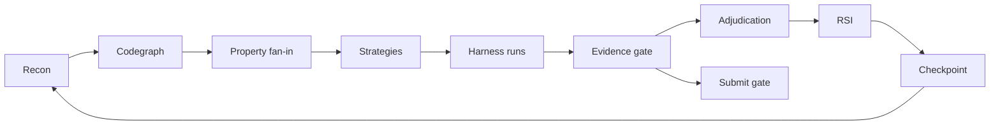

# STRAT-S10 — Exhaustive Lombard Hard-First Orchestration Spec

## Mission

Run an exhaustive, hard-first Lombard investigation focused on the primary
subsystem:

> Solana `lombard_token_pool` `release_or_mint` / `lock_or_burn` plus
> `mailbox` / `bridge` / `consortium` cross-layer handling, with EVM GMP
> Mailbox / BridgeV2 / AssetRouter as the differential mirror.

The loop persists until one of these occurs:

1. A submission-gate passer is reproduced with validator/fork evidence and
   measured impact.
2. All active Lombard leads are closed with replayable honest-zero evidence.
3. The human operator changes target or strategy.

No signal may be promoted beyond `open` without strict CPCV / credible-harness
evidence.

## Current baseline

| Item | State |
|------|-------|
| Latest loop | v6.51.11 |
| Attempts | 21 |
| Submit-ready | unchanged at 1 (OnRe H1 v6.13 only) |
| Lombard submission candidates | 0 |
| Strongest open lead | `SIG-XR-001-ROLLBACK` validator replay |
| Hard blocker | R3 runtime needs `yarn run ts-mocha` / `anchor-test-each.sh` |
| Crucible state | 8 programs loaded, 6 actions discovered, live sister-program write action working |

## Mandatory skill stack

Each round must explicitly invoke or apply the listed `.agents/skills`.

| Order | Skill | Purpose in Lombard loop | Required output |
|-------|-------|-------------------------|-----------------|
| 1 | `operator-recon` | Refresh semantic map, ranked files, git patch shapes, production entrypoints | updated recon notes or skipped-with-reason |
| 2 | `codegraph-x-ray` | Re-establish primary subsystem via `codegraph explore`, `blast`, `central`; synthesize verified invariants | `codegraph-x-ray-summary.md`, `invariants.md`, `property_candidates.md` deltas |
| 3 | `ultrafuzz-discovery` | Own property fan-in, executable attempts, failure preservation, adjudication | `property_fanin.md`, `runs.jsonl`, evidence paths |
| 4 | `fuzz-scaffolder` | Optional only when harness setup blocks progress; proposals marked agent-proposed | `harness_scaffold/` or `scaffolder_notes.md` |
| 5 | `agentic-strategy-generation` | Produce 4-8 high-signal strategies; at least 70% primary subsystem | ranked strategy queue with provenance |
| 6 | `operator-exploit` | EVM fork / Hardhat / Foundry PoC iteration when an EVM lead appears | fork logs, DELTA/impact notes if relevant |
| 7 | `operator-triage` | Impact sizing and submission-readiness decision after a repro | submission-gate decision, never corpus-only |
| 8 | `solodit-research` | Historical analogue prompts only, never evidence | untrusted analogue notes or skipped-with-reason |
| 9 | `auditvault-research` | Audit corpus axis-gap and severity analogue scan, never evidence | untrusted analogue notes or skipped-with-reason |
| 10 | `recursive-improvement` | Feed failures, blockers, repeats, and queue mutations back into next round | improvement ledger / refinement hints |
| 11 | `operator-checkpoint` | Persist state before rollover and before long attempts | checkpoint or final runbook |
| 12 | `lab-notebook` | Record same-vs-different and night-shift handoff | dated lab entry |

## Orchestration graph



Legend: Recon=`operator-recon`; Codegraph=`codegraph-x-ray`;
Property fan-in / evidence / adjudication=`ultrafuzz-discovery`;
Strategies=`agentic-strategy-generation`; RSI=`recursive-improvement`.

## Round cadence

Each exhaustive round is one bounded unit:

1. **Load context**
   - Read `STRAT-S9-final-handoff-runbook-v6-51-10.md`.
   - Read `summary.json`, last 5 `runs.jsonl` rows, and the newest lab entry.
   - Confirm current git status and preserve untracked user work.

2. **Skill refresh**
   - Invoke `ultrafuzz-discovery`, `codegraph-x-ray`,
     `agentic-strategy-generation`, and `fuzz-scaffolder`.
   - Read or apply `operator-recon`, `operator-exploit`, `operator-triage`,
     `solodit-research`, `auditvault-research`, `recursive-improvement`,
     `operator-checkpoint`, and `lab-notebook` when their phase is reached.

3. **Hard-first selection**
   - At least 70% of work must target `release_or_mint` / mailbox / bridge /
     consortium interaction.
   - Secondary EVM work is allowed only when it explains or falsifies a
     Solana cross-layer behavior.

4. **Executable attempts**
   - Minimum 3 fresh-context attempts for a new surface.
   - Minimum 5 attempts for previously blocked or high-bounty surfaces.
   - Crucible dry-runs, fixed replays, and coverage-only runs do not count as
     fuzz attempts.

5. **Evidence gate**
   - Every candidate needs command, stdout/stderr, account/storage delta, and
     replay path.
   - Crashes must include original + minimized sequence when Crucible can
     replay them.

6. **Adjudication**
   - Exact class only: `production_defect`, `underspecified_issue`,
     `harness_artifact`, `mirror_only_divergence`, `fixture_only_behavior`,
     `engineering_blocker`, `engine_level_honest_zero`.

7. **Closeout**
   - Append `runs.jsonl`.
   - Update `summary.json`.
   - Add evidence log(s).
   - Write strategy or blocker file.
   - Write lab notebook same-vs-different.
   - Commit only durable, low-noise artifacts.

## Lead queue and round order

### L1 — BR-XR-LIGHT rollback proof

**Goal:** replay R3/N4 without full hydration overhead.

Use `operator-recon` and `codegraph-x-ray` to isolate the smallest validator
or bankrun fixture that exercises:

`mailbox.handle_message` → recipient CPI → `release_or_mint_tokens` revert.

Required checks:

- Pre-state `messageInfo.status == Delivered`.
- Execute path rejects downstream.
- Post-state `messageInfo.status == Delivered`, not `Handled`.
- Recipient balance unchanged.
- `message_handled` PDA absent or unchanged.

Evidence:

- `ANCHOR_MOCHA_FILES=tests/ccip.ts anchor test --skip-build -- --features localnet --no-default-features`
  when `yarn` is present, or a lean bankrun test modeled after
  `bascule.bankrun.test.ts`.
- Log path:
  `evidence/rollback-br-xr-light-validator.log`.

Promotion rule:

- If post-state is `Handled`, promote as critical candidate and run
  `operator-triage`.
- If post-state stays `Delivered`, close `SIG-XR-001-ROLLBACK` as validator
  honest-zero.

### L2 — Crucible C-class state expansion

**Goal:** turn the v6.51.10 six-action scaffold into a deeper stateful
multi-program harness.

Actions to add, in order:

1. `action_post_session_payload` (already live).
2. `action_create_session` where pre-state can be synthesized.
3. `action_post_session_signatures_in_range`.
4. `action_post_session_signatures_oob`.
5. `action_mailbox_deliver_mock`.
6. `action_release_or_mint_wrong_dest`.
7. `action_release_or_mint_wrong_amount`.

Use `fuzz-scaffolder` only for skeletons. `ultrafuzz-discovery` owns final
property rows and pass@k.

Promotion rule:

- OOB index remains informational unless it blocks a bounty-relevant
  finalization or fund-moving path.
- Any minimized Crucible crash must be replayed on validator or bankrun before
  promotion.

### L3 — EVM/Solana differential replay

**Goal:** keep EVM as a mirror for cross-layer semantics, not as the primary
lane.

Current evidence:

- `PROP-XR-EVM-006/007/010`: 6/6 Hardhat passing.
- EVM `Mailbox.deliverAndHandle` has no per-handler gate.
- BridgeV2 `payloadSpent[payload.id]` is the single-shot dedupe.

Next variants:

1. BridgeV2 handler revert after `payloadSpent` set.
2. AssetRouter mint with bascule disabled plus malformed body variants.
3. Mailbox retry with changed handler state and same payload hash.

Promotion rule:

- Design divergence alone is not a bug.
- Needs measurable unauthorized mint, double spend, or bypass of intended
  bridge accounting.

### L4 — SIG-CR-001-OOB-DOS hardening path

**Goal:** finish the consortium index-bounds lane.

Required proof ladder:

1. Pure Rust probe already proves OOB panic.
2. Crucible action should drive pre-session payload and session state.
3. Validator or bankrun should show attacker-reachable session DoS.
4. Fund-loss attempt must be explicitly falsified.

Recommendation stays:

```rust
require!(
    *index < current_validators.len() as u64,
    ConsortiumError::ValidatorIndexOutOfBounds
);
```

Promotion rule:

- Disclosure only as informational DoS unless a validator-set finalization
  freeze creates bounty-relevant impact.

### L5 — Corpus-informed analogue pass

Use `solodit-research` and `auditvault-research` only after L1/L2 have fresh
evidence or a true plateau.

Allowed analogue axes:

- cross-chain message replay;
- handler revert retry;
- validator set / quorum indexing;
- admin disabling risk controls;
- bridge token accounting drift.

All analogue outputs are `metadata.trusted=false` and cannot affect
`submit_ready`.

## Evidence and promotion gate

| Gate | Requirement |
|------|-------------|
| Executable | command runs locally from clean checkout or records env-block |
| Replay | crash/test reproduces with seed or test selector |
| Substrate | Solana validator/bankrun or EVM Hardhat/fork as appropriate |
| Impact | balance, mint supply, validator-set finality, or bridge accounting delta |
| Novelty | not catalogue-only, not already closed by current tests |
| Scope | target-pinned to Lombard bounty scope |

`submit_ready` may change only if all gates pass and `operator-triage`
confirms submission criteria.

## Stop / continue policy

Continue if:

- a lead is env-blocked but has written test code;
- a Crucible action discovers new coverage;
- EVM differential evidence contradicts Solana assumptions;
- RSI adds a refinement hint for Lombard.

Stop or rotate only if:

- L1 rollback is validator honest-zero;
- L2 Crucible expansion reaches no new actions after 5 fresh attempts;
- L3 EVM variants remain design-only;
- L4 DoS remains informational after validator reachability attempt;
- `operator-checkpoint` and `lab-notebook` are written.

## Per-round artifact contract

Every round must update or create:

- `runs.jsonl` row;
- `summary.json` validated_tests or blockers;
- `evidence/<round>.log`;
- strategy file or adjudication JSON;
- lab notebook entry;
- checkpoint before ending if any lead remains open.

## Recommendation encoded in spec

1. Do not submit Lombard now.
2. Run `BR-XR-LIGHT` first in a proper `yarn` / `anchor-test-each.sh`
   environment.
3. Keep `SIG-CR-001-OOB-DOS` informational unless validator-level impact is
   proven.
4. Use EVM divergence only as a differential guide unless measurable bridge
   accounting impact appears.
5. Persist with Crucible stateful expansion until action coverage plateaus,
   then feed failures into RSI and corpus-informed strategy generation.
