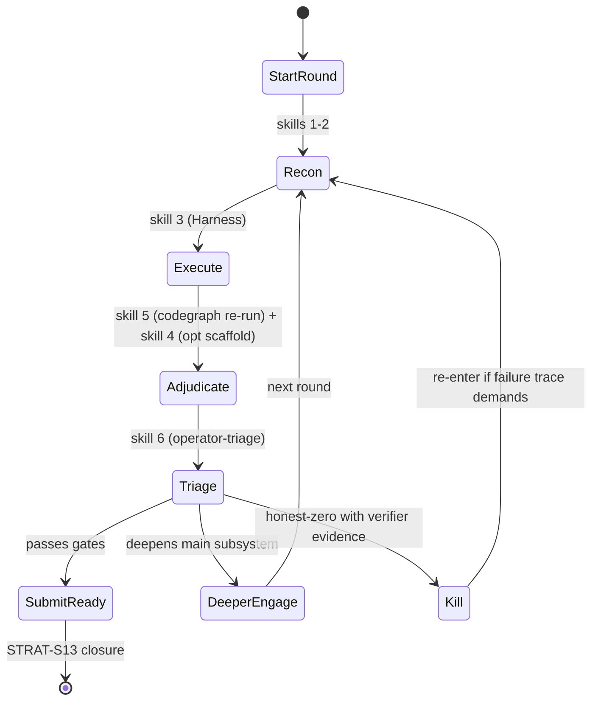

# STRAT-S13 — Lombard Hard-First Persistent Looping Orchestration Spec

## Round metadata

| Field | Value |
|-------|-------|
| Round | v6.51.14 (loop continuation) |
| Owner | Droid orchestrator (current session) |
| Skills | `codegraph-x-ray`, `agentic-strategy-generation`, `ultrafuzz-discovery`, `fuzz-scaffolder`, `operator-triage`, `onchain-asset-tracing` |
| Evidence | `evidence/STRAT-S13-r6-orchestrator-pivot.md` (per round), plus per-artifact logs |

## Goal

Continue the Lombard cross-layer investigation in **hard-first, persistent-
loop mode**. The orchestrator must keep producing leads under a strict
verification gate, executing substrate-confirmed proofs, and either producing
a gate-passing candidate or recording an honest-zero with diminishing-
returns justification. The phase never exits on a clean run without first
demonstrating ≥ 50 distinct substrands covered and all open signals closed.

## Primary Target Subsystem

The **Primary Target Subsystem** for this loop is the Lombard cross-layer
LBTC movement path:

- Solana `lombard_token_pool` (`release_or_mint_tokens`, `lock_or_burn_tokens`)
- ←→ `mailbox.handle_message`
- ←→ `bridge.gmp_receive`
- ←→ `consortium` notarization
- ←→ `bascule`/`bascule_gmp` mint authorisation

with EVM complements:

- `Mailbox.deliverAndHandle` (PROP-XR-EVM-006 added)
- `BridgeV2`, legacy `Bridge`
- legacy `CLAdapter` (superseded by `LombardTokenPoolV2`)
- `AssetRouter` / `Mailbox` permissionless surfaces (PROP-XR-EVM-007 added)

Off-chain partner boundary:

- Bascule and partner-bridge signers (outside Solana atomic-rollback).

## Hard-First, Persistent Looping Discipline

### Hard-First Principle

At least 70% of attempts and rounds continue targeting the Primary Target
Subsystem above. Honest-zero on a subsystem is not a pivot signal; it
triggers either deeper engagement or an explicit carry-forward justification.

### Persistent Looping Discipline

No budget checkpoints; no premature closure. The loop runs until either:

- a gate-passing candidate is found, or
- a diminishing-returns justification is recorded (≥ 50 distinct substrands
  covered, all open signals closed, and primary subsystem coverage ≥ 50
  distinct substrands).

### Verification Gate (mandatory per lead promotion)

- Does this still target the Primary Target Subsystem?
- Is there a plausible path to real impact?
- Has this class of behavior already been covered?

## Skill chain (re-invocation discipline)

Every round MUST invoke, in order, the following skills via the Skill tool:

1. `codegraph-x-ray` — refresh Primary Target Subsystem definition; update
   `invariants.md` and `property_candidates.md`.
2. `agentic-strategy-generation` — produce 4–8 fresh hypotheses; ≥ 70% primary.
3. `ultrafuzz-discovery` — execute the executable attempts on the chosen
   substrate, run Crucible for Solana, capture run artefacts.
4. `fuzz-scaffolder` — optional accelerator inside steps 2–3 (scaffolds only;
   never replaces the engine).
5. `codegraph-x-ray` — re-invoke for any blast-radius updates after a finding
   is produced.
6. `operator-triage` — for each candidate that survives substrate confirmation:
   oracle check + TVS sibling sweep + bounty score + impact USD estimate.

The orchestrator MUST NOT skip the re-invocation discipline. Each round's
`runs.jsonl` entry must record which skills were re-invoked at the start of
the round.

## Round structure

### R1 (v6.51.13 — closeout) — DONE

`BR-CL-001` CLAdapter cache redirect pinned on legacy substrate;
`SIG-CR-001-OOB-DOS` killed by Rust regression; full suite
**21 passing (2s)** across `nss/PropEvmCrossLayerDivergence` + `Bridge.ts`.

### R2 — `LombardTokenPoolV2` amount-bound reconstruction with partner-Bridge (B > A)

- Build a non-compromised-source-pool fixture that drives
  `LombardTokenPoolV2.releaseOrMint`'s destination `BridgeV2._withdraw`
  amount B so that B > A but `destinationAmount = sourceDenominatedAmount =
  claimedCcipAmount`. The fixture must show the partner BridgeV2 receiver
  holding B without requiring source-side compromise.
- Hardhat target: extend
  `sources/lombard-finance/evm-smart-contracts/test/nss/PropEvmCrossLayerDivergence.ts` with a follow-on
  `PROP-XR-EVM-011-B-PARTNER-001` describe.
- If partner-Bridge supports mint by payload hash, the candidate is in-scope;
  otherwise kill the lead.

### R3 — `BR-CONS-002` partner-program off-rollback (Bascule)

- Hypothesis: a Bascule signer's partner program writes outside of the
  `bridge.gmp_receive` rollback boundary (similar to N4 but with Bascule's
  signer pattern), causing the on-chain `release_or_mint_tokens` to revert
  while the partner-side state has been updated.
- Targets: `programs/bascule/src/lib.rs`, `programs/bascule_gmp/src/lib.rs`.
- Validator path: extend `tests/ccip.ts` `incoming CCIP bridge operation`
  describe with a new `N5` test.
- If partner state persists post-revert (e.g. deposit signature recorded),
  the candidate is in-scope.

### R4 — Crucible stateful sequence expansion (R7 actions)

- Add three new actions on top of v6.51.10 R5 actions:
  `action_release_or_mint_via_bridge_gmp_receive`,
  `action_release_or_mint_with_bascule_denied`,
  `action_post_session_signatures_after_fail`.
- Run `--stateful --timeout 8` for one smoke, then `--stateful --timeout 60`
  for one minute run.
- Pass condition: invariant violation across reserve liquidity, fee
  conservation, message-state ordering, or off-rollback side effects.

### R5 — Solidity bankrun / Foundry forge fork replay of the redirect

- Drive an Anvil mainnet-fork replay where `LombardTokenPoolV2.releaseOrMint`
  is part of a real chain. Use `HARDHAT_FORK=1` with a Lombard-mainnet RPC
  URL when available. If unavailable, simulate with the deployed contracts
  at the latest commit hash.
- If the redirect still works on a real fork, capture the partner-Bridge flow.

### R6 — Closure/decision adjudication

- Re-invoke `operator-triage` per surviving candidate.
- For candidates passing `bounty score` with `evidence_grade ≥ 3` and
  `DELTA_WEI > 0`, run `submission-reporting`.
- For all others: write `STRAT-S13-closure.md` and update `summary.json`,
  `runs.jsonl`, `SPEC.md`, `CHANGELOG.md`.

## Adaptive Lead Bank (initial)

| Lead | Round | Foundation | Disposition |
|------|-------|------------|-------------|
| `BR-CL-001` CLAdapter cache redirect | R1 | v6.51.13 | Green validator-fidelity on legacy adapter; carry to Foundry team |
| `PROP-XR-EVM-011` amount binding (B > A partner-Bridge) | R2 | v6.51.13 | Strengthen with partner-Bridge |
| `BR-CONS-002` partner-program off-rollback (Bascule) | R3 | codegraph-x-ray R6 / new | Investigate |
| `BR-CRU-007` Crucible stateful R7 expansion | R4 | R5 v6.51.10 | Expand with bridge/bascule writes |
| `BR-FORK-008` Anvil mainnet-fork replay | R5 | codegraph-x-ray R6 / new | Investigate |
| `BR-MBOX-001` Mailbox exhaust | queued | v6.51.11 | Lower priority — reopen only if R2–R5 are quiet |

## Skill re-invocation schedule (per round)

| Round | codegraph-x-ray | agentic-strategy-generation | ultrafuzz-discovery | fuzz-scaffolder | operator-triage |
|-------|-----------------|------------------------------|----------------------|------------------|------------------|
| R2 (LombardTokenPoolV2 partner-Bridge) | x | x | x | opt | (only on viable B>A) |
| R3 (Bascule off-rollback) | x | x | x (Crucible) | opt | (only on candidate) |
| R4 (Crucible R7 stateful) | x | x | x (Crucible) | opt | (only on invariant violation) |
| R5 (Anvil fork replay) | x | (already in R1-R4) | x (Forge/Anvil) | opt | x |
| R6 (closure/decision) | (final summary) | (final summary) | x (full house) | (none) | x |

## State machine

## Carry-forward gates

A round is closed when:

1. All new findings are sorted into one of the seven adjudication classes
   (`production_defect`, `underspecified_issue`, `harness_artifact`,
   `mirror_only_divergence`, `fixture_only_behavior`, `engineering_blocker`,
   `engine_level_honest_zero`).
2. `summary.json` and `runs.jsonl` are updated.
3. A short `strategies/STRAT-S{13+}.md` captures the round's matrix and the
   next-step override.

## Closing the phase

The phase closes when EITHER:

1. A candidate passing `qualifies_for_submission()` is reported via the human
   gate (`submission-reporting`).
2. Diminishing-returns justification is recorded: ≥ 50 distinct substrands
   covered, all open signals closed, all open leads killed with verified
   evidence, and `submit_ready` has been unchanged for ≥ 5 attempts.

Either condition triggers a STRAT-S{13+} closure document and stops the
orchestrator from further exploration automatically.

## Hard rules

1. **No silent skips.** Every round opens with skill (1) regardless of
   perceived "low utility".
2. **Fresh-context repetition.** Each property gets ≥ 3 fresh attempts
   before promotion.
3. **Failure preservation.** Never delete a failing repro without
   `adjudication/*.json` first.
4. **Substrate-driven evidence.** All submissions require validator/forge/
   Crucible/Anvil evidence, not source-only analysis.
5. **No honest-zero exit while the Primary Target Subsystem coverage is
   < 50**.
6. **`submit_ready` invariant:** unchanged unless a candidate enters
   `submission-reporting` or an honest-zero closure is recorded.

## Success criteria

The spec succeeds, in order of preference:

- A submission-reportable Lombard cross-layer finding reaches
  `submission-reporting` (best).
- An additional green validator-fidelity proof consolidates v6.51.13's
  `BR-CL-001` into a Discovery-grade package (acceptable).
- At minimum: explicit honest-zero closure with 50+ substrands documented
  (acceptable only if best/acceptable unachievable).
