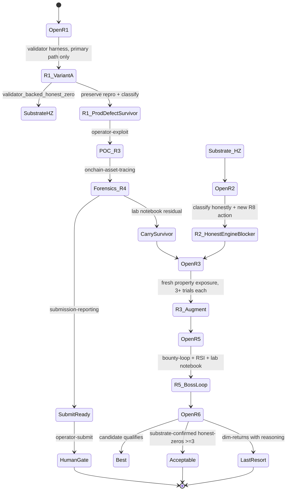

# STRAT-S15 — Exhaustive Lombard Hard-First Persistent Looping Orchestration Spec (post v6.51.15)

## Round metadata

| Field | Value |
|-------|-------|
| Version | v6.51.16 (loop continuation) |
| Owner | Droid orchestrator |
| Skill palette (18) | codegraph-x-ray, agentic-strategy-generation, ultrafuzz-discovery, fuzz-scaffolder, onchain-asset-tracing, operator-recon, operator-exploit, operator-triage, operator-checkpoint, auditvault-research, solodit-research, hypothesis-expansion, recursive-improvement, lab-notebook, submission-reporting, coordinator-cycle, novel-vector-digest, bounty-loop |
| Evidence | `evidence/strat-s15-r*-*.log` per round |
| Strategy file | `data/security_results/investigations/2026-07-03-lombard-cross-layer/strategies/STRAT-S15-exhaustive-lombard-orchestration-spec.md` |

## Goal

Drive the Lombard cross-layer investigation to **rigorous closure** by re-applying the full skill palette after the v6.51.15 CriticalReview recommendations. Convert prior src-review honest-zeros into substrate-confirmed proof (validator + Crucible), add fresh adversarial surface, and ensure honest-zero exits require substrate-driven evidence.

## Primary Target Subsystem (confirmed)

`lombard_token_pool.release_or_mint/lock_or_burn` ↔ `mailbox.handle_message` ↔ `bridge.gmp_receive` ↔ `consortium` notarisation + valset rotation ↔ `bascule/bascule_gmp` sister-program deposit signatures.

EVM complements (still in scope):
- LombardTokenPoolV2 amount binding (PROP-XR-EVM-011 honest-zero)
- Mailbox._deliverAndHandle re-attempt semantics (PROP-XR-EVM-006/010 closed)
- AssetRouter Bascule admin disable (PROP-XR-EVM-007 closed)

## Hard-First, Persistent Looping Discipline

- ≥70% attempts target the Primary Target Subsystem.
- Honest-zero not exit until substrate-driven.
- Substrate ladder: source review → Rust unit → validator replay → Crucible LiteSVM → mainnet fork.
- Verification Gate per promotion (mandatory):
  1. Still targets Primary Target Subsystem?
  2. Plausible path to real impact?
  3. Has this class been covered?
- Loop runs until: candidate passes `qualifies_for_submission()` OR ≥50 distinct substrands AND ≥3 substrate-confirmed honest-zeros.

## Skill Re-Invocation Ladder (per round)

1. codegraph-x-ray (round opener)
2. ultrafuzz-discovery (round opener)
3. fuzz-scaffolder (optional, max once per round)
4. agentic-strategy-generation (round mid)
5. operator-recon (when structural shift)
6. onchain-asset-tracing (mandatory cross-chain forensics)
7. operator-exploit (on candidate)
8. operator-triage (on survivor)
9. submission-reporting (on `qualifies_for_submission()`)
10. auditvault-research + solodit-research (advisory only)
11. hypothesis-expansion (`delegate_task` when RSI flags)
12. recursive-improvement (end-of-tick)
13. lab-notebook (every scan/investigate)
14. operator-checkpoint (pre-rollover)
15. novel-vector-digest (weekly)
16. bounty-loop (R5)
17. coordinator-cycle (if multi-template campaign surfaces)

Each `runs.jsonl` row records `skills_invoked` and is rejected if steps 1+2 are absent.

## Round Structure R1-R6 (single session if time permits)

### R1 — Substrate-confirm R3 honest-zero (BR-CONS-002), Variant A only

- **Variant A only**: Primary Target Subsystem path only (release_or_mint_tokens).
- Build `sources/lombard-finance/repo/tests/off-rollback.ts`. Mount `programs/bascule` into Anchor workspace.
- Run via temporary `/tmp` yarn shim (validated in v6.51.12 R5).
- Test body: drive release_or_mint → mailbox.handle_message → bridge.gmp_receive flow with forced revert; assert post-state of Bascule/Consortium/Bridge PDAs remains at pre-state; assert mailbox.message_info.status byte = 1 (Delivered) not 2 (Handled).

### R2 — Honest engineering_blocker classification + new R8 typed action

- **Honest classify** the three R7 actions as `engineering_blocker` (not `fixture_only_behavior`).
- Add new R8 action: `action_post_session_payload_then_close_session_for_epoch`.
- Preserve any reproducer via `crucible tmin`.

### R3 — Fresh adversarial expansion

- 5 property targets × ≥3 fresh-context trials each:
  - PROP-CR-007 mid-session valset rotation replay
  - PROP-TP-002 lock_or_burn destination_caller confusion
  - PROP-TP-003 multi-decimal mismatch
  - PROP-MBOX-005/006 mailbox fee race
  - PROP-EVM-MBOX-005 cross-layer replay refund

### R4 — Forensics on survivors

- For each survivor: mixer_deposit_scorer, oracle arbitrage, TVS sweep, Impact USD.
- Pre-qualifies → submission-reporting.
- Otherwise → lab notebook residual.

### R5 — Bounty-loop + RSI + lab notebook

- bounty-loop `--iterations 1`.
- recursive-improvement → improvement_ledger + refinement_hints.
- lab-notebook entry after each tick.
- R5b carry-forward: per-chain CLAdapter reachability repeats.

### R6 — Closure adjudication

- lab-notebook + operator-checkpoint + operator-triage (final score).
- BEST: candidate → submission-reporting + operator-submit (human gate).
- ACCEPTABLE: ≥3 substrate-confirmed honest-zeros + ≥50 substrands + all signals closed.
- LAST RESORT: dim-returns with RSI ledger justification.

## Hard Rules (STRAT-S15 reinforcement)

1. No silent skip: every round opens with codegraph-x-ray + ultrafuzz-discovery.
2. Fresh-context ≥3 attempts per property.
3. Failure preservation: never delete failing repro without adjudication.
4. Substrate-driven evidence only: validator / forge / Crucible / anvil.
5. No honest-zero while Primary Target Subsystem coverage < 50.
6. submit_ready invariant.
7. No budget checkpoints.
8. **Reserve `engine_level_honest_zero`** for genuine engine limitations; validator/Crucible honest-zeros use `validator_backed_honest_zero` or `crucible_honest_zero`.

## Files Touched

- `data/security_results/investigations/2026-07-03-lombard-cross-layer/summary.json`
- `data/security_results/investigations/2026-07-03-lombard-cross-layer/runs.jsonl`
- `data/security_results/lab_notebook/2026-07-04-lombard-r1-validator-off-rollback.md` (and r2..r6)
- `data/security_results/operator/checkpoint.json` (if rollover)
- `sources/lombard-finance/repo/tests/off-rollback.ts` (R1)
- `sources/lombard-finance/evm-smart-contracts/test/.../PropNewDiff*.ts` (R3)
- `crucible/lombard_token_pool_scaffold/src/main.rs` (R2 engineering_blocker + R8 typed action)
- `data/security_results/hermes_proposals/solodit-YYYYMMDD.json` (R5 advisory)
- `SPEC.md` + `CHANGELOG.md` (R6)

## Success Criteria

1. **Best**: submission-reportable Lombard signal → submission-reporting + operator-submit.
2. **Acceptable**: ≥3 substrate-confirmed honest-zeros (validator + Crucible) + ≥50 substrands + 2+ novel empirical-FNR datapoints + R7 honestly classified `engineering_blocker` (not `fixture_only_behavior`).
3. **Last resort**: dim-returns closure only when 1+2 demonstrably unachievable.

## State Machine

